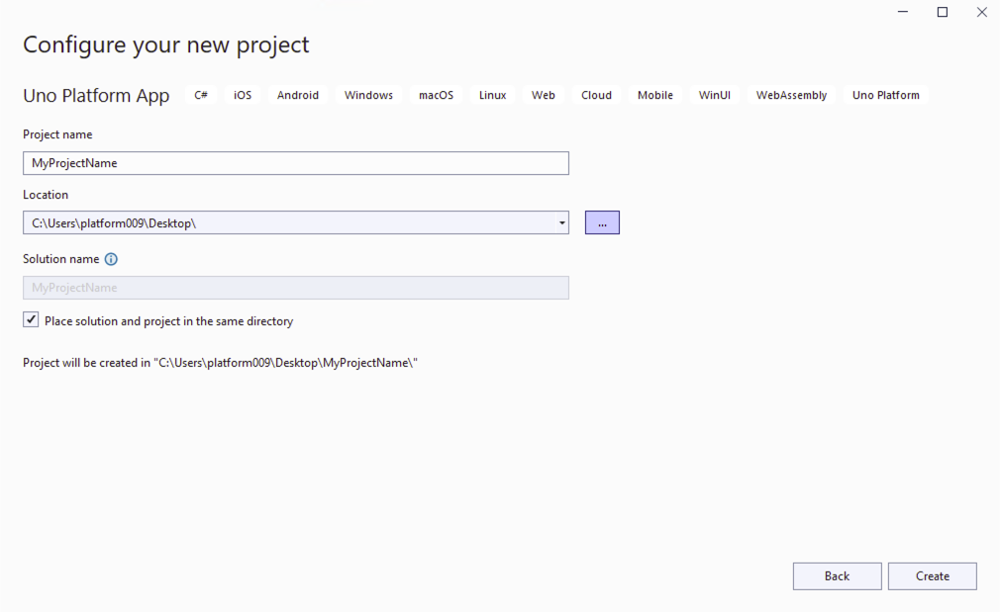
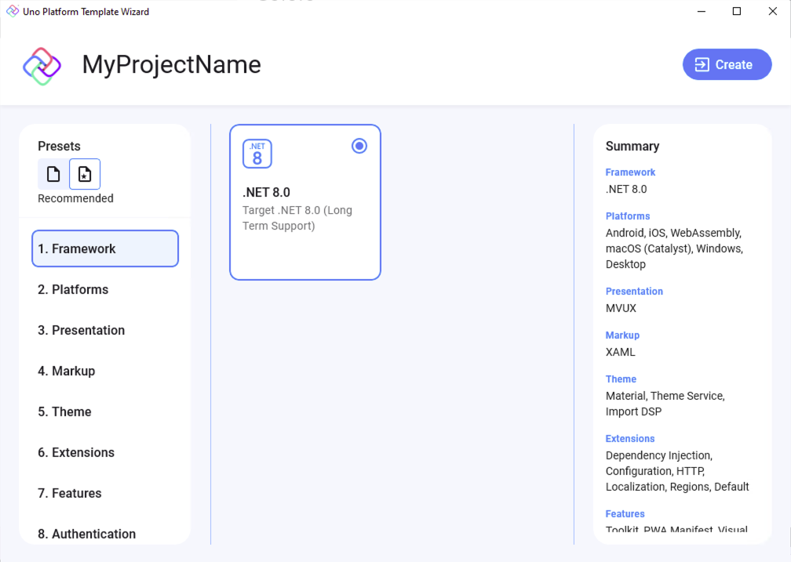
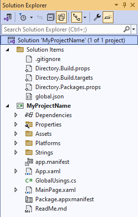
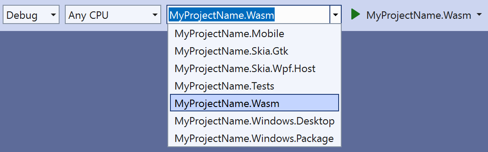

# How-To: Getting Started

This tutorial will walk you through how to create an Uno application with Uno.Extensions using the Wizard and CLI and how to install Uno.Extensions to an existing Uno application.

> [!NOTE]
> Make sure to setup your environment first by [following our instructions](xref:Uno.GetStarted.vs2022).

## Creating a new application

### 1. Creating the app

### [Wizard](#tab/wizard)

#### Create an Uno Platform app with Wizard

* Create a new C# solution using the **Uno Platform App** template, from Visual Studio's **Start Page**, then click the **Next** button

    
    

* Configure your new project by providing a project name and a location, check the "**Place solution and project in the same directory**" option, then click the **Create** button

    

* Choose the **Recommended** preset to build your application

    

    > [!TIP]
    > For a detailed overview of the Uno Platform project template wizard and all its options, see [this](xref:Uno.GettingStarted.UsingWizard).

* Click the create button

* Wait for the projects to be created, and their dependencies to be restored

* A banner at the top of the editor may ask to reload projects, click **Reload projects**:  
    

### [Command Line](#tab/cli)

#### Create an Uno Platform app with the CLI

The `dotnet` templates included in the `Uno.Templates` package are used to easily create new projects that already reference the Uno.Extensions.

* Open a command prompt and run the following:

    ```dotnetcli
    dotnet new install Uno.Templates
    ```

* Navigate to the desired projects directory, and use the `unoapp` template to generate the starter solution discussed above

    ```dotnetcli
    dotnet new unoapp -o MyProject -preset recommended
    ```

    The argument specified after the `-o` flag (i.e. MyProjectName) will act as the name for both a containing directory and the generated solution.

* Open the solution in Visual Studio

    `.\MyProjectName\MyProjectName.sln`

---

### 2. Exploring the Solution

The generated solution will contain *MyProjectName* for application logic, including constructs like ViewModels and services, along with the pages, controls, and other views constituting the UI of the application.



### 3. Running the Application

* Select a target from the drop-down as pictured below

    

* Click the "play" button, or press F5 to start debugging. The project will be compiled and deployed based on the target platform. For more detailed instructions specific to each platform, refer to the [Debug the App](xref:Uno.GettingStarted.CreateAnApp.VS2022#debug-the-app) documentation.

## Installing Extensions in an existing project

To get started with Extensions in your project, follow these steps:

### Step 1: Add Hosting to Your Project

Hosting is the foundation for using Extensions. Begin by adding Hosting to your project. Refer to the detailed instructions in the [Hosting Setup Documentation](xref:Uno.Extensions.Hosting.HowToHostingSetup).

### Step 2: Configure the OnLaunched Method

After setting up Hosting, adjust the `OnLaunched` method in `App.xaml.cs` to initialize the Extensions features. Ensure you have added the necessary [Uno Platform Features](xref:Uno.Features.Uno.Sdk#uno-platform-features).

Update the `Configure` method as shown below:

```csharp
var builder = this.CreateBuilder(args)
    .Configure(host => host
        // Configure the host builder
        .UseConfiguration(...)
        .UseLocalization()
        .UseSerialization(...)
        .UseHttp(...)
    );
```

Add a `protected` property named Host of type `IHost` to your App.xaml.cs file:

```csharp
protected IHost? Host { get; private set; }
```

After creating the `builder`, initialize the `Host` by building it:

```csharp
Host = builder.Build();
```

### Step 3: Use the Builder to Create the Main Window

Finally, instead of directly creating an instance of a `Window` using `MainWindow = new Window()`, use the `builder` to set up the main window:

```diff
-MainWindow = new Window();

var builder = this.CreateBuilder(args)
    .Configure(host => host
        // Configure the host builder
    );

+MainWindow = builder.Window;

Host = builder.Build();

if (MainWindow.Content is not Frame rootFrame)
{
    rootFrame = new Frame();
    MainWindow.Content = rootFrame;
}

if (rootFrame.Content == null)
{
    rootFrame.Navigate(typeof(MainPage), args.Arguments);
}

MainWindow.Activate();
```

> [!IMPORTANT]
> Be sure to remove any other code that sets `MainWindow` to prevent conflicts in your application.
