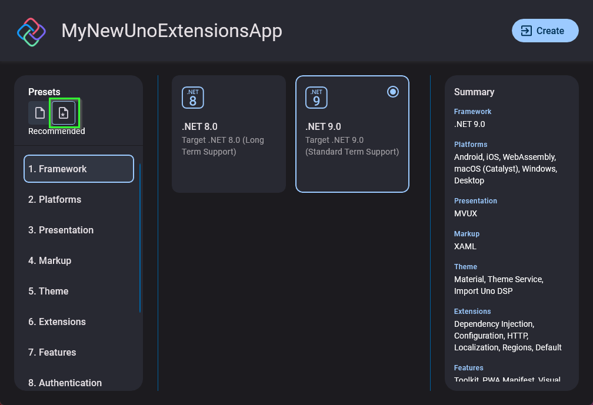
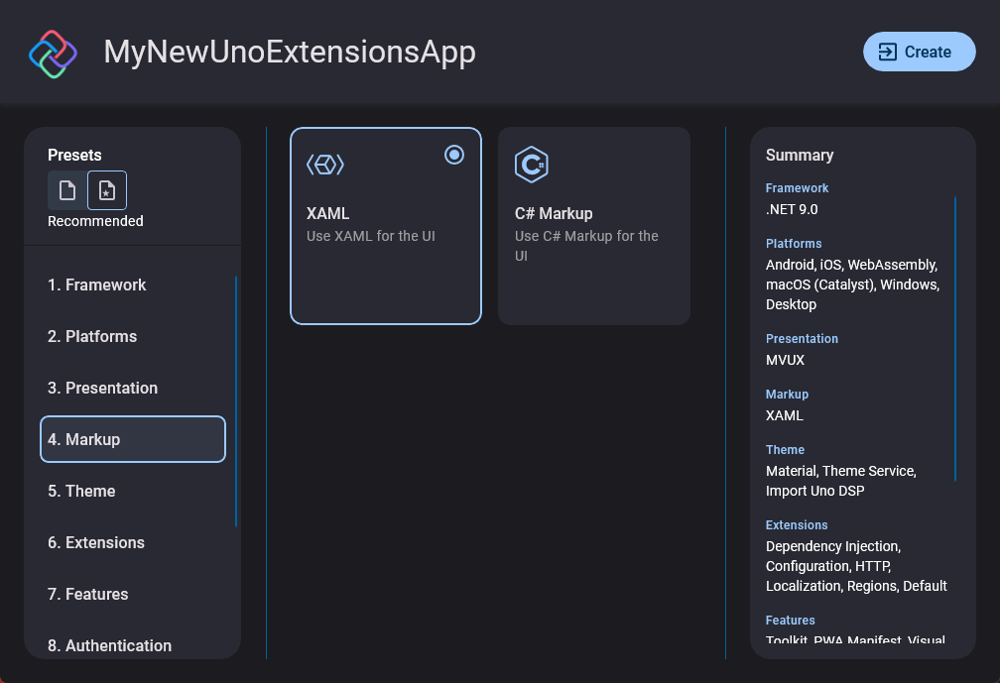
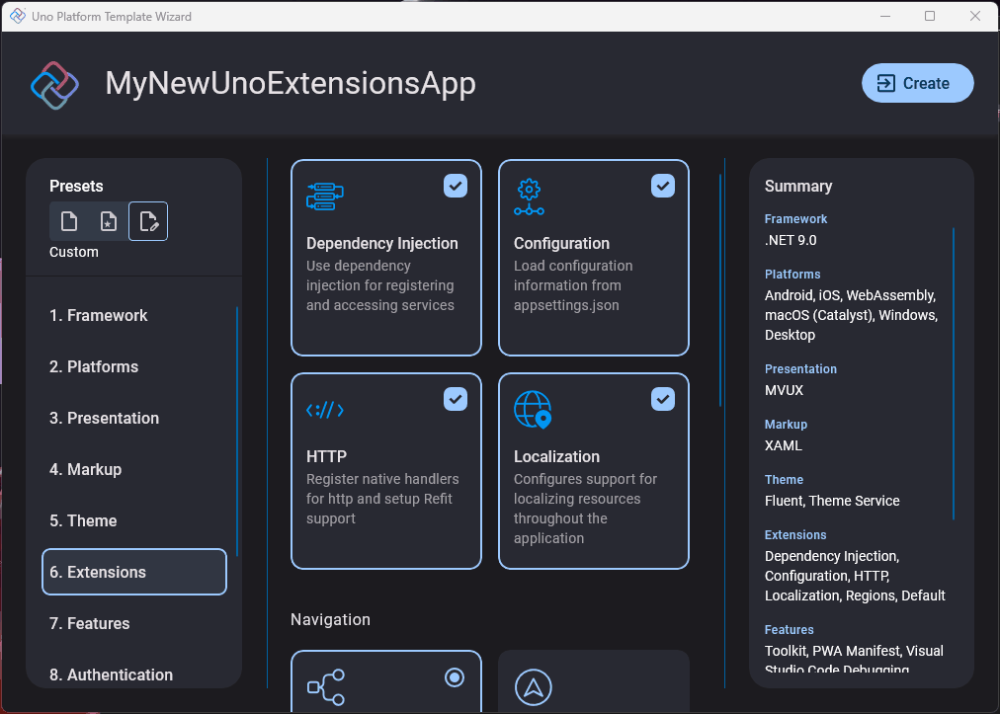
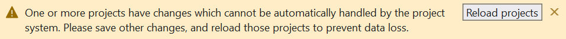
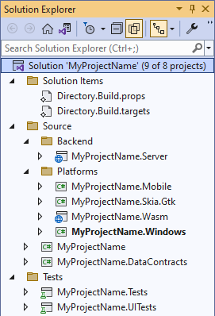
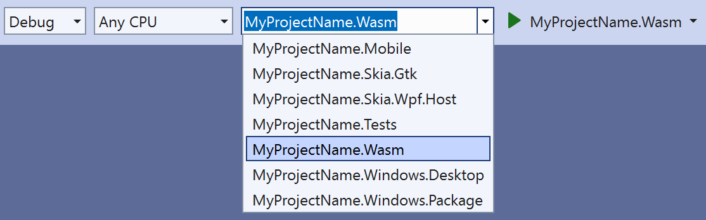

<!--markdownlint-disable MD004 MD051 -->
# How-To: Getting Started

This tutorial will walk you through :

- How to: Create an Uno application with Uno.Extensions using the Wizard and CLI
- How to: Upgrade an existing Uno Application to use Uno.Extensions

> [!NOTE]
> Make sure to setup your environment first by [following the Getting Started Guide](https://platform.uno/docs/articles/get-started.html).

## Creating a new application

### 1. Creating the app

#### [Using the Wizard](#tab/wizard)

* Create a new C# solution using the **Uno Platform App** template, from Visual Studio's **Start Page**, then click the **Next** button

    
    

* Configure your new project by providing a project name and a location, check the "**Place solution and project in the same directory**" option, then click the **Create** button

    

    > [!TIP]
    > With the Visual Studio Wizard it's currently not possible to create a Uno Project in an already existing Solution, but as simplest workarounds, your options are:
    > - Using the [`dotnet new unoapp` CLI](#using-the-command-line) by providing the `-n` or `--name` AND `-o` or `--output` argument right from your commandline in VS 2022 or external Terminal application.
    > - Creating the wanted Project as new Solution, as you would normally want it do in your existing solution, but in a different Directory, and move the created Project files afterwards to your initial Solution, similar as if you would add additional targets.
<!-- TODO: Add link to the appropriate mentioned Guide, since should only point out, that there is this limitation and give a short list of options that can be considered.-->

* Choose the **Recommended** preset on the panel on the left side of the wizard window

    

* Choose the Presentation kind for your new Project. By using the **Recommended** preset in the wizard, this will default to **MVUX**.

    

    > [!NOTE]
    > By using the **Recommended** preset, you will have to choose between **MVVM** or **MVUX** and not being able to choose **None**

* On the **Extensions** tab, you can now select those you want to include from creation process to your project and by that, in most of the cases, get some extension specific content right out of the Box into your Project!

    

    > [!TIP]
    > For a detailed overview of the Uno Platform project template wizard and all its options, you can [visit the Wizard Getting Started Guide](xref:Uno.GettingStarted.UsingWizard).
    > [!TIP]
    > Please notice, that depending on the Extensions you want to use and might got forwarded to this guide here, the Options you should select or will need can differ from this, as this is meant as general starting point with Extensions. So please check the Extension specific Guides for future instructions you may have to select.

* Click the create button

* Wait for the projects to be created, and their dependencies to be restored

* In case, you get a banner at the top of the editor may ask to reload projects, click **Reload projects**:

    

#### [Using the Command Line](#tab/cli)

The `dotnet` templates included in the `Uno.Templates` package are used to easily create new projects that already reference the Uno.Extensions.

* Open a command prompt and run the following:

    ```dotnetcli
    dotnet new install Uno.Templates
    ```

* Navigate to the desired projects directory, and use the `unoapp` template to generate the starter solution discussed above

    ```dotnetcli
    dotnet new unoapp -o MyProject -preset recommended
    ```

    > [!NOTE]
    > In case you don't provide the `-n` or `--name` argument to the `dotnet new` CLI, the argument specified after the `-o` flag (i.e. MyProjectName) will act as the name for both a containing directory and the generated solution.

    If you are trying to add a new Project to an already existing Solution, you should consider using both of this arguments.

    For example, if your Solution is nested in a `src` Folder, you could use this:

    ```dotnetcli
    dotnet new unoapp -o src/MyProject -n MyProject -preset recommended
    ```

* Open the solution in Visual Studio or any other IDE you may choose

    `.\MyProjectName\MyProjectName.sln`

---

### 2. Exploring the Solution

The generated solution will contain *MyProjectName* for application logic, including template contained constructs like ViewModels and services, along with the pages, controls, and other views constituting the UI of the application.



As good starting point to check out the code you now have in place, you could take a look into `App.xaml.cs`, where you will find the HostBuilder as the central configuration and setup point of your Apps capabilities, or else the `MainPage.xaml` (or .cs if you choosen cSharp-Markup) as first Page your app will show at Runtime.

You cant wait to see your new Uno App in action and the restoring process of the nuget packages is completed? Let's run your app!

> [!NOTE]
> This restoring process may take some moments to minutes, depending on your Network and already local available packages

### 3. Running the Application

> [!IMPORTANT]
> In case your IDE is not Visual Studio 2022, please refer for the steps to actually run your app to the [VS Code guide](https://platform.uno/docs/articles/create-an-app-vscode.html#debug-the-app) or [Rider guide](https://platform.uno/docs/articles/create-an-app-rider.html#debug-the-app)

* Select a target from the drop-down as pictured below

    

* Click the "play" button, or press `F5` to start debugging. The project will be compiled and deployed based on the target platform. For more detailed instructions specific to each platform in Visual Studio 2022, refer to the [Debug the App](xref:Uno.GettingStarted.CreateAnApp.VS2022#debug-the-app) documentation.

## Installing Extensions in an existing project

To get started with Extensions in your project, follow these steps:

### Step 1: Add Hosting to Your Project

Hosting is the foundation for using Extensions. Begin by adding Hosting to your project. Refer to the detailed instructions in the [Hosting Setup Documentation](xref:Uno.Extensions.Hosting.HowToHostingSetup).

### Step 2: Configure the OnLaunched Method

After setting up Hosting, adjust the `OnLaunched` method in `App.xaml.cs` to initialize the Extensions features. Ensure you have added the necessary [Uno Platform Features](xref:Uno.Features.Uno.Sdk#uno-platform-features).

Update the `Configure` method as shown below:

```csharp
var builder = this.CreateBuilder(args)
    .Configure(host => host
        // Configure the host builder
        .UseConfiguration(...)
        .UseLocalization()
        .UseSerialization(...)
        .UseHttp(...)
    );
```

Add a `protected` property named Host of type `IHost` to your App.xaml.cs file:

```csharp
protected IHost? Host { get; private set; }
```

After creating the `builder`, initialize the `Host` by building it:

```csharp
Host = builder.Build();
```

### Step 3: Use the Builder to Create the Main Window

Finally, instead of directly creating an instance of a `Window` using `MainWindow = new Window()`, use the `builder` to set up the main window:

```diff
-MainWindow = new Window();

var builder = this.CreateBuilder(args)
    .Configure(host => host
        // Configure the host builder
    );

+MainWindow = builder.Window;

Host = builder.Build();

if (MainWindow.Content is not Frame rootFrame)
{
    rootFrame = new Frame();
    MainWindow.Content = rootFrame;
}

if (rootFrame.Content == null)
{
    rootFrame.Navigate(typeof(MainPage), args.Arguments);
}

MainWindow.Activate();
```

> [!IMPORTANT]
> Be sure to remove any other code that sets `MainWindow` or `Window.Current` to prevent conflicts in your application.
