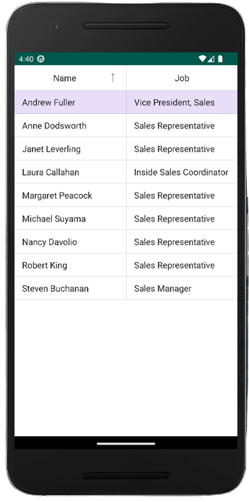
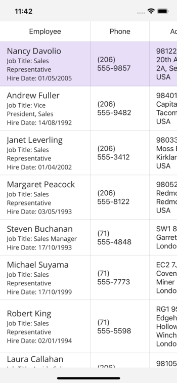

# .NET MAUI Embedding - DevExpress .NET MAUI Controls

The controls from [DevExpress .NET MAUI Controls](https://www.devexpress.com/maui/) can be used in an Uno Platform application via .NET MAUI Embedding.

## Sample App

An existing sample app that showcases the controls is available [here](https://github.com/unoplatform/Uno.Samples/tree/master/UI/MauiEmbedding/DevExpressApp).

> [!NOTE]
> DevExpress .NET MAUI Controls are currently only compatible with Android and iOS with Uno Platform at the moment.

## Installation

The DevExpress .NET MAUI Controls are currently available [free of charge](https://www.devexpress.com/maui/). However, in order to access the NuGet packages you do need to create an account at [DevExpress website](https://www.devexpress.com/MyAccount/Register/?returnUrl=https%3a%2f%2fnuget.devexpress.com%2f%23feed-url).

Once you have an account with DevExpress, you need to visit the [Your DevExpress NuGet Feed URL](https://nuget.devexpress.com/#feed-url) page to retrieve a NuGet feed that's associated with your account. You can either add this as a NuGet feed in Visual Studio or use a nuget.config file.

```xml
<?xml version="1.0" encoding="utf-8"?>
<configuration>
  <packageSources>
    <add key="DevExpress Private Feed" value="[your NuGet feed goes here]" />
  </packageSources>
</configuration>
```

## Getting Started

### [Visual Studio](#tab/vs)

> [!NOTE]
> If you don't have the **Uno Platform Extension for Visual Studio** installed, follow [these instructions](xref:Uno.GetStarted.vs2022).

- Launch **Visual Studio** and click on **Create new project** on the Start Window. Alternatively, if you're already in Visual Studio, click **New, Project** from the **File** menu.

- Type `Uno Platform` in the search box

- Click **Uno Platform App**, then **Next**

- Name the project `DevExpressApp` and click **Create**

At this point you'll enter the **Uno Platform Template Wizard**, giving you options to customize the generated application.

- Select **Blank** in **Presets** selection

- Select the **Platforms** tab and unselect **WebAssembly**, **macOS (Catalyst)**, **Windows**, and **Desktop** platforms

- Select the **Features** tab and click on **.NET MAUI Embedding** and **Toolkit**

- Click **Create** to complete the wizard

The template will create a solution with a single cross-platform project, named `DevExpressApp`, ready to run.

For more information on all the template options, see [Using the Uno Platform Template](xref:Uno.GettingStarted.UsingWizard).

### [Command Line](#tab/cli)

> [!NOTE]
> If you don't have the **Uno Platform dotnet new templates** installed, follow [dotnet new templates for Uno Platform](xref:Uno.GetStarted.dotnet-new).

Create a new application using the `unoapp` template, enabling .NET MAUI Embedding. In this case, we're going to use the Blank template (`-preset blank`) and include .NET MAUI Embedding support (`-maui`).

```bash
dotnet new unoapp -preset blank -maui -toolkit -platforms "android" -platforms "ios" -o DevExpressApp
```

This will create a new folder called **DevExpressApp** containing the new application.

---

## NuGet Packages

Add a reference to `DevExpress.Maui.DataGrid` to the DevExpressApp.MauiControls project.

## Updating AppBuilderExtensions

In the `AppBuilderExtensions` class, on `DevExpressApp.MauiControls` project, update the `UseMauiControls` extension method to call the `UseDevExpress` method.

```csharp
using DevExpress.Maui;

namespace DevExpressApp;

public static class AppBuilderExtensions
{
    public static MauiAppBuilder UseMauiControls(this MauiAppBuilder builder)
        => builder
            .UseDevExpress()
            .ConfigureFonts(fonts =>
            {
                fonts.AddFont("Assets/Fonts/OpenSansRegular.ttf", "OpenSansRegular");
                fonts.AddFont("Assets/Fonts/OpenSansSemibold.ttf", "OpenSansSemibold");
            });
}
```

## Adding DataGridView Control

1. Update the `EmbeddedControl.xaml` in the `DevExpressApp.MauiControls` project with the following XAML that includes the `DataGridView` control:

    ```xml
    <?xml version="1.0" encoding="utf-8" ?>
    <ContentView
        x:Class="DevExpressApp.MauiControls.EmbeddedControl"
        xmlns="http://schemas.microsoft.com/dotnet/2021/maui"
        xmlns:x="http://schemas.microsoft.com/winfx/2009/xaml"
        xmlns:dxg="clr-namespace:DevExpress.Maui.DataGrid;assembly=DevExpress.Maui.DataGrid">
        <dxg:DataGridView ItemsSource="{Binding Employees}">
            <dxg:DataGridView.Columns>
                <dxg:TextColumn FieldName="Name" Caption="Name" />
                <dxg:TextColumn FieldName="Position" Caption="Job"/>
            </dxg:DataGridView.Columns>
        </dxg:DataGridView>
    </ContentView>
    ```

    > [!NOTE]
    > You may notice that the `Binding` markup extension is used on some properties. The `MauiEmbedding` can handle bindings between MAUI Controls and Uno Platform, just make sure the property in the `Binding` expression matches the property on your ViewModel.

1. Update the `EmbeddedControl.xaml.cs` with the following code:

    ```csharp
    namespace DevExpressApp.MauiControls;

    public partial class EmbeddedControl : ContentView
    {
        public EmbeddedControl()
        {
            InitializeComponent();
        }
    }
    ```

1. It's time to create the ViewModel that will hold the properties that will be data bound to the `DataGridViewControl` control. In the `DevExpressApp` project, create a new folder called `ViewModels` and add a new class called `MainViewModel`. This class will have the following code:

    ```csharp
    namespace DevExpressApp.ViewModels;

    public class MainViewModel
    {
        public IReadOnlyList<Employee> Employees { get; }= new EmployeeData().Employees;
    }
    ```

1. And let's create the `Employee` model and mock it.

    ```csharp
    public enum AccessLevel
    {
        Admin,
        User
    }

    public class Employee
    {
        public Employee(string name)
        {
            this.Name = name;
        }

        public string Name { get; }
        public DateTime BirthDate { get; set; }
        public DateTime HireDate { get; set; }
        public string? Position { get; set; }
        public string? Address { get; set; }
        public string? Phone { get; set; }
        public AccessLevel Access { get; set; }
        public bool OnVacation { get; set; }
    }

    public class EmployeeData {
        void GenerateEmployees() {
            ObservableCollection<Employee> result = new ObservableCollection<Employee>();
            result.Add(
                new Employee("Nancy Davolio") {
                    BirthDate = new DateTime(1978, 12, 8),
                    HireDate = new DateTime(2005, 5, 1),
                    Position = "Sales Representative",
                    Address = "98122, 507 - 20th Ave. E. Apt. 2A, Seattle WA, USA",
                    Phone = "(206) 555-9857",
                    Access = AccessLevel.User,
                    OnVacation = false
                }
            );
            result.Add(
                new Employee("Andrew Fuller") {
                    BirthDate = new DateTime(1965, 2, 19),
                    HireDate = new DateTime(1992, 8, 14),
                    Position = "Vice President, Sales",
                    Address = "98401, 908 W. Capital Way, Tacoma WA, USA",
                    Phone = "(206) 555-9482",
                    Access = AccessLevel.Admin,
                    OnVacation = false
                }
            );
            result.Add(
                new Employee("Janet Leverling") {
                    BirthDate = new DateTime(1985, 8, 30),
                    HireDate = new DateTime(2002, 4, 1),
                    Position = "Sales Representative",
                    Address = "98033, 722 Moss Bay Blvd., Kirkland WA, USA",
                    Phone = "(206) 555-3412",
                    Access = AccessLevel.User,
                    OnVacation = false
                }
            );
            result.Add(
                new Employee("Margaret Peacock") {
                    BirthDate = new DateTime(1973, 9, 19),
                    HireDate = new DateTime(1993, 5, 3),
                    Position = "Sales Representative",
                    Address = "98052, 4110 Old Redmond Rd., Redmond WA, USA",
                    Phone = "(206) 555-8122",
                    Access = AccessLevel.User,
                    OnVacation = false
                }
            );
            result.Add(
                new Employee("Steven Buchanan") {
                    BirthDate = new DateTime(1955, 3, 4),
                    HireDate = new DateTime(1993, 10, 17),
                    Position = "Sales Manager",
                    Address = "SW1 8JR, 14 Garrett Hill, London, UK",
                    Phone = "(71) 555-4848",
                    Access = AccessLevel.User,
                    OnVacation = true
                }
            );
            result.Add(
                new Employee("Michael Suyama") {
                    BirthDate = new DateTime(1981, 7, 2),
                    HireDate = new DateTime(1999, 10, 17),
                    Position = "Sales Representative",
                    Address = "EC2 7JR, Coventry House Miner Rd., London, UK",
                    Phone = "(71) 555-7773",
                    Access = AccessLevel.User,
                    OnVacation = false
                }
            );
            result.Add(
                new Employee("Robert King") {
                    BirthDate = new DateTime(1960, 5, 29),
                    HireDate = new DateTime(1994, 1, 2),
                    Position = "Sales Representative",
                    Address = "RG1 9SP, Edgeham Hollow Winchester Way, London, UK",
                    Phone = "(71) 555-5598",
                    Access = AccessLevel.User,
                    OnVacation = false
                }
            );
            result.Add(
                new Employee("Laura Callahan") {
                    BirthDate = new DateTime(1985, 1, 9),
                    HireDate = new DateTime(2004, 3, 5),
                    Position = "Inside Sales Coordinator",
                    Address = "98105, 4726 - 11th Ave. N.E., Seattle WA, USA",
                    Phone = "(206) 555-1189",
                    Access = AccessLevel.User,
                    OnVacation = true
                }
            );
            result.Add(
                new Employee("Anne Dodsworth") {
                    BirthDate = new DateTime(1980, 1, 27),
                    HireDate = new DateTime(2004, 11, 15),
                    Position = "Sales Representative",
                    Address = "WG2 7LT, 7 Houndstooth Rd., London, UK",
                    Phone = "(71) 555-4444",
                    Access = AccessLevel.User,
                    OnVacation = false
                }
            );
            Employees = result;
        }

        public ObservableCollection<Employee> Employees { get; private set; }

        public EmployeeData() {
            GenerateEmployees();
        }
    }
    ```

1. The final step is to add the `MainViewModel` as the `DataContext` of the `MainPage.xaml` file. The final `MainPage.xaml` file will look like this:

    ```xml
    <Page x:Class="DevExpressApp.MainPage"
          xmlns="http://schemas.microsoft.com/winfx/2006/xaml/presentation"
          xmlns:x="http://schemas.microsoft.com/winfx/2006/xaml"
          xmlns:local="using:DevExpressApp.ViewModels"
          xmlns:d="http://schemas.microsoft.com/expression/blend/2008"
          xmlns:mc="http://schemas.openxmlformats.org/markup-compatibility/2006"
          xmlns:utu="using:Uno.Toolkit.UI"
          utu:SafeArea.Insets="VisibleBounds"
          mc:Ignorable="d"
          Background="{ThemeResource ApplicationPageBackgroundThemeBrush}">
        <Page.DataContext>
            <local:MainViewModel />
        </Page.DataContext>
        <Border>
            <embed:MauiHost xmlns:controls="using:DevExpressApp.MauiControls"
                            xmlns:embed="using:Uno.Extensions.Maui"
                            Source="controls:EmbeddedControl" />
        </Border>
    </Page>
    ```

1. Now the project is good to go! Press F5 and you should see the `DataGridView` control working as expected.
   For more detailed instructions specific to each platform, refer to the [Debug the App](xref:Uno.GettingStarted.CreateAnApp.VS2022#debug-the-app) documentation.

## App Render Output

- **Android:**

    

- **iOS:**

    
