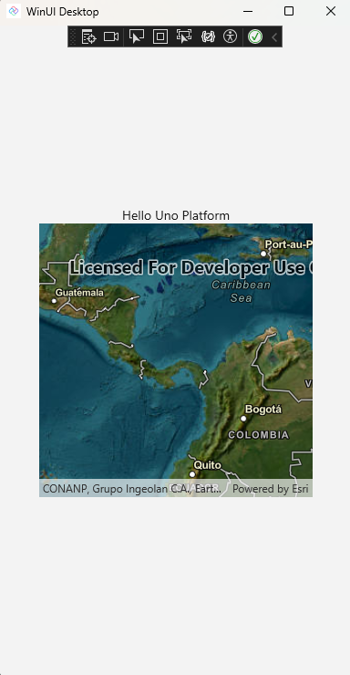

# .NET MAUI Embedding - Esri ArcGIS Maps SDK for .NET

The MapView control, that's part of the ArcGIS Maps SDK for .NET, can be used in an Uno Platform application via .NET MAUI Embedding.

## Sample App

An existing sample app that showcases the controls is available [here](https://github.com/unoplatform/Uno.Samples/tree/master/UI/MauiEmbedding/ArcGisApp).

> [!NOTE]
> For this sample you don't need to have a license, because it's just a demo and for development purposes.
>
> Esri ArcGIS Maps SDK for .NET is currently only compatible with Windows, Android, iOS, and Mac Catalyst when used with Uno Platform at the moment.

## Installation

In order to use the MapView control, you first need to create an account via the [ArcGIS Developers portal](https://developers.arcgis.com/sign-up/), and depending on the use of location services, you may also need an API key. This walkthrough does not require a license or an API key to run.

## Getting Started

### [Visual Studio](#tab/vs)

> [!NOTE]
> If you don't have the **Uno Platform Extension for Visual Studio** installed, follow [these instructions](xref:Uno.GetStarted.vs2022).

- Launch **Visual Studio** and click on **Create new project** on the Start Window. Alternatively, if you're already in Visual Studio, click **New, Project** from the **File** menu.

- Type `Uno Platform` in the search box

- Click **Uno Platform App**, then **Next**

- Name the project `ArcGisApp` and click **Create**

At this point you'll enter the **Uno Platform Template Wizard**, giving you options to customize the generated application.

- Select **Blank** in **Presets** selection

- Select the **Platforms** tab and unselect **Desktop** and **Web Assembly** platforms

- Select the **Features** tab and click on **.NET MAUI Embedding**

- Click **Create** to complete the wizard

The template will create a solution with a single cross-platform project, named `ArcGisApp`, ready to run.

For more information on all the template options, see [Using the Uno Platform Template](xref:Uno.GettingStarted.UsingWizard).

### [Command Line](#tab/cli)

> [!NOTE]
> If you don't have the **Uno Platform dotnet new templates** installed, follow [dotnet new templates for Uno Platform](xref:Uno.GetStarted.dotnet-new).

Create a new application using the `unoapp` template, enabling .NET MAUI Embedding. In this case, we're going to use the Blank template (`-preset blank`) and include .NET MAUI Embedding support (`-maui`).

```bash
dotnet new unoapp -preset blank -maui -platforms "android" -platforms "ios" -platforms "maccatalyst" -platforms "windows" -o ArcGisApp
```

This will create a new folder called **ArcGisApp** containing the new application.

---

## Nuget Packages

Add a reference to the [Esri.ArcGISRuntime.Maui NuGet package](https://www.nuget.org/packages/Esri.ArcGISRuntime.Maui) to the `ArcGisApp.MauiControls` project.

## Updating AppBuilderExtensions

In the `AppBuilderExtensions` class, on `ArcGisApp.MauiControls` project, update the `UseMauiControls` extension method to call the `UseArcGISRuntime` method.

```cs
using Esri.ArcGISRuntime;
using Esri.ArcGISRuntime.Maui;
using Esri.ArcGISRuntime.Security;

namespace ArcGisApp;

public static class AppBuilderExtensions
{
    public static MauiAppBuilder UseMauiControls(this MauiAppBuilder builder) 
        => builder
            .UseArcGISRuntime(
            //config => config
            //    .UseLicense("[Your ArcGIS Maps SDK License key]")
            //    .UseApiKey("[Your ArcGIS location services API Key]")
            //    .ConfigureAuthentication(auth => auth
            //        .UseDefaultChallengeHandler() // Use the default authentication dialog
            //    )
            )
            .ConfigureFonts(fonts =>
            {
                fonts.AddFont("Assets/Fonts/OpenSansRegular.ttf", "OpenSansRegular");
                fonts.AddFont("Assets/Fonts/OpenSansSemibold.ttf", "OpenSansSemibold");
            });
}
```

> [!NOTE]
> If you have a license key and/or a location service API key, uncomment the `delegate` provided on `UseArcGISRuntime` method. This isn't required to run this sample.

## Adding MapView

1. Update the EmbeddedControl.xaml in the `MauiEmbedding.MauiControls` project with the following XAML that includes the `MapView` control.

    ```xml
    <?xml version="1.0" encoding="utf-8" ?>
    <ContentView 
        xmlns="http://schemas.microsoft.com/dotnet/2021/maui"
        xmlns:x="http://schemas.microsoft.com/winfx/2009/xaml"
        xmlns:esriUI="clr-namespace:Esri.ArcGISRuntime.Maui;assembly=Esri.ArcGISRuntime.Maui"
        x:Class="ArcGisApp.MauiControls.EmbeddedControl">
        <Grid>
            <esriUI:MapView x:Name="mapView"
                            HeightRequest="300"
                            WidthRequest="300" />
        </Grid>
    </ContentView>
    ```

1. Update the EmbeddedControl.xaml.cs with the following code

    ```cs
    using Esri.ArcGISRuntime.Geometry;
    using Esri.ArcGISRuntime.Mapping;
    using Map = Esri.ArcGISRuntime.Mapping.Map;

    namespace ArcGisApp.MauiControls;

    public partial class EmbeddedControl : ContentView
    {
        public EmbeddedControl()
        {
            InitializeComponent();

            var myMap = new Map()
            {
                InitialViewpoint = new Viewpoint(new Envelope(-180, -85, 180, 85, SpatialReferences.Wgs84)),
                Basemap = new Basemap(new Uri("https://arcgis.com/home/item.html?id=86265e5a4bbb4187a59719cf134e0018"))
            };

            // Assign the map to the MapView.
            mapView.Map = myMap;
        }
    }
    ```

1. Now the project is good to go! Press F5 and should see the MapView control running on your application.
   For more detailed instructions specific to each platform, refer to the [Debug the App](xref:Uno.GettingStarted.CreateAnApp.VS2022#debug-the-app) documentation.

## App Render Output

- **Android:**

    

- **iOS:**

    

- **Mac Catalyst:**

    

- **Windows:**

    
