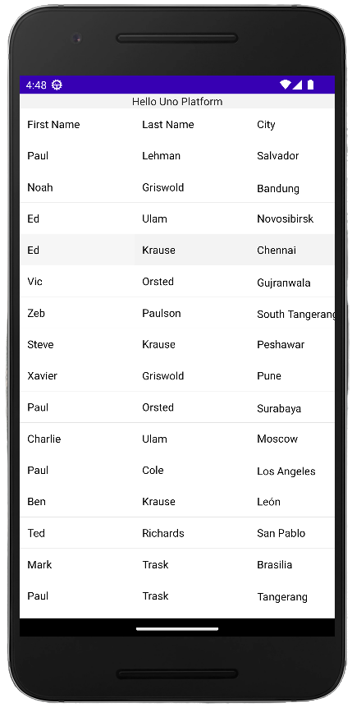

# .NET MAUI Embedding - GrapeCity ComponentOne .NET MAUI Controls

The FlexGrid and Calendar in the ComponentOne .NET MAUI Controls can be used in an Uno Platform application via .NET MAUI Embedding.

## Sample App

An existing sample app that showcases the controls is available [here](https://github.com/unoplatform/Uno.Samples/tree/master/UI/MauiEmbedding/GrapeCityApp).

## Installation

In order to use the ComponentOne controls, you first need to install the ComponentOne ControlPanel following [these instructions](https://www.grapecity.com/componentone/docs/maui/online-maui/get-started.html).

## Getting Started

1. Create a new application using the `unoapp` template, enabling .NET MAUI Embedding. In this case, we're going to use the Blank template (`-preset blank`) and include .NET MAUI Embedding support (`-maui`).

    ```dotnetcli
    dotnet new unoapp -preset blank -maui -o MauiEmbeddingApp
    ```

1. Remove the `net8.0` target framework from both the MauiEmbeddingApp and MauiEmbeddingApp.MauiControls projects.  GrapeCity doesn't provide reference assemblies for `net8.0`, so the `net8.0` target framework needs to be removed to avoid build errors.

1. Next, add a reference to the C1 .NET MAUI NuGet packages to the MauiEmbeddingApp.MauiControls project. If you want to use the FlexGrid control, add a reference to [`C1.Maui.Grid`](https://www.nuget.org/packages/C1.Maui.Grid). If you want to use the Calendar control, add a reference to [`C1.Maui.Calendar`](https://www.nuget.org/packages/C1.Maui.Calendar).

1. In the `AppBuilderExtensions` class, update the `UseMauiControls` extension method to call either, or both, the `RegisterFlexGridControls` or `RegisterCalendarControls` methods.

    ```cs
    using C1.Maui.Grid;
    using C1.Maui.Calendar;

    namespace MauiEmbeddingApp;

    public static class AppBuilderExtensions
    {
      public static MauiAppBuilder UseMauiControls(this MauiAppBuilder builder)
        => builder
                .RegisterFlexGridControls()
                .RegisterCalendarControls()
                .ConfigureFonts(fonts =>
                {
                    fonts.AddFont("MauiEmbeddingApp/Assets/Fonts/OpenSansRegular.ttf", "OpenSansRegular");
                    fonts.AddFont("MauiEmbeddingApp/Assets/Fonts/OpenSansSemibold.ttf", "OpenSansSemibold");
                });
    }
    ```

## Adding FlexGrid

1. Follow the [FlexGrid Quick Start](https://www.grapecity.com/componentone/docs/maui/online-maui/flexgrid-quickstart.html) to apply XAML to the EmbeddedControl.xaml and C# code to the EmbeddedControl.xaml.cs (in the constructor).

1. Add Customer class (see https://www.grapecity.com/componentone/docs/maui/online-maui/customerclass.html).

1. Wrap content in `ScrollViewer` on the `MainPage` of the Uno Platform application to make sure the full `FlexGrid` and other controls can be scrolled into the view.

### App Render Output

- **Android:**
  - 

- **Windows:**
  - 

## Adding Calendar

1. Follow the [Calendar Quick Start](https://www.grapecity.com/componentone/docs/maui/online-maui/calendarquickstart.html) to apply XAML to the EmbeddedControl.xaml.

1. In order for the Calendar control to render correctly on all platforms you should set both `HeightRequest` and `WidthRequest` attributes on the Calendar control.

### App Render Output

- **Android:**
  - 

- **Windows:**
  - 
