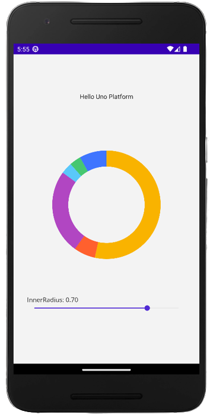

# .NET MAUI Embedding - Grial UI Kit

The controls from Grial UI Kit can be used in an Uno Platform application via .NET MAUI Embedding. 

## Sample App

An existing sample app that showcases the controls is available [here](https://github.com/unoplatform/Uno.Samples/tree/master/UI/MauiEmbedding/GrialKitApp).

> [!NOTE]
 > GrialKit SDK for .NET is currently only compatible with Android and iOS when used with Uno Platform at the moment.

## Installation

In order to use the Grial UI Kit controls, you first need to [sign up](https://admin.grialkit.com/secure/grial/front/signup). 

After signing up, when you log in to the [admin portal](https://admin.grialkit.com), you'll be prompted to create a Grial app by entering the name of the application. Once you've created the Grial app, go to the Download tab and select `Download Kickoff Solution` - at this point, you'll be prompted to purchase a license, which you'll need in order to proceed with using Grial.

Extract the downloaded zip file and locate the GrialLicense file. We'll add this file to the Uno application. Also in the zip file, open the csproj file and retrieve the ApplicationTitle and ApplicationId property values.

```xml
<!-- Display name -->
<ApplicationTitle>[ApplicationTitle]</ApplicationTitle>
<!-- App Identifier -->
<ApplicationId>[ApplicationId]</ApplicationId>
```
The last thing we'll need from the zip file is the nuget.config file. This file will also be added to the Uno application.


## Getting Started

### [Visual Studio](#tab/vs)

 > [!NOTE]
 > If you don't have the **Uno Platform Extension for Visual Studio** installed, follow [these instructions](xref:Uno.GetStarted.vs2022).
 - Launch **Visual Studio** and click on **Create new project** on the Start Window. Alternatively, if you're already in Visual Studio, click **New, Project** from the **File** menu.

 - Type `Uno Platform` in the search box

 - Click **Uno Platform App**, then **Next**

 - Name the project `GrialKitApp` and click **Create**

 At this point you'll enter the **Uno Platform Template Wizard**, giving you options to customize the generated application.

 - Select **Blank** in **Presets** selection

 - Select the **Platforms** tab and unselect **Desktop**, **Windows**, **MacOS** and **Web Assembly** platforms

 - Select the **Features** tab and click on **.NET MAUI Embedding**

 - Click **Create** to complete the wizard

 The template will create a solution with a single cross-platform project, named `GrialKitApp`, ready to run.

 For more information on all the template options, see [Using the Uno Platform Template](xref:Uno.GettingStarted.UsingWizard).

 ### [Command Line](#tab/cli)

 > [!NOTE]
 > If you don't have the **Uno Platform dotnet new templates** installed, follow [dotnet new templates for Uno Platform](xref:Uno.GetStarted.dotnet-new).
 Create a new application using the `unoapp` template, enabling .NET MAUI Embedding. In this case, we're going to use the Blank template (`-preset blank`) and include .NET MAUI Embedding support (`-maui`).

 ```bash
 dotnet new unoapp -preset blank -maui -platforms "android" -platforms "ios" -o GrialKitApp
 ```

 This will create a new folder called **GrialKitApp** containing the new application.

 ---

1. Add the `GrialLicense` file to the GrialKitApp.MauiControls project as an `EmbeddedResource`

```csharp
  <!--<ItemGroup Condition=" Exists('GrialLicense') ">
    <None Remove="GrialLicense" />
    <EmbeddedResource Include="GrialLicense" />
  </ItemGroup>-->
```

2. Add the nuget.config file to the solution folder and make sure that the `packageSourceCredentials` section includes username and password. If you're missing credentials, go to the [profile page](https://admin.grialkit.com/secure/grial/front/profile) in the admin portal and click on the Nuget tab where you can create credentials for your account.

```xml
<?xml version="1.0" encoding="utf-8"?>
<configuration>
  <packageSourceCredentials>
    <UXDivers>
      <add key="Username" value="[username]" />
      <add key="ClearTextPassword" value="[password]" />
    </UXDivers>
  </packageSourceCredentials>
  <packageSources>
    <clear />
    <add key="nuget.org" value="https://api.nuget.org/v3/index.json" />
    <add key="UXDivers" value="https://nuget.uxdivers.com/grial" />
  </packageSources>
</configuration>
```

3. In the project file (csproj) for GrialKitApp.Mobile update the `ApplicationTitle` and `ApplicationId` properties with those retrieved earlier from the zip file.

4. Expand out the GrailKitApp project and locate the Main.Android.cs file under `Platforms/Android`. Change the Label property of the ApplicationAttribute from `@string/ApplicationName` to the ApplicationTitle retrieved earlier from the zip file.

```cs
[global::Android.App.ApplicationAttribute(
    Label = "ApplicationTitle",
    Icon = "@mipmap/iconapp",
    LargeHeap = true,
    HardwareAccelerated = true,
    Theme = "@style/AppTheme"
)]
public class Application : Microsoft.UI.Xaml.NativeApplication
```

5. Add a reference to the UXDivers.GrialMaui NuGet packages to the GrialKitApp.MauiControls project.  

6. In the `AppBuilderExtensions` class, update the `UseMauiControls` extension method to call the `GrialKit.Init` and `UseGrial` methods.  

```cs
using UXDivers.Grial;

namespace GrialKitApp;

public static class AppBuilderExtensions
{
    public static MauiAppBuilder UseMauiControls(this MauiAppBuilder builder)
    {
#if __IOS__
        var theme = new ThemeColorsBase(new Dictionary<string, Color>
        {
                { "AccentColor", Color.FromArgb("#FF3F75FF") }
        });

        GrialKit.Init(theme, "GrialKitApp.MauiControls.GrialLicense");
#else
        GrialKit.Init("GrialKitApp.MauiControls.GrialLicense");
#endif
        return builder
            .UseGrial()
            .ConfigureFonts(fonts =>
            {
                fonts.AddFont("Assets/Fonts/OpenSansRegular.ttf", "OpenSansRegular");
                fonts.AddFont("Assets/Fonts/OpenSansSemibold.ttf", "OpenSansSemibold");
            });
    }
}
```

## Adding a PieChart

The PieChart is one of many controls that's available in the Grial UI Kit. More information about the PieChart and other controls is available in the [Grial UI Kit Documentation](https://docs.grialkit.com/charts/pie-chart)

1. Update the EmbeddedControl.xaml in the `MauiEmbedding.MauiControls` project with the following XAML that includes the PieChart

```xml
<?xml version="1.0" encoding="utf-8" ?>
<ContentView xmlns="http://schemas.microsoft.com/dotnet/2021/maui"
             xmlns:x="http://schemas.microsoft.com/winfx/2009/xaml"
             xmlns:toolkit="http://schemas.microsoft.com/dotnet/2022/maui/toolkit"
             xmlns:grial="http://uxdivers.com/grial"
             x:Class="GrialKitApp.MauiControls.EmbeddedControl"
             HorizontalOptions="Fill"
             VerticalOptions="Fill">
  <ContentPage.Resources>
    <grial:ChartTheme x:Key="PieTheme">
      <SolidColorBrush Color="#F9B300" />
      <SolidColorBrush Color="#FF602E" />
      <SolidColorBrush Color="#B146C2" />
      <SolidColorBrush Color="#5AC8FA" />
      <SolidColorBrush Color="#46C771" />
      <SolidColorBrush Color="#3F75FF" />
    </grial:ChartTheme>
  </ContentPage.Resources>

  <VerticalStackLayout Padding="30">
    <grial:PieChart x:Name="chart"
                    HeightRequest="400"
                    BackgroundColor="Transparent"
                    IsAnimated="False"
                    LabelFontColor="DimGray"
                    LabelFontSize="12"
                    StrokeSize="0"
                    Theme="{ StaticResource PieTheme }">
      <grial:PieSeries InnerRadius="{ Binding Value, Source={x:Reference radius} }"
                       ItemsSource="{ Binding . }"
                       Radius="120"
                       ValuePath="Value" />
      </grial:PieChart>

    <Label Text="{Binding Value, Source={x:Reference radius}, StringFormat='InnerRadius: {0:F2}'}" />

    <Slider Maximum=".9"
            Minimum="0"
            Value="0.8"
            x:Name="radius" />
	</VerticalStackLayout>
</ContentView>
```

2. Update the EmbeddedControl.xaml.cs with the following code that sets the `BindingContext` for the chart (the PieChart) to be a basic set of data. 

```cs
namespace GrialKitApp.MauiControls;

public partial class EmbeddedControl : ContentView
{
    public EmbeddedControl()
    {
        InitializeComponent();

        chart.BindingContext = new[]
        {
          new {
            Value = 521.02,
          },
          new {
            Value = 62.56,
          },
          new {
            Value = 245.52,
          },
          new {
            Value = 33.26,
          },
          new {
            Value = 33.26,
          },
          new {
            Value = 78.95,
          }
       };
    }
}
```
3. Now the project is good to go! Press F5 and should see the PieChart control running on your application.
   For more detailed instructions specific to each platform, refer to the [Debug the App](xref:Uno.GettingStarted.CreateAnApp.VS2022#debug-the-app) documentation.

**App Render Output**

- **Android:**
  - 

- **iOS:**
  - 
