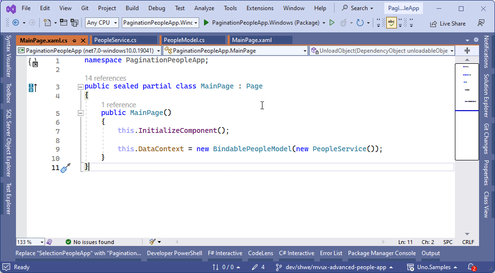
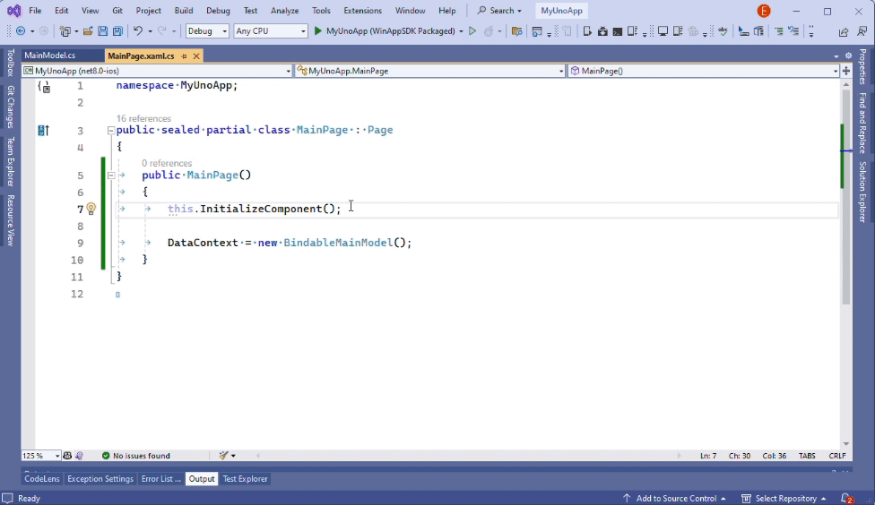
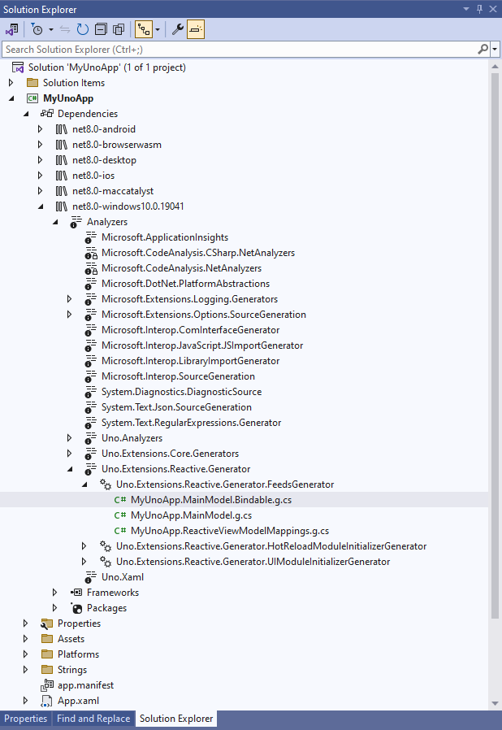

# Inspecting the generated code

MVUX makes extensive use of code generation. It's used to generate ViewModels for models, entities, and commands.
Inspecting the generated code can give you a lot of insight into how the ViewModels work under the hood as well as how MVUX operates behind the scenes.

Using Visual Studio, viewing the generated code can be achieved in several ways:

1. Placing the cursor on the class name and hitting <kbd>F12</kbd>:

    

1. Hitting <kbd>Ctrl</kbd>+<kbd>T</kbd> and typing in the ViewModel type name:

    

1. Navigating to the project's analyzers:

    This method can also be used to inspect all code generated by MVUX and even other code generators.

    1. Expand the project's *Dependencies* object.
    2. Expand the current target platform (e.g. *net8.0windows10.0...*).
    3. Expand the *Analyzers* sub menu and then *Uno.Extensions.Reactive.Generator*.
    4. Under *Uno.Extensions.Reactive.Generator.FeedsGenerator* you'll find the generated ViewModel types.

    
