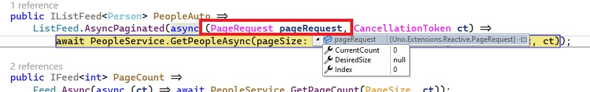

# Pagination

There are several ways to paginate data.

> [!NOTE]
> The source code for the sample app demonstrated in this section can be found [here](https://github.com/unoplatform/Uno.Samples/tree/master/UI/MvuxHowTos/PaginationPeopleApp).

## Incremental loading

The easiest and most straight-forward is to use the built-in incremental loading functionality that some controls (e.g. `ListView`, `GridView`) offer via the [`ISupportIncrementalLoading`](https://learn.microsoft.com/uwp/api/windows.ui.xaml.data.isupportincrementalloading) interface the paginated Feed implements.

For the Pagination example, we'll also use the *PeopleApp* example used above in [Selection](xref:Uno.Extensions.Mvux.Advanced.Selection), but you can find the full code [here](https://github.com/unoplatform/Uno.Samples/tree/master/UI/MvuxHowTos/PaginationPeopleApp).

### Service

Let's change the `GetPeopleAsync` method in the *PeopleService.cs* file to support pagination:

```csharp
namespace PaginationPeopleApp;

public partial record Person(int Id, string FirstName, string LastName);

public interface IPeopleService
{
    ValueTask<IImmutableList<Person>> GetPeopleAsync(uint pageSize, uint firstItemIndex, CancellationToken ct);
}

public class PeopleService : IPeopleService
{
    public async ValueTask<IImmutableList<Person>> GetPeopleAsync(uint pageSize, uint firstItemIndex, CancellationToken ct)
    {
        // convert to int for use with LINQ
        var (size, count) = ((int)pageSize, (int)firstItemIndex);

        // fake delay to simulate loading data
        await Task.Delay(TimeSpan.FromSeconds(1), ct);

        // this is where we would asynchronously load actual data from a remote data store
        var people = GetPeople();

        return people
            .Skip(count)
            .Take(size)
            .ToImmutableList();
    }

    private Person[] GetPeople() =>
        new Person[]
        {
            new(1, "Liam", "Wilson"),
            new(2, "Emma", "Murphy"),
            new(3, "Noah", "Jones"),
            new(4, "Olivia", "Harris"),
            new(5, "William", "Jackson"),
            /* ... more names ... */
        }
    }
}
```

> [!NOTE]
> You will find unsigned integers (`uint`) used in the context of Pagination as unsigned integers do not allow negative values and prevent them in the first place.

### Model

```csharp
public partial record PeopleModel(IPeopleService PeopleService)
{
    const uint DefaultPageSize = 20;

    public IListFeed<Person> PeopleAuto =>
        ListFeed.AsyncPaginated(async (PageRequest pageRequest, CancellationToken ct) =>
            await PeopleService.GetPeopleAsync(pageSize: pageRequest.DesiredSize ?? DefaultPageSize, firstItemIndex: pageRequest.CurrentCount, ct));
}
```

The `AsyncPaginated` method generates a `ListFeed` that supports pagination.

Whenever the user scrolls down to see additional data and is hitting the end of the collection displayed in a `ListView`, the pagination List-Feed is automatically triggered with a page request.
The parameter of `AsyncPaginated`, is a delegate taking in a [`PageRequest`](#the-pagerequest-type) value and a `CancellationToken` and returning an `IListFeed<T>` where `T` is `Person` in our case. This delegate is invoked when a page request comes in.

Inside this callback, we call the service by providing it with the following parameters:

- `pageSize`: the page size the `ListView` expects being able to display on the first page, which is received via the `DesiredSize` property of the `PageRequest`. This property is a nullable uint, and is null on the first call, as by the time of the first call the UI is initializing the data-binding and there's no data present yet to determine the number of items the UI should place in the space. On the first call, we'll instead use the constant value `DefaultPageSize` which is set to `20`.
- `firstItemIndex:` The index of the first item on the requested page. We use the current count (which is one-based) as the next one's index (which is zero-based).

### View

```xml
<Page
    x:Class="PaginationPeopleApp.MainPage"
    xmlns="http://schemas.microsoft.com/winfx/2006/xaml/presentation"
    xmlns:x="http://schemas.microsoft.com/winfx/2006/xaml"
    xmlns:local="using:PaginationPeopleApp"
    xmlns:mvux="using:Uno.Extensions.Reactive.UI">

    <Page.Resources>
        <DataTemplate x:Key="PersonDataTemplate" x:DataType="local:Person">
            <StackPanel Orientation="Horizontal" Spacing="2">
                <TextBlock Text="{x:Bind Id}"/>
                <TextBlock Text="{x:Bind FirstName}"/>
                <TextBlock Text="{x:Bind LastName}"/>
            </StackPanel>
        </DataTemplate>
    </Page.Resources>

    <ListView ItemsSource="{Binding PeopleAuto}" ItemTemplate="{StaticResource PersonDataTemplate}" />
</Page>
```

In addition, make sure the `DataContext` of the `Page` is set to the generated ViewModel called `PeopleViewModel` (*MainPage.xaml.cs*):

```csharp
public MainPage()
{
    this.InitializeComponent();

    this.DataContext = new PeopleViewModel(new PeopleService());
}
```

> [!TIP]
> You can inspect the generated code by either placing the cursor on the word `PeopleViewModel` and hitting <kbd>F12</kbd>, see other ways to inspect the generated code [here](xref:Uno.Extensions.Mvux.Advanced.InspectGeneratedCode).

As you can see, there's nothing special in the XAML code as MVUX is taking advantage of the tools already implemented with the `ListView`.

- When the page load, the first 20 items are loaded (after a delay of one second - as simulated in the service).
- If there's available space in the `ListView`, the next batch of 20 items will be requested from the Feed and loaded from the service thereafter.
- When the user scrolls down and hits the bottom of the `ListView`, the next 20 items will be requested.
- This behavior will follow as the user scrolls down and chases the service for more data until all items have been loaded.

Here's what the app renders like:


> [!NOTE]
> The source code for the sample app demonstrated in this section can be found [here](https://github.com/unoplatform/Uno.Samples/tree/master/UI/MvuxHowTos/PaginationPeopleApp).

## Offset pagination

Offset pagination is controlled via a State that stores the current page index in the Model, and the List-Feed depending on it, using [the `Select` operator](xref:Uno.Extensions.Reactive.Feed#select).
When the user requests a new page, the current page index state is updated, thereby updating the dependent collection List-Feed.

Using the example started in [incremental loading above](#incremental-loading), we'll add another method to the service, which will disclose to the View how many items are there in total. Getting a count of items is more efficient than enumerating all entries. This is necessary to identify the total number of pages we have.

### Service

Here are the methods added to the service (*PeopleService.cs*):

```csharp
public IFeed<uint> PageCount =>
    Feed.Async(async (ct) => await PeopleService.GetPageCount(DefaultPageSize, ct));
```

The signature of `GetPageCount` should also be added to the `IPeopleService` interface:

```csharp
ValueTask<uint> GetPageCount(uint pageSize, CancellationToken ct);
```

### Model

Let's expand the Model with the following:

```csharp
public partial record PeopleModel(IPeopleService PeopleService)
{
    public IListFeed<Person> PeopleAuto ...// will not be used in this example

    public IFeed<uint> PageCount =>
        Feed.Async(async (ct) => await PeopleService.GetPageCount(DefaultPageSize, ct));

    public IState<uint> CurrentPage => State.Value(this, () => 1u);

    public IListFeed<Person> PeopleManual =>
        CurrentPage
        .SelectAsync(async (currentPage, ct) =>
            await PeopleService.GetPeopleAsync(
                pageSize: DefaultPageSize,
                // currentPage argument as index based - subtracting 1
                firstItemIndex: (currentPage - 1) * DefaultPageSize, ct))
        .AsListFeed();
}
```

`PeopleManual` is a Feed that reacts to changes in the `CurrentPage` property and projects the current page data according to its number.
To accomplish this, the [`SelectAsync` operator](xref:Uno.Extensions.Reactive.Feed#selectasync) of Feeds is used.
The callback of this operator calls the service's `GetPeopleAsync` with the following arguments:

- `pageSize`: As with the [automatic incremental loading](#incremental-loading) example above we're passing the size of each page, except this time we are manually setting the page size to an arbitrary number via the `DefaultPageSize` constant, which is set to `20`.
- `firstItemIndex`: To get the first item of the next page, the currentPage argument of the `SelectAsync` callback is subtracted with one, to make it zero-based, then multiplied by the page size (20), for the service to return the 20 `Person` objects starting at the index provided with this parameter.

### View

Replace the `ListView` from the previous example with this one:

```xml
<ListView ItemsSource="{Binding PeopleManual}"
          ItemTemplate="{StaticResource PersonDataTemplate}">

    <ListView.Footer>
        <NumberBox
            HorizontalAlignment="Center"
            Header="Current page:"
            Minimum="1"
            Maximum="{Binding PageCount}"
            SpinButtonPlacementMode="Inline"
            Value="{Binding CurrentPage, Mode=TwoWay}"/>
    </ListView.Footer>
</ListView>
```

The `ListView`'s footer contains a `NumberBox` which increments/decrements the `CurrentPage` State it's bound to, via its `Value` property. The `Maximum` property is bound to `PageCount`, to disable navigating to a page that does not exist.
It's then propagated to the `PeopleManual` property as explained [above](#model).

When running the app, the `NumberBox` will be displayed and set with the first page:


When running the app, the first page will be loaded and await the users input to navigate to other pages which will be loaded on-demand:


### The `PageRequest` type

The [`PageRequest`](https://github.com/unoplatform/uno.extensions/blob/main/src/Uno.Extensions.Reactive/Sources/PageRequest.cs) type contains the following properties and is used by a paginated Feed to pass information about the desired page the user wants to navigate to. It's the first parameter passed into the `PaginatedAsync` method when invoked:



Its properties are:

|Property|Description|
|---|---|
|Index|The index of the page to be loaded.|
|CurrentCount|This is the total number of items currently on the list.|
|DesiredSize|The desired number of items for the current page, if any.<br/><br/>This is the desired number of items that the view requested to load.<br/>It's expected to be null only for the first page.<br/>Be aware that this might change between pages (especially if the user resizes the window), Do NOT use in `source.Skip(page.Index * page.DesiredSize).Take(page.DesiredSize)`.<br/>Prefer to use the `CurrentCount` property, e.g. `source.Skip(page.CurrentCount).Take(page.DesiredSize)`.|

## Keyset pagination with a cursor

[Jump to example](#service)

There are several caveats in using `Skip` and `Take` (Offset pagination) with an arbitrary page size multiplied by the page number.

- When we skip data records, the database might still have to process some of the skipped records on its way to the desired ones.
- If any updates have been applied to the records preceding the currently displayed page, and then the user moves to the next or previous page, there might be inconsistencies in showing the subsequent data, some of the entries might be skipped or shown twice.

An alternative way to paginate data is by using a cursor that points to a specific record and takes the number of desired records in a page onwards.
This is referred to as 'keyset pagination' or 'seek-based pagination'.

To utilize this pagination style, MVUX provides another `ListFeed` factory overload, the `AsyncPaginatedByCursor`.

The signature of this method is:

```csharp
public static IListFeed<T> AsyncPaginatedByCursor<TCursor>(TCursor firstPage, GetPage<TCursor, T> getPage)
```

where the `GetPage` type is a delegate with the following pattern:

```csharp
public delegate ValueTask<PageResult<TCursor, TItem>> GetPage<TCursor, TItem>(TCursor cursor, uint? desiredPageSize, CancellationToken ct);
```

The callback delegate takes two parameters and returns two.

The two input parameters are:

- A cursor to the first page, in other words, the item this page starts with. The service then starts by ordering the data and searching for the first item, then uses the second parameter:
- The desired page size, the number of entries following it, along with another entity that uses as the cursor of the next page, which is not displayed to the user.
- A `CancallationToken` which can be used to abort the operation.

The callback returns a `PageResult<TCursor, TItem>`, and it contains:

- An `ImmutableList<T>` containing the items to be displayed on the resulting page.
- A `TCursor` that can be of a different type that points to the beginning of the upcoming page.

To demonstrate this we'll stick to the *PaginatedPeopleApp* we've started before.

### Service

To keep the service agnostic, we'll add the following method to the Service:

*IPeopleService*:

```csharp
ValueTask<(IImmutableList<Person> CurrentPage, int? NextPersonIdCursor)> GetPeopleAsync(int? personIdCursor, uint pageSize, CancellationToken ct);
```

This method has 3 parameters:

- The first is an `int?` which uses as a cursor to the first page, i.e. the first `Person.Id` to appear as the first item of the requested page.
- The second is a `uint` representing the number of entities to follow the first one. The reason for using a `uint` is that negative values are not expected here.
- The third one is a `CancellationToken` which can be used to signal the service to abort loading data.

The method returns a tuple with two components (same as `PageResult`, only keeping the service agnostic of MVUX):

- An `IImmutableList<Person>` which includes the entities of this page
- An `int?` which uses as a cursor to the beginning of the next page, if any.

> [!TIP]
> The cursor does not necessarily have to be an `int?` or the data type the collection contains, it can also be another key of an entity for the service to look up and return it along with its upcoming entries.

The fully implemented method in the service is as follows:

```csharp
public async ValueTask<(IImmutableList<Person> CurrentPage, int? NextPersonIdCursor)> GetPeopleAsync(int? personIdCursor, uint pageSize, CancellationToken ct)
{
    // fake delay to simulate loading data
    await Task.Delay(TimeSpan.FromSeconds(1), ct);

    var people = GetPeople();

    var collection = people
        // select only subsequent items
        .Where(person => person.Id >= personIdCursor.GetValueOrDefault())
        // take only n number of rows, plus the first entity of the next page
        .Take((int)pageSize + 1)
        // using array to enable range access
        .ToArray();

    // determine if there's another page ahead
    var noMoreItems = collection.Length <= pageSize;

    // use the last item as the cursor of the next page, if it exceeds the page size
    var lastIndex = noMoreItems ? ^0 : ^1;
    var nextPersonIdCursor = noMoreItems ? default(int?) : collection[^1].Id;

    // this returns a tuple of two elements
    // first element is the current page's entities except the last
    // the second contains the last item in the collection, which is a cursor for the next page
    return (CurrentPage: collection[..lastIndex].ToImmutableList(), NextPersonIdCursor: nextPersonIdCursor);
}
```

### Model

```csharp
public IListFeed<Person> PeopleCursor =>
    ListFeed<Person>.AsyncPaginatedByCursor(
        // starting with a blank Person, since the person list is to be ordered by name, any valid name will follow.
        firstPage: default(int?),
        // this will be automatically invoked by the ISupportIncrementalLoading the ListView supports
        getPage: async (cursor, desiredPageSize, ct) =>
        {
            var result = await PeopleService.GetPeopleAsync(cursor, desiredPageSize ?? DefaultPageSize, ct);
            return new PageResult<int?, Person>(result.CurrentPage, result.NextPersonIdCursor);
        });
```

### View

There's not much needed in the View as this is magically working via the `ISupportIncrementalLoading` interface implemented with the `ListView`!

```xml
<ListView ItemsSource="{Binding PeopleCursor}" ItemTemplate="{StaticResource PersonDataTemplate}" />
```

When the program runs, it works as it did in auto incremental loading, it's just the underlying pagination technique that's different:


