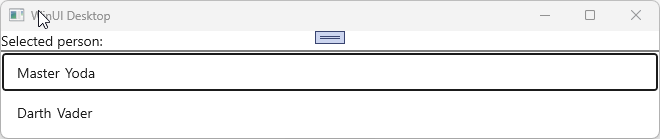

# Selection

MVUX has built-in support for both [single item](#single-item-selection) and [multi-item selection](#multi-item-selection).
Any control that inherits [`Selector`](https://learn.microsoft.com/windows/windows-app-sdk/api/winrt/microsoft.ui.xaml.controls.primitives.selector) (e.g. [`ListView`](https://learn.microsoft.com/windows/windows-app-sdk/api/winrt/microsoft.ui.xaml.controls.listview), [`GridView`](https://learn.microsoft.com/windows/windows-app-sdk/api/winrt/microsoft.ui.xaml.controls.gridview), [`ComboBox`](https://learn.microsoft.com/windows/windows-app-sdk/api/winrt/microsoft.ui.xaml.controls.combobox), [`FlipView`](https://learn.microsoft.com/windows/windows-app-sdk/api/winrt/microsoft.ui.xaml.controls.flipview)), has automatic support for updating a List-State with its current selection.
Binding to the `SelectedItem` property is not even required, as this works automatically.

To synchronize to the selected value in the `Model` side, use the `Selection` operator of the `IListFeed`.

## Recap of the *PeopleApp* example

We'll be using the *PeopleApp* example which we've built step-by-step in [this tutorial](xref:Uno.Extensions.Mvux.HowToListFeed).

The *PeopleApp* uses an `IListFeed<T>` where `T` is a `Person` [record](https://learn.microsoft.com/dotnet/csharp/language-reference/builtin-types/record) with the properties `FirstName` and `LastName`.
It has a service that has the following contract:

```csharp
public interface IPeopleService
{
    ValueTask<IImmutableList<Person>> GetPeopleAsync(CancellationToken ct);
}
```

It is then used by the `PeopleModel` class which requests the service using a List-Feed.

```csharp
public partial record PeopleModel(IPeopleService PeopleService)
{
    public IListFeed<Person> People => ListFeed.Async(PeopleService.GetPeopleAsync);
}
```

The data is then displayed on the View using a `ListView`:

```xml
<Page ...>
    <ListView ItemsSource="{Binding People}">
        <ListView.ItemTemplate>
            <DataTemplate>
                <StackPanel Orientation="Horizontal" Spacing="5">
                    <TextBlock Text="{Binding FirstName}"/>
                    <TextBlock Text="{Binding LastName}"/>
                </StackPanel>
            </DataTemplate>
        </ListView.ItemTemplate>
    </ListView>
</Page>
```

> [!NOTE]
> The use of the `FeedView` is not necessary in our example, hence the `ListView` has been extracted from it, and its `ItemsSource` property has been directly data-bound to the Feed.

### Implement selection in the *PeopleApp*

MVUX has two extension methods of `IListFeed<T>`, that enable single or multi-selection.

> [!NOTE]
> The source code for the sample app demonstrated in this section can be found on [GitHub](https://github.com/unoplatform/Uno.Samples/tree/master/UI/MvuxHowTos/SelectionPeopleApp).

## Single-item selection

A Feed doesn't store any state, so the `People` property won't be able to hold any information, nor the currently selected item.
To enable storing the selected value in the model, we'll create an `IState<Person>` which will be updated by the `Selection` operator of the `IListFeed<T>` (it's an extension method).

Let's change the `PeopleModel` as follows:

```csharp
public partial record PeopleModel(IPeopleService PeopleService)
{
    public IListFeed<Person> People =>
        ListFeed
        .Async(PeopleService.GetPeopleAsync)
        .Selection(SelectedPerson);

    public IState<Person> SelectedPerson => State<Person>.Empty(this);
}
```

The `SelectedPerson` State is initialized with an empty value using `State<Person>.Empty(this)` (we still need a reference to the current instance to enable caching).

> [!NOTE]
> Read [this](xref:Uno.Extensions.Mvux.States#other-ways-to-create-feeds) to learn more about States and the `Empty` factory method.

The `Selection` operator was added to the existing `ListFeed.Async(...)` line, it will listen to the `People` List-Feed and will affect its selection changes onto the `SelectedPerson` State property.

In the View side, wrap the `ListView` element in a `Grid`, and insert additional elements to display the currently selected value via the `SelectedPerson` State.
We'll also add a separator (using `Border`) to be able to distinguish them.

The View code shall look like the following:

```xml
<Page ...>

    <Grid>
        <Grid.RowDefinitions>
            <RowDefinition Height="Auto"/>
            <RowDefinition Height="Auto"/>
            <RowDefinition Height="*"/>
        </Grid.RowDefinitions>

        <StackPanel DataContext="{Binding SelectedPerson}" Orientation="Horizontal" Spacing="5">
            <TextBlock Text="Selected person:" />
            <TextBlock Text="{Binding FirstName}"/>
            <TextBlock Text="{Binding LastName}"/>
        </StackPanel>

        <Border Height="2" Background="Gray" Grid.Row="1" />

        <ListView Grid.Row="2" ItemsSource="{Binding People}">
    </Grid>
</Page>
```

When running the app, the top section will reflect the item the user selects in the `ListView`:



> [!NOTE]
> The source code for the sample app can be found [GitHub](https://github.com/unoplatform/Uno.Samples/tree/master/UI/MvuxHowTos/SelectionPeopleApp).

### Listening to the selected value

You can listen and detect selection changes by either creating a feed that projects the selection with the `Select` operator or by subscribing to the selection feed using the `ForEach` operator.

#### Using the Select operator

Using the example above, we can project the `SelectedPerson` property to project or transform the current `Person`, using the `SelectedPerson`'s [`Where`](xref:Uno.Extensions.Reactive.Feed#where) and [`Select`](xref:Uno.Extensions.Reactive.Feed#select) operators.

```csharp
public IFeed<string> GreetingSelect => SelectedPerson.Select(person => person == null ? string.Empty : $"Hello {person.FirstName} {person.LastName}!");
```

A `TextBlock` can then be added in the UI to display the selected value:

```xml
<TextBlock Text="{Binding GreetingSelect}"/>
```

#### Using the ForEach operator

Selection can also be propagated manually to a State using the [`ForEach`](xref:Uno.Extensions.Reactive.State#foreach) operator.
First, we need to create a State with a default value, which will be used to store the processed value once a selection has occurred.

```csharp
public IState<string> GreetingForSelectedPerson => State.Value(this, () => string.Empty);
```

In the constructor, we can then subscribe to the value in the following manner:

```csharp
public partial record PeopleModel
{
    private IPeopleService _peopleService;

    public PeopleModel(IPeopleService peopleService)
    {
        _peopleService = peopleService;

        SelectedPerson.ForEach(action: SelectionChanged);
    }

    ...

    public async ValueTask SelectionChanged(Person? selectedPerson, CancellationToken ct)
    {
        if (selectedPerson == null)
            return;

        await GreetingForSelectedPerson.Set($"Hello {selectedPerson.FirstName} {selectedPerson.LastName}!", ct);
    }
}
```

The `ForEach` operator listens to a selection occurrence and invokes the `SelectionChanged` callback with the newly available data, in this case, the recently selected `Person` entity.

> [!TIP]
> MVUX takes care of the lifetime of the subscription, so it will be disposed of along with its declaring `Model` being garbage-collected.

#### On-demand using a Command parameter

Another option is using a `Button` which when clicked, invokes a command which checks the current selection, this can be achieved via its parameters:

```csharp
public ValueTask CheckSelection(Person selectedPerson)
{
    // selectedPerson points to the recent selection
}
```

In the above example, since `selectedPerson` has the same name as the `SelectedPerson` feed, it will be automatically evaluated and provided as a parameter on the command execution.

> [!TIP]
> This behavior can also be controlled using attributes.
> To learn more about commands and how they can be configured using attributes, refer to the [Commands](xref:Uno.Extensions.Mvux.Advanced.Commands) page.

## Multi-item selection

The `Selection` operator has another overload that enables selecting multiple items. An `IListState<Person>` is needed for multi-selection instead of the `IState<Person>` used above.

In the `PeopleModel`, we'll modify the `SelectedPerson` property to look like the following:

```csharp
public IState<IImmutableList<Person>> SelectedPeople => State<IImmutableList<Person>>.Empty(this);
```

Then change `.Selection(SelectedPerson)` to `.Selection(SelectedPeople)`.

This is what's changed in the PeopleModel class:

```csharp
public partial record PeopleModel(IPeopleService PeopleService)
{
    public IListFeed<Person> People =>
        ListFeed
        .Async(PeopleService.GetPeopleAsync)
        .Selection(SelectedPeople);

    public IState<IImmutableList<Person>> SelectedPeople => State<IImmutableList<Person>>.Empty(this);
}
```

Head to the View and enable multi-selection in the `ListView` by changing its `SelectionMode` property to `Multiple`.

> [!NOTE]
> The source code for the sample app can be found [here](https://github.com/unoplatform/Uno.Samples/tree/master/UI/MvuxHowTos/SelectionPeopleApp).

## Manual selection

The options above explained how to subscribe to selection that has been requested in the View by a Selector control (i.e. `ListView`).
If you want to manually select an item or multiple items, rather use a [List-State](xref:Uno.Extensions.Mvux.ListStates) instead of a List-Feed to load the items, so that you can update their selection state. You can then use the List-State's selection operators to manually select items.

Refer to the [selection operators](xref:Uno.Extensions.Mvux.ListStates#selection-operators) section in the List-State page for documentation on how to use manual selection.
