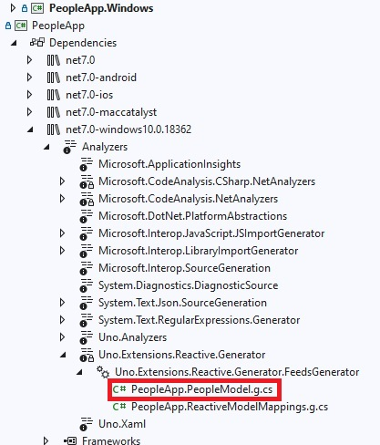

---
uid: Uno.Extensions.Mvux.HowToListFeed
---

# How to create a list feed

In this tutorial, you will learn how to create an MVUX project that asynchronously requests
and displays a collection of items from a service, and enables refreshing the data.

In this tutorial, you will learn how to create an MVUX project and the basic usage of a list-feed (`IListFeed<T>`), and the `FeedView` control.

- For our data, we're going to create a service that asynchronously provides a collection of `Person` entities upon request.
- You'll learn how to use a feed to asynchronously request this data from the service.
- How to display the data on the UI
- How to use the `FeedView` control to display the data and automatically respond to the current feed status.
- Use a refresh button to retrieve the latest weather data on-demand.

## PeopleApp Sample

You can find the code of this tutorial [here](https://github.com/unoplatform/Uno.Samples/tree/master/UI/MvuxHowTos/PeopleApp).

## Create the Model

1. Create an MVUX project by following the steps in [this tutorial](xref:Uno.Extensions.Mvux.HowToMvuxProject), and name your project *PeopleApp*.

1. Add a class named *PeopleService.cs*, and replace its content with the following:

    ```csharp
    namespace PeopleApp;

    public partial record Person(string FirstName, string LastName);

    public interface IPeopleService
    {
        ValueTask<IImmutableList<Person>> GetPeopleAsync(CancellationToken ct);
    }

    public class PeopleService
    {
        public async ValueTask<IImmutableList<Person>> GetPeopleAsync(CancellationToken ct)
        {
            await Task.Delay(TimeSpan.FromSeconds(2), ct);

            var people = new Person[]
            {
                new Person(FirstName: "Master", LastName: "Yoda"),
                new Person(FirstName: "Darth", LastName: "Vader")
            };

            return people.ToImmutableList();
        }
    }
    ```

    We're using a [record](https://learn.microsoft.com/dotnet/csharp/language-reference/builtin-types/record) for the `Person` type on purpose, as records are designed to be immutable to ensure the purity of objects as well as other features.

    The `IListFeed<T>` is a feed type tailored for dealing with collections.

1. Create a class named *PeopleModel.cs* replacing its content with the following:

    ```csharp
    using Uno.Extensions.Reactive;

    namespace PeopleApp;

    public partial record PeopleModel(IPeopleService PeopleService)
    {
        public IListFeed<Person> People => ListFeed.Async(PeopleService.GetPeopleAsync);
    }
    ```

    > [!NOTE]
    > Feeds (`IFeed<T>` and `IListFeed<T>` for collections) are used as a gateway to asynchronously request data from a service and wrap the result or an error if any in metadata to be displayed in the View in accordingly.
    Learn more about list-feeds [here](xref:Uno.Extensions.Mvux.HowToListFeed).
    >
    > [!TIP]
    > Feeds are stateless and are there for when the data from the service is read-only and we're not planning to enable edits to it.
    MVUX also provides stateful feeds. For that purpose States (`IState<T>` and `<IListState<T>` for collections) come in handy.
    Refer to [this tutorial](xref:Uno.Extensions.Mvux.HowToSimpleState) to learn more about states.

## Data-bind the view

`PeopleModel` exposes a `People` property which is an `IListFeed<T>` where `T` is a `Person`.
This is similar in concept to an `IObservable<IEnumerable<T>>`, where an `IListFeed<T>` represents a sequence of person-collections obtained from the service.

> [!TIP]
> An `IListFeed<T>` is awaitable, meaning that to get the value of the feed you would do the following in the model:
>
> ```csharp
> IImmutableList<Person> people = await this.People;
> ```

To make it possible to data bind to feeds, the MVUX analyzers read the `PeopleModel`
and generate a ViewModel called `PeopleViewModel`,
which exposes properties that the View can data bind to.

1. Open the file `MainView.xaml` and add the following namespace to the XAML:

    `xmlns:mvux="using:Uno.Extensions.Reactive.UI"`

1. Replace anything inside the `Page` contents with the following code:

    ```xml
    <mvux:FeedView Source="{Binding People}">
        <DataTemplate>
            <ListView ItemsSource="{Binding Data}">

                <ListView.Header>
                    <Button Content="Refresh" Command="{Binding Refresh}" />
                </ListView.Header>

                <ListView.ItemTemplate>
                    <DataTemplate>
                        <StackPanel Orientation="Horizontal" Spacing="5">
                            <TextBlock Text="{Binding FirstName}"/>
                            <TextBlock Text="{Binding LastName}"/>
                        </StackPanel>
                    </DataTemplate>
                </ListView.ItemTemplate>

            </ListView>
        </DataTemplate>
    </mvux:FeedView>
    ```

    > [!TIP]
    > The `FeedView` wraps its source (in this case the `People` feed) in a `FeedViewState` object, and makes the current value of the feed accessible via its `Data` property as well as the `Refresh` property, which is a command that explicitly triggers reloading the data.

1. Press <kbd>F7</kbd> to navigate to open code-view, and in the constructor, after the line that calls `InitializeComponent()`, add the following line:

    ```csharp
    this.DataContext = new PeopleViewModel(new PeopleService());
    ```

1. Click <kbd>F5</kbd> to run the project.

1. When the app loads you'll notice how the `ProgressTemplate` shows (if you've included one), till the data is received from the service (2 seconds).

    

1. Once the data is available, the `FeedView` switches to its `ValueTemplate` (the first default `DataTemplate` in our example), and displays the people list.

    

1. If you're using Visual-Studio 2022, Right-click the `PeopleApp` project, and navigate to *Dependencies*.
    Open up *net8.0-windows10...* → *Analyzers*.
    Under *Uno.Extensions.Reactive.Generator*, expand *Uno.Extensions.Reactive.FeedGenerator*.
    Here you'll be able to inspect all files MVUX has generated for you, and learn more about how MVUX runs behind the scenes.

    

    Read [inspecting the generated code](xref:Uno.Extensions.Mvux.Advanced.InspectGeneratedCode) for more.

## Add search / filtering criteria

Let assume that we want to display only items that match some given criteria.

1. Update the file *PeopleService.cs*, to add a `PersonCriteria` parameter to the `GetPeopleAsync` method:

    ```csharp
    namespace PeopleApp;

    public partial record PersonCriteria(string? Term, bool IsDarkSideOnly)
    {
        public bool Match(Person person)
        {
            if (Term is { Length: > 0 } term
                && !person.FirstName.Contains(term,StringComparison.OrdinalIgnoreCase)
                && !person.LastName.Contains(term, StringComparison.OrdinalIgnoreCase))
            {
                return false;
            }
            
            if (IsDarkSideOnly && !person.IsDarkSide)
            {
                return false;
            }
            
            return true;
        }
    }

    public partial record Person(string FirstName, string LastName, bool IsDarkSide);

    public interface IPeopleService
    {
        ValueTask<IImmutableList<Person>> GetPeopleAsync(PersonCriteria criteria, CancellationToken ct);
    }

    public class PeopleService
    {
        public async ValueTask<IImmutableList<Person>> GetPeopleAsync(PersonCriteria criteria, CancellationToken ct)
        {
            await Task.Delay(TimeSpan.FromSeconds(2), ct);
            
            var people = new Person[]
            {
                new Person(FirstName: "Master", LastName: "Yoda", IsDarkSide: false),
                new Person(FirstName: "Darth", LastName: "Vader", IsDarkSide: true)
            };
            
            return people.Where(criteria.Match).ToImmutableList();
        }
    }
    ```

1. Update the *PeopleModel.cs* file with the following:

    ```csharp
    using Uno.Extensions.Reactive;
    
    namespace PeopleApp;
    
    public partial record PeopleModel(IPeopleService PeopleService)
    {
        public IState<PersonCriteria> Criteria => State.Value(this, () => new PersonCriteria());

        public IListFeed<Person> People => Criteria.Select(PeopleService.GetPeopleAsync).AsListFeed();
    }
    ```

    > [!NOTE]  
    > Here we use the `AsListFeed` operator to create the `ListFeed`.
    > This converts a `Feed<ImmutableList<T>>` to an `IListFeed<T>`
    > (Cf. [AsListFeed](xref:xref:Uno.Extensions.Mvux.ListFeeds)).

1. Finally update your view `MainView.xaml` to add UI to edit the criteria:

    ```xml
    <Grid>
        <Grid.RowDefinitions>
            <RowDefinition Height="Auto"/>
            <RowDefinition Height="*"/>
        </Grid.RowDefinitions>

        <StackPanel>
            <TextBox Header="Search term" Text="{Binding Criteria.Term, Mode=TwoWay}" />
            <ToggleSwitch Header="Show the dark side only" IsOn="{Binding Criteria.IsDarkSideOnly, Mode=TwoWay}" />
        </StackPanel>

        <mvux:FeedView Source="{Binding People}">
            <DataTemplate>
                <ListView ItemsSource="{Binding Data}">

                    <ListView.Header>
                        <Button Content="Refresh" Command="{Binding Refresh}" />
                    </ListView.Header>

                    <ListView.ItemTemplate>
                        <DataTemplate>
                            <StackPanel Orientation="Horizontal" Spacing="5">
                                <TextBlock Text="{Binding FirstName}"/>
                                <TextBlock Text="{Binding LastName}"/>
                            </StackPanel>
                        </DataTemplate>
                    </ListView.ItemTemplate>

                </ListView>
            </DataTemplate>
        </mvux:FeedView>
    </Grid>
    ```
