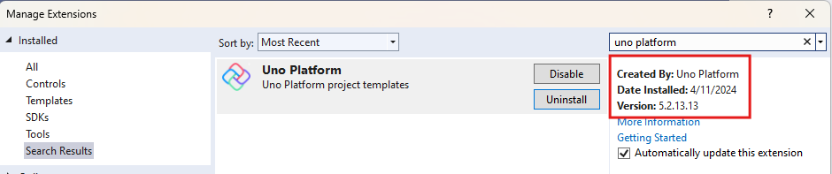
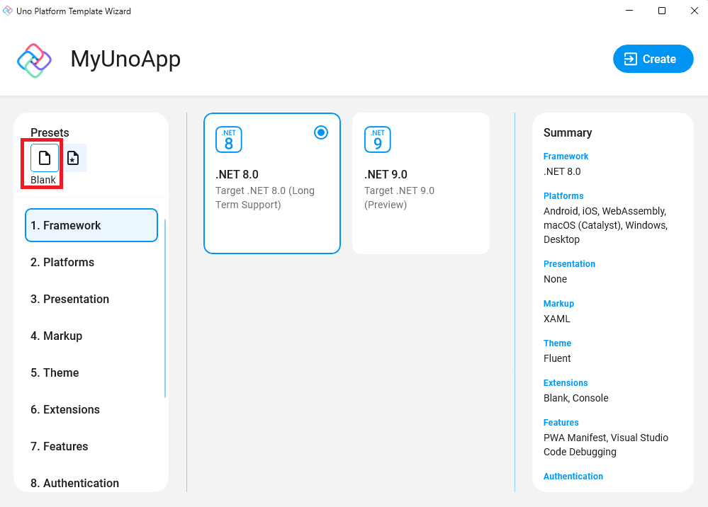
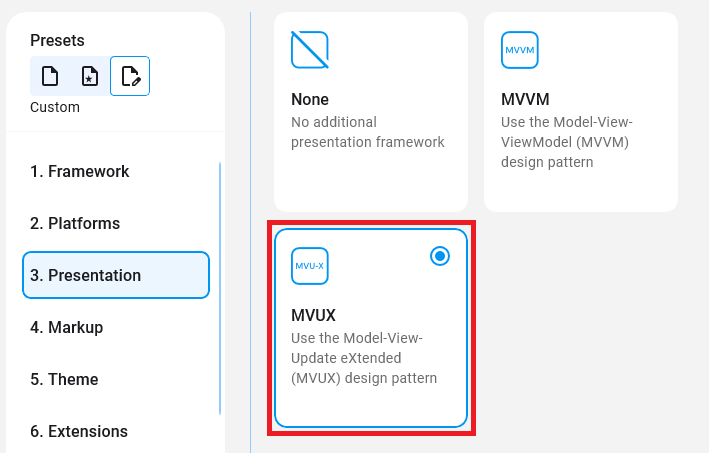

# How to set up an MVUX project

In this tutorial, you'll learn how to set up an Uno Platform project to use MVUX.

> [!NOTE]
> Make sure to setup your environment first by [following our instructions](xref:Uno.GetStarted.vs2022).

## Creating a new Uno app with MVUX

1. Make sure your environment is set up properly by using [uno check](xref:UnoCheck.UsingUnoCheck).
1. You can create an Uno Platform App by either using the Uno Platform Visual Studio extension or via the command line interface.

   ## [**Visual Studio**](#tab/vs)

   ### Using Visual Studio 2022 Uno Platform Extension

   - Make sure you have the latest version of Uno Extension (v4.8 or higher) installed.

        

   - Press <kbd>Ctrl</kbd>+<kbd>Shift</kbd>+<kbd>N</kbd> to create a new project and select "Uno Platform App".

   - Give your project an appropriate name.

   - When prompted select the *Blank* template under the Presets section.

        

   - In the *Presentation* tab (3rd one), select MVUX.

        

   - Click *Create* on the bottom right corner.

   ## [**CLI**](#tab/cli)

   ### Using the command line interface

   - Run the following command, using an appropriate name (`MyApp` in this page).

        ```cmd
        dotnet new unoapp -preset blank -presentation mvux -o MyApp
        ```

        Refer to [this](https://platform.uno/docs/articles/get-started-dotnet-new.html) article for more details
        on using the CLI interface of creating projects.

   - Launch the created solution, MyApp.sln, in  Visual Studio or Visual Studio Code.

## Add MVUX to an existing Uno app

> [!IMPORTANT]
> This guide assumes you created your app using the Single Project template. If you used a different template, please refer to our [Migrating Projects to Single Project](xref:Uno.Development.MigratingToSingleProject) documentation.

`MVUX` is provided as an Uno Feature. To enable `MVUX` support in your application, add `MVUX` to the `<UnoFeatures>` property in the Class Library (.csproj) file.

```diff
<UnoFeatures>
    Material;
    Extensions;
+   MVUX;
    Toolkit;
</UnoFeatures>
```

For more information about `UnoFeatures` refer to our [Using the Uno.Sdk](xref:Uno.Features.Uno.Sdk) docs.
