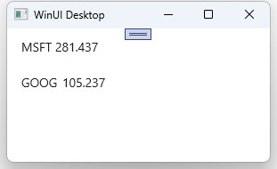

# How to create a list feed where values are pushed in

In this tutorial, you will learn how to create an MVUX project that displays stock data that is pushed in from a service using an [Async Enumerable](https://learn.microsoft.com/archive/msdn-magazine/2019/november/csharp-iterating-with-async-enumerables-in-csharp-8#a-tour-through-async-enumerables) method.

In this tutorial, you will also learn how to create an MVUX project and utilization of feed (`IFeed<T>`) and the `FeedView` control to display data pushed in asynchronously from an `IAsyncEnumerable<T>`.

- For our data, we're going to create a service that has an `IAsyncEnumerable<T>` method that returns periodic stock market updates.
- You'll learn how to use a feed to asynchronously request this data from the service.
- How to use the `FeedView` control to display the asynchronous data and automatically respond to the current feed status.

## StockMarketApp Sample

You can find the code of this tutorial [here](https://github.com/unoplatform/Uno.Samples/tree/master/UI/MvuxHowTos/StockMarketApp).

## Create the Model

1. Create an MVUX project by following the steps in [this tutorial](xref:Uno.Extensions.Mvux.HowToMvuxProject), and name the project *StockMarketApp*..

1. Add a class named *StockMarketService.cs*, and replace its content with the following:

    ```csharp
    using System.Runtime.CompilerServices;

    namespace StockMarketApp;

    public partial record Stock(string Name, double Value);

    public class StockMarketService
    {
        public async IAsyncEnumerable<IImmutableList<Stock>> GetCurrentMarket(
            [EnumeratorCancellation] CancellationToken ct)
        {
            var rnd = new Random();

            while (!ct.IsCancellationRequested)
            {
                // return current stock-market info
                yield return _stocks.ToImmutableList();

                // this delays the next iteration by 5 seconds
                await Task.Delay(TimeSpan.FromSeconds(5), ct);

                // this updates the market prices
                // in a more realistic program
                // this would have taken place on the remote server
                for (int i = 0; i < _stocks.Count; i++)
                {
                    var stock = _stocks[i];
                    var increment = rnd.NextDouble();

                    _stocks[i] = stock with { Value = stock.Value + increment };
                }
            }
        }

        // this list is for the purpose of this demonstration
        // we're treating this variable as our database
        // ideally a service doesn't hold the data just requests it
        private readonly List<Stock> _stocks = new List<Stock>
        {
            new Stock("MSFT", 279.35),
            new Stock("GOOG", 102.11),
        };
    }
    ```

    We're using a [record](https://learn.microsoft.com/dotnet/csharp/language-reference/builtin-types/record) for the `Stock` type on purpose, as records are immutable and ensure the purity of objects as well as other features.

    The `GetCurrentMarket` emits a collection of stocks with updated values every 5 seconds.
    The `IListFeed<T>` is a feed tailored for dealing with collections.

1. Create a class named *StockMarketModel.cs* replacing its content with the following:

    ```csharp
    public partial record StockMarketModel(StockMarketService StockMarketService)
    {
        public IListFeed<Stock> Stocks => ListFeed.AsyncEnumerable(StockMarketService.GetCurrentMarket);
    }
    ```

> [!NOTE]
> Feeds (`IFeed<T>` and `IListFeed<T>` for collections) are used as a gateway to asynchronously request data from a service and wrap the result or error if any in metadata to be displayed in the View accordingly.
> Learn more about list-feeds [here](xref:Uno.Extensions.Mvux.HowToListFeed).
>
> [!TIP]
> Feeds are stateless
> and are there for when the data from the service is read-only and we're not planning to enable edits to it.
> MVUX also provides stateful feeds. For that purpose States (`IState<T>` and `<IListState<T>` for collections) come handy.
> Refer to [this tutorial](xref:Uno.Extensions.Mvux.HowToSimpleState) to learn more about states.

## Data bind the view

The `Stocks` property on `StockMarketModel` is an `IListFeed<T>` where `T` is `Stock`.
This is similar in concept to an `IObservable<IImmutableList<Stock>>`,
where an `IListsFeed<T>>` represents a sequence of collections pushed in whenever they become available,
signaling the UI about the new data.

> [!TIP]
> An `IListFeed<T>` is awaitable, meaning that to get the value of the feed you would execute the following in the model:
>
> ```csharp
> StockMarket currentMarket = await this.Stocks;
> ```

To make it possible to data bind to feeds, the MVUX analyzers read the `StockMarketModel`
and generate a ViewModel called `StockMarketViewModel`, which exposes properties that the View can data bind to.

1. Open the file `MainView.xaml` and replace anything inside the `Page` element with the following code:

    ```xml
    <ListView ItemsSource="{Binding Stocks}" SelectionMode="None">
        <ListView.ItemTemplate>
            <DataTemplate>
                <StackPanel Orientation="Horizontal" Spacing="5">
                    <TextBlock Text="{Binding Name}"/>
                    <TextBlock Text="{Binding Value}"/>
                </StackPanel>
            </DataTemplate>
        </ListView.ItemTemplate>
    </ListView>
    ```

1. Press <kbd>F7</kbd> to navigate to open code-view, and in the constructor, after the line that calls `InitializeComponent()`, add the following line:

    ```csharp
    this.DataContext = new StockMarketViewModel(new StockMarketService());
    ```

1. Press <kbd>F5</kbd> to run the app.

1. The app will display the stock values which will keep updating every 5 seconds.

    Here are 3 screenshots taken consecutively with some delay apart:

    
    
    
