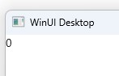
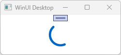
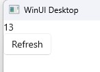

# How to create a feed

In this tutorial, you will learn how to create a project that uses MVUX with a combination of a feed (`IFeed<T>`) and the `FeedView` control to asynchronously load and display data coming from a service.

- The data will come from a service that asynchronously provides a single value of current weather information upon request.
- An `IFeed` will be created and used to asynchronously request data from the service.
- The `FeedView` control will be used to display the data and automatically respond to the current feed status.
- The `FeedView` will be styled to use a different template when awaiting data from the service.
- A Refresh button will be added to retrieve the latest weather data on-demand.

## WeatherApp Sample

You can find the code for our weather app [here](https://github.com/unoplatform/Uno.Samples/tree/master/UI/MvuxHowTos/WeatherApp).

## Create the Model

1. Create an MVUX project by following the steps in [this tutorial](xref:Uno.Extensions.Mvux.HowToMvuxProject), and name the project *WeatherApp*.

1. Add a class named *WeatherService.cs*, and replace its content with the following:

    ```csharp
    namespace WeatherApp;

    public partial record WeatherInfo(int Temperature);

    public interface IWeatherService
    {
        ValueTask<WeatherInfo> GetCurrentWeatherAsync(CancellationToken ct);
    }

    public record WeatherService : IWeatherService
    {
        public async ValueTask<WeatherInfo> GetCurrentWeatherAsync(CancellationToken ct)
        {
            // fake delay to simulate requesting data from a remote server
            await Task.Delay(TimeSpan.FromSeconds(2), ct);

            // assign a random number ranged -40 to 40.
            var temperature = new Random().Next(-40, 40);

            return new WeatherInfo(temperature);
        }
    }
    ```

    We're using a [record](https://learn.microsoft.com/dotnet/csharp/language-reference/builtin-types/record) for the `WeatherInfo` type, as records are designed to be immutable, to ensure purity of objects, as well as other features.

1. Create a class named *WeatherModel.cs* replacing its content with the following:

    ```csharp
    public partial record WeatherModel(IWeatherService WeatherService)
    {
        public IFeed<WeatherInfo> CurrentWeather => Feed.Async(WeatherService.GetCurrentWeatherAsync);
    }
    ```

    > [!NOTE]
    > Feeds (`IFeed<T>` and `IListFeed<T>` for collections) are used as a gateway to asynchronously request data from a service and wrap the result or error (if any) in metadata to be displayed in the View in accordingly.
    Learn more about list-feeds [here](xref:Uno.Extensions.Mvux.HowToListFeed).

## Data bind the View

`WeatherModel` exposes a `CurrentWeather` property which is an `IFeed` of type `WeatherInfo`. This is similar in concept to an `IObservable<T>`, where an `IFeed<T>` represents a sequence of values.

> [!TIP]
> An `IFeed<T>` is awaitable, meaning that to get the value of the feed you would do the following in the model:
>
> ```csharp
> WeatherInfo currentWeather = await this.CurrentWeather;
> ```
>
> To make it possible to data bind to a feeds, the MVUX analyzers read the `WeatherModel` and generate a ViewModel called `WeatherViewModel`, which exposes properties that the View can data bind to.
In this case the `WeatherViewModel` exposes a `CurrentWeather` property that can be uses in a data binding expression the same way you would with a regular property that returns a `WeatherInfo` entity.

1. Open the file `MainView.xaml` and replace the `Page` contents with the following:

    ```xml
    <TextBlock Text="{Binding CurrentWeather.Temperature}" />
    ```

1. Press <kbd>F7</kbd> to navigate to open code-view, and in the constructor, after the line that calls `InitializeComponent()`, add the following line:

    ```csharp
    this.DataContext = new WeatherViewModel(new WeatherService());
    ```

1. Press <kbd>F5</kbd> to run the app. The app will load with a default `WeatherInfo` value, with a `Temperature` of `0`:

    

    But then, after two seconds (the `GetCurrentWeatherAsync` method on the `WeatherService` includes a 2 second delay before returning data), the value that came from the service will display:

    

    Note that this is a random value and may be different on your machine.

> [!NOTE]
> It's worth noting that the `CurrentWeather` feed will only be invoked once, and the value captured in the ViewModel.
> The captured value will be returned to all binding expressions that use CurrentWeather.
> This means that it's OK to use a lambda expression when defining the IFeed (`=>`), so that it can accessing the local `WeatherService` in `Feed.Async(WeatherService.GetCurrentWeatherModel)`.
> The `WeatherService` property wouldn't have been available in a regular assignment context (`=`).

## Using a FeedView

To this point, this is a similar binding experience you have most likely been familiar with using MVVM. With the MVVM approach you would have to add error handling around the call to `GetCurrentWeatherAsync`, you would need to expose properties on the ViewModel to indicate that data is loading, and you would have to expose a method, or command, that can be invoked in order to refresh the data.

However, thanks to the metadata accompanied with each request handled by the `IFeed`, MVUX is capable of much more than the simple example you've just seen.

In the next section we'll use the `FeedView` control to unlock the capabilities of the feed.

1. Add the following namespace to the `MainView.xaml` file:

    `xmlns:mvux="using:Uno.Extensions.Reactive.UI"`

1. Wrap the `TextBlock` inside a `FeedView` control like the following:

    ```xml
    <mvux:FeedView Source="{Binding CurrentWeather}">
        <DataTemplate>
            <TextBlock DataContext="{Binding Data}" Text="{Binding Temperature}" />
        </DataTemplate>
    </mvux:FeedView>
    ```

    Notice how the `DataContext` property on the `TextBlock` is data bound to a `Data` property. Alternatively, the `Text` property can be data bound to `Data.Temperature` instead, if you prefer.

    > [!TIP]
    > The `FeedView` wraps its source (in this case our `CurrentWeather` feed) in a `FeedViewState` object, and makes the actual feed accessible via its `Data` property.
    The `FeedViewState` also provides additional metadata properties as we'll soon see.

1. Click <kbd>F5</kbd> to run the project.
The temperature is requested from the service and is displayed on page:

    

    While the data is requested from the service, the `FeedView` automatically displays a progress-ring (`ProgressRing`), as shown on the last screenshot.

1. Once the data is the available, the `FeedView` will show the `DataTemplate` above, with the `TextBlock` displaying the value obtained from the service:

    

1. Let's add a `Refresh` button to allow the user to request an update to the data.
Change the `FeedView` content to the following:

    ```xml
    <mvux:FeedView Source="{Binding CurrentWeather}">
        <DataTemplate>
            <StackPanel>
                <TextBlock DataContext="{Binding Data}" Text="{Binding Temperature}" />
                <Button Content="Refresh" Command="{Binding Refresh}" />
            </StackPanel>
        </DataTemplate>
    </mvux:FeedView>
    ```

    Like the `Data` property, the `Refresh` property is a special `ICommand` customized to work asynchronously and invokes the service for refreshed data without blocking the UI.
    It's also a property of the `FeedViewState` class mentioned earlier.

1. Hit <kbd>F5</kbd> again.

    The progress-ring shows up while awaiting the data.

    

    After a couple of seconds, once the data has been asynchronously received from the service, the above template takes places.
    The temperature is now displayed accompanied by the *Refresh* button.

    

1. Click the *Refresh* button. You'll notice it disables instantly, and the progress-ring message is displayed thereafter.

    
    

    After a couple of seconds the View will display the refreshed value the feed asynchronously retrieved from the service.

1. The `FeedView` also gives you the ability to customize the various templates that are to be used according to the current state of the feed.
In the following step you'll learn how to customize the progress-ring you saw before.

1. Close the app and below the `DataTemplate` above, add the following content (within the `FeedView`):

    ```xml
            ...
        </DataTemplate>
        <mvux:FeedView.ProgressTemplate>
            <DataTemplate>
                <TextBlock Text="Requesting temperature..."/>
            </DataTemplate>
        </mvux:FeedView.ProgressTemplate>
    </mvux:FeedView>
    ```

1. When the app loads you'll notice how the custom `ProgressTemplate` we've just marked-up shows until the data is received from the service.

    

1. Once the data is the available and the `FeedView` switches to its `ValueTemplate` (the first default `DataTemplate` in our example).
