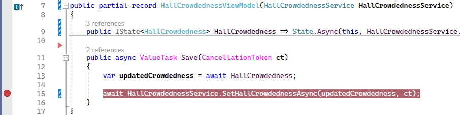
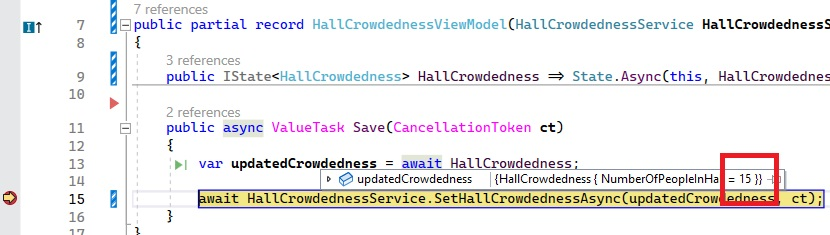

# How to create a state with a command

In this tutorial, you will learn how to create an MVUX project and basic usage of a state (`IState<T>`) and the `FeedView` control, to asynchronously load, display and manipulate data from and to an service.

- The data is provided by a service that asynchronously retrieves and updates a single value that determines the crowdedness of a wedding hall, via a 'remote' service.
- A State to asynchronously request and update the data from and to the service.
- The `FeedView` control will be used to display the data and automatically respond to the current State status.
- See how MVUX generates commands and learn how to react to them in the Model.

## WeddingHallApp Sample

You can find the code for our weather app [here](https://github.com/unoplatform/Uno.Samples/tree/master/UI/MvuxHowTos/WeddingHallApp).

## Create the Model

1. Create an MVUX project by following the steps in [this tutorial](xref:Uno.Extensions.Mvux.HowToMvuxProject), and name your project `TheFancyWeddingHall`.

1. Add a class named *HallCrowdednessService.cs*, and replace its content with the following:

    ```csharp
    namespace TheFancyWeddingHall;

    public partial record HallCrowdedness(int NumberOfPeopleInHall);

    public interface IHallCrowdednessService
    {
        ValueTask<HallCrowdedness> GetHallCrowdednessAsync(CancellationToken ct);
        ValueTask SetHallCrowdednessAsync(HallCrowdedness crowdedness, CancellationToken ct);
    }

    public class HallCrowdednessService : IHallCrowdednessService
    {
        // a service is normally stateless
        // the local field is for the purpose of this demo
        private int _numberOfPeopleInHall = 5;

        public async ValueTask<HallCrowdedness> GetHallCrowdedness(CancellationToken ct)
        {
            // fake "loading from server"
            await Task.Delay(TimeSpan.FromSeconds(1));
            var result = new HallCrowdedness(_numberOfPeopleInHall);

            return result;
        }

        public async ValueTask SetHallCrowdedness(HallCrowdedness crowdedness, CancellationToken ct)
        {
            // fake "updating server"
            await Task.Delay(TimeSpan.FromSeconds(1));
            _numberOfPeopleInHall = crowdedness.NumberOfPeopleInHall;
        }
    }
    ```

    We're using a [record](https://learn.microsoft.com/dotnet/csharp/language-reference/builtin-types/record) for the `HallCrowdedness` entity type on purpose, as records are designed to be immutable to ensure purity of objects as well as other features.

1. Create a class named *HallCrowdednessModel.cs* and replace its content with the following:

    ```csharp
    using Uno.Extensions.Reactive;

    namespace TheFancyWeddingHall;

    public partial record HallCrowdednessModel(IHallCrowdednessService HallCrowdednessService)
    {
        public IState<HallCrowdedness> HallCrowdedness => State.Async(this, HallCrowdednessService.GetHallCrowdedness);

        public async ValueTask Save(CancellationToken ct)
        {
            var updatedCrowdedness = await HallCrowdedness;

            if(updatedCrowdedness is null)
            {
                return;
            }

            await HallCrowdednessService.SetHallCrowdedness(updatedCrowdedness, ct);
        }
    }
    ```

    > [!NOTE]
    > Feeds and States (`IState<T>` and `IListState<T>` for collections) are both used as a gateway to asynchronously request data from a service and wrap the result or error (if any) in metadata to be displayed in the View in accordingly.
    However, unlike a Feed, a State, as its name suggests, is stateful.
    While a Feed is just a query of a stream of data, a State also implies an up-to-date value that represents the current state of the application that can be accessed and updated.
    >
    > [!TIP]
    > Unlike feeds, States require a reference to the owner type which is used to store and manage the state of the model.
    In addition, by having a reference to the owner, we link the lifetime of the model with its owner, and the State is ready to be collected by the Garbage Collector as soon as its owner is disposed.

## Data bind the View

The `HallCrowdedness` property in `HallCrowdednessModel`, is an `IState` of type `HallCrowdedness`.
This is similar in concept to an `IObservable<HallCrowdedness>`, where an `IState<HallCrowdedness>` represents a sequence of values, with access to the additional metadata.
The difference of States is that they provide update operators and enable manipulating the data, as opposed to Feeds, which doesn't.

> [!TIP]
> An `IFeed<T>` as well as `IState<T>` are awaitable, meaning that to get the value of the feed you would do the following in the model:
>
> ```csharp
> HallCrowdedness hallCrowdedness = await this.HallCrowdedness;
> ```

1. Replace anything inside the `Page` element with the following code:

    ```xml
    <StackPanel>
        <TextBlock Text="How many people are currently in the hall?" />
        <TextBox
            DataContext="{Binding HallCrowdedness}"
            Text="{Binding NumberOfPeopleInHall, Mode=TwoWay, UpdateSourceTrigger=PropertyChanged}" />

    </StackPanel>
    ```

    When the user edits the text in the `TextBox`, MVUXs data-binding adapters translate between the data-binding into updating the `HallCrowdedness` state, by recreating the whole `HallCrowdedness` entity (it's immutable) with the changed `NumberOfPeopleInHall` value that was received per the `TextBox` edit.

## MVUX commands

1. In the `Save` method above, place a breakpoint on the line `await _hallCrow...SetHallCrowd...`, for later use:

    

    MVUX's analyzers will read the `HallCrowdednessModel` and will generate a special ViewModel called `HallCrowdednessViewModel`, which provides binding capabilities for the View and performs all Update message for us, to keep the `IState` up to date.

    In addition, MVUX reads the `Save` method, and generates in the ViewModel a command named `Save` that can be used from the View, which is invoked asynchronously.

1. In the XAML file, after the `TextBox`, add the following `Button` code:

    ```xml
        <TextBox ... />

        <Button Content="Save" Command="{Binding Save}" />
    </StackPanel>
    ```

    The generated `Save` command is used as the button's `Command` property, so that when the user clicks the button, the command is executed and the call is directed to the `Save` method in the Model.

    > [!TIP]
    > A `CancellationToken` is automatically provided by the View and can be used in advanced scenarios, and is recommended to use although it's optional.

1. Press <kbd>F7</kbd> to navigate to open code-view, and in the constructor, after the line that calls `InitializeComponent()`, add the following line:

    ```csharp
    this.DataContext = new HallCrowdednessViewModel(new HallCrowdednessService());
    ```

    The `HallCrowdednessViewModel` is a special MVUX-generated ViewModel bindable proxy class that represents a mirror of the `HallCrowdednessModel` adding binding capabilities, for MVUX to be able to recreate and renew the model when an update message is sent by the view.

1. Click <kbd>F5</kbd> to run the project

1. The app will load with its default value '5' as the number of people.

    

1. Change the number to 15 and click 'Save'.

    The debugger will stop at the breakpoint you placed earlier. <!--(See step No. x)-->

    

    As you can see, the current value of the state has gotten the updated number '*15*'. This is now being saved to the service, in the following line execution once you hit <kbd>F5</kbd> again.
