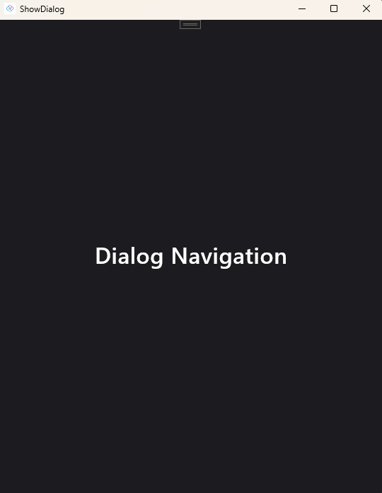
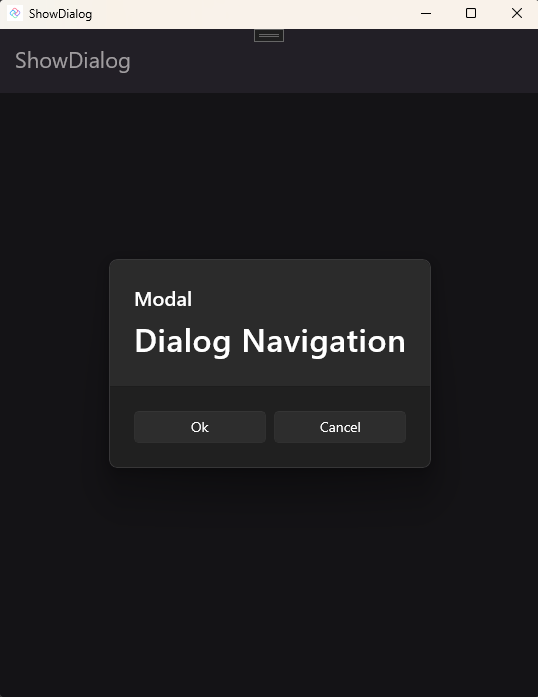

# How-To: Display a Dialog (modal or flyout)

This topic provides a step-by-step guide on using Navigation to display a Dialog.

## Step-by-step

[!include[create-application](../includes/create-application.md)]

### 1. Displaying a dialog from code

- Add a new `Page`, `SamplePage.xaml`, which will be used to display content inside the flyout.

    ```xml
    <Page x:Class="ShowDialog.Views.SamplePage"
          xmlns="http://schemas.microsoft.com/winfx/2006/xaml/presentation"
          xmlns:x="http://schemas.microsoft.com/winfx/2006/xaml"
          xmlns:local="using:ShowDialog.Views"
          xmlns:d="http://schemas.microsoft.com/expression/blend/2008"
          xmlns:mc="http://schemas.openxmlformats.org/markup-compatibility/2006"
          mc:Ignorable="d"
          Background="{ThemeResource ApplicationPageBackgroundThemeBrush}">

        <Grid>
            <TextBlock Text="Dialog Navigation"
                       FontSize="32"
                       HorizontalAlignment="Center"
                       VerticalAlignment="Center" />
        </Grid>
    </Page>
    ```

- Update the `Button` in `MainPage.xaml` as follows, which wires up the `Click` event to the `ShowDialogClick` method:

    ```xml
    <Button Content="Show flyout"
            Click="ShowDialogClick"
            Grid.Row="1"
            HorizontalAlignment="Center"
            VerticalAlignment="Center"/>
    ```

- Add the `ShowDialogClick` method to the `MainPage.xaml.cs` file:

    ```csharp
    private void ShowDialogClick(object sender, RoutedEventArgs e)
    {
        _ = this.Navigator()?.NavigateViewAsync<SamplePage>(this, qualifier: Qualifiers.Dialog);
    }
    ```

### 2. Displaying a dialog from XAML

- Add another `Button` with the content `Show flyout from XAML` to `MainPage.xaml`. Set the `Navigation.Request` property to `!Sample` which indicates the `Sample` route should be opened as a Dialog in a Flyout.

    ```xml
    <StackPanel Grid.Row="1"
                HorizontalAlignment="Center"
                VerticalAlignment="Center">
        <Button Content="Show flyout"
                Click="ShowDialogClick" />
        <Button Content="Show flyout from XAML"
                uen:Navigation.Request="!Sample" />
    </StackPanel>
    ```

## Flyout vs. Modal

It is important to understand that "!" and `Qualifiers.Dialog` do not automatically determine whether the content will be displayed as a Flyout or as a Modal. These elements indicate a dialog, with the specific behavior (Flyout or Modal) being determined by the type of view used. In the previous example, we used a `Page`, which is displayed as a Flyout. If the intended behavior is to display a Modal, we need to change the `Page` to a `ContentDialog`.

### Example

- The result of our previous example, where a `Page` is used, displays as a Flyout:

  

- If we modify the example to use a `ContentDialog` instead of a `Page`, the result will be displayed as a Modal. Here is the XAML code for the `ContentDialog`:

    ```xml
    <ContentDialog x:Class="ShowDialog.Views.SamplePage"
                   xmlns="http://schemas.microsoft.com/winfx/2006/xaml/presentation"
                   xmlns:x="http://schemas.microsoft.com/winfx/2006/xaml"
                   xmlns:local="using:ShowDialog.Views"
                   xmlns:mc="http://schemas.openxmlformats.org/markup-compatibility/2006"
                   Title="Modal"
                   PrimaryButtonText="Ok"
                   SecondaryButtonText="Cancel"
                   Style="{ThemeResource DefaultContentDialogStyle}">

        <Grid>
            <TextBlock HorizontalAlignment="Center"
                       VerticalAlignment="Center"
                       FontSize="32"
                       Text="Dialog Navigation" />
        </Grid>
    </ContentDialog>
    ```

    This change results in the following display:

    
