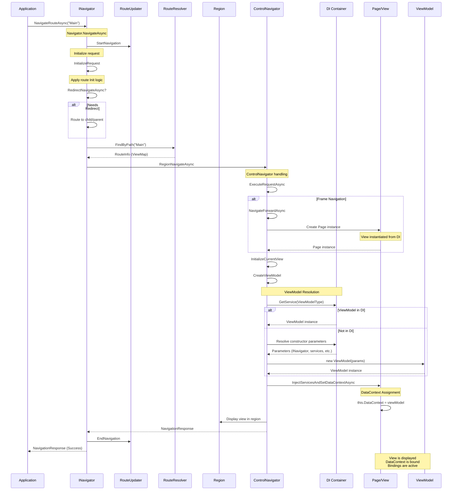

# Troubleshooting: ViewMap and DataContext Issues

This guide helps you diagnose and resolve common issues related to `ViewMap`, `DataContext`, and view-viewmodel binding in Uno.Extensions Navigation.

## Common Symptoms

- Buttons or UI controls don't respond to clicks
- Bindings don't work even though XAML appears correct
- `DataContext` is `null` when it should contain a ViewModel
- `NullReferenceException` when accessing ViewModel properties

## Understanding ViewMap and DataContext

### How ViewMap Works Internally

The `ViewMap` system is the bridge between your Views and ViewModels. When you register a `ViewMap`, several important things happen:

1. **Type Registration**: The ViewModel type is registered with the Dependency Injection (DI) container as a transient service
2. **View-ViewModel Association**: A mapping is created linking the View type to its corresponding ViewModel type
3. **Navigation Resolution**: When navigating, the framework uses this mapping to:
   - Create the appropriate View instance
   - Resolve the ViewModel from DI
   - Set the View's `DataContext` to the ViewModel instance

**Example registration:**

```csharp
views.Register(
    new ViewMap<MainPage, MainViewModel>()
);
```

This registration does the following:

- Registers `MainPage` as a transient service (creates a new instance each navigation)
- Registers `MainViewModel` as a transient service
- Creates a mapping: `MainPage` ↔ `MainViewModel`

### When DataContext Gets Assigned

The `DataContext` is set automatically during navigation in the following sequence:

1. **Navigation Request**: A navigation is triggered (via code or XAML)
2. **Route Resolution**: The framework resolves which View to show based on the route/ViewModel type
3. **View Creation**: The View is instantiated from DI
4. **ViewModel Creation**: The ViewModel is created using one of these methods (in order):
   - Retrieved from DI container (`services.GetService(viewModelType)`)
   - Created via reflection using constructor injection
5. **DataContext Assignment**: The ViewModel is assigned to `view.DataContext`
6. **View Display**: The View is displayed in the appropriate region

**Key code location** (`FrameworkElementExtensions.cs`):

```csharp
internal static async ValueTask InjectServicesAndSetDataContextAsync(
    this FrameworkElement view,
    IServiceProvider services,
    INavigator navigation,
    object? viewModel)
{
    if (view is not null && viewModel is not null && view.DataContext != viewModel)
    {
        view.DataContext = viewModel;
    }
}
```

## Navigation Lifecycle Deep Dive

Understanding the complete navigation lifecycle is crucial for troubleshooting DataContext issues. Here's a detailed explanation of what happens when you navigate to a page.

### Complete Navigation Flow



### Key Stages Explained

#### 1. Navigation Initiation

When you call `NavigateRouteAsync`, `NavigateViewModelAsync`, or use XAML navigation:

```csharp
// Code navigation
await _navigator.NavigateRouteAsync(this, "Main");

// XAML navigation
<Button uen:Navigation.Request="Main" />
```

The `Navigator.NavigateAsync` method is invoked, starting the lifecycle.

#### 2. Route Initialization and Redirection

**RouteUpdater.StartNavigation** marks the beginning of navigation tracking.

The `InitializeRequest` method runs any custom logic defined in the `RouteMap.Init` parameter:

```csharp
new RouteMap("Main", 
    View: views.FindByViewModel<MainViewModel>(),
    Init: (request) => 
    {
        // Custom initialization logic
        // e.g., redirect if not authenticated
        return request;
    })
```

The navigator checks if the request needs **redirection**:

- To a child region (nested navigation)
- To a parent region (route doesn't match current region)

#### 3. Route Resolution

The `RouteResolver.FindByPath` method looks up the route in the `RouteMap` and `ViewMap` registrations:

```csharp
var routeInfo = resolver.FindByPath("Main");
// Returns: RouteInfo containing View type, ViewModel type, Data mapping, etc.
```

This is where the **ViewMap registration** becomes critical. If no mapping exists, navigation fails.

#### 4. Region-Specific Navigation

Different navigator types handle navigation differently:

**FrameNavigator** (page navigation):

- Checks if forward or backward navigation
- Manages back stack
- Creates/retrieves the Page instance
- Calls `Frame.Navigate(pageType)`

**ContentControlNavigator** (content switching):

- Sets `ContentControl.Content` to the view

**PanelVisibilityNavigator** (visibility switching):

- Changes `Visibility` of child elements

#### 5. View Creation

The View is created through DI or Activator:

```csharp
// From ControlNavigator.CreateControlFromType
var view = services?.GetService(viewType) ?? Activator.CreateInstance(viewType);
```

The View is instantiated **before** the ViewModel. At this point, `view.DataContext` is `null`.

#### 6. ViewModel Creation

The `CreateViewModel` method in `ControlNavigator` follows this process:

```csharp
protected async Task<object?> CreateViewModel(
    IServiceProvider services,
    NavigationRequest request,
    Route route,
    RouteInfo? mapping)
{
    // Step 1: Try to get from DI
    var vm = services.GetService(mapping.ViewModel);
    
    if (vm is null)
    {
        // Step 2: Try reflection with constructor injection
        var constructor = mapping.ViewModel.GetNavigationConstructor(navigator, services, out var args);
        vm = constructor.Invoke(args);
    }
    
    // Step 3: Inject INavigator if ViewModel implements IInjectable<INavigator>
    if (vm is IInjectable<INavigator> navAware)
    {
        navAware.Inject(navigator);
    }
    
    return vm;
}
```

**Constructor resolution order**:

1. DI container (`services.GetService(ViewModelType)`)
2. Reflection with available parameters from DI

**Common ViewModel constructors**:

```csharp
// Simple - no dependencies
public MainViewModel() { }

// With INavigator
public MainViewModel(INavigator navigator) { }

// With service dependencies
public MainViewModel(INavigator navigator, IProductService productService) { }

// With data parameter (DataViewMap)
public ProductDetailViewModel(Product product, INavigator navigator) { }
```

#### 7. DataContext Assignment

The critical moment - `InjectServicesAndSetDataContextAsync` assigns the ViewModel:

```csharp
await view.InjectServicesAndSetDataContextAsync(services, navigator, viewModel);

// Inside this method:
if (view is not null && viewModel is not null && view.DataContext != viewModel)
{
    view.DataContext = viewModel;  // ← DataContext assigned here
}
```

After this assignment:

- All `{Binding}` expressions in XAML resolve to ViewModel properties
- `x:Bind` expressions are connected (for compiled bindings)
- UI updates reflect ViewModel state

#### 8. View Display

The view is displayed in the appropriate region:

- **Frame**: Page added to navigation stack and displayed
- **ContentControl**: Content property set
- **Panel**: Visibility changed to `Visible`

The `RouteUpdater.EndNavigation` marks completion, and a `NavigationResponse` is returned.

### DataContext Assignment Verification Points

At each stage, verify:

| Stage | Verification | What to Check |
|-------|--------------|---------------|
| **Route Resolution** | RouteInfo exists | ViewMap registered correctly |
| **View Creation** | View instance created | View type in DI or has parameterless constructor |
| **ViewModel Creation** | ViewModel instance created | Dependencies registered in DI |
| **DataContext Assignment** | `view.DataContext != null` | ViewModel was successfully created |
| **Binding Activation** | UI shows data | ViewModel implements INotifyPropertyChanged |

### Common Lifecycle Failure Points

**Failure at Route Resolution**:

```text
Symptom: Navigation doesn't happen
Cause: Missing ViewMap registration
Fix: Add ViewMap to views.Register()
```

**Failure at ViewModel Creation**:

```text
Symptom: DataContext is null
Cause: Missing DI registration for ViewModel dependencies
Fix: Register all constructor dependencies in DI
```

**Failure at DataContext Assignment**:

```text
Symptom: DataContext null even though ViewModel created
Cause: View created outside navigation framework
Fix: Always use navigation framework, not manual instantiation
```

**Failure at Binding**:

```text
Symptom: DataContext set but UI doesn't update
Cause: ViewModel doesn't implement INotifyPropertyChanged
Fix: Implement INotifyPropertyChanged or use MVUX
```

## Prerequisites: DI + ViewMap Relationship

For `DataContext` to be set correctly, **both** of these must be properly configured:

### 1. Dependency Injection Setup

Your ViewModels and their dependencies must be registered with DI:

```csharp
// In App.xaml.cs or similar
private static void ConfigureServices(HostBuilderContext context, IServiceCollection services)
{
    // Register your services
    services.AddSingleton<IProductService, ProductService>();
    services.AddTransient<INavigator>(); // Usually auto-registered by Navigation extension
}
```

### 2. ViewMap Registration

Views and ViewModels must be registered in the `ViewMap`:

```csharp
private static void RegisterRoutes(IViewRegistry views, IRouteRegistry routes)
{
    // Register View-ViewModel associations
    views.Register(
        new ViewMap(ViewModel: typeof(ShellViewModel)),
        new ViewMap<MainPage, MainViewModel>(),
        new ViewMap<ProductsPage, ProductsViewModel>()
    );

    // Register routes
    routes.Register(
        new RouteMap("", View: views.FindByViewModel<ShellViewModel>(),
            Nested:
            [
                new ("Main", View: views.FindByViewModel<MainViewModel>()),
                new ("Products", View: views.FindByViewModel<ProductsViewModel>())
            ]
        )
    );
}
```

**Critical relationship**: The `ViewMap` registration automatically registers the ViewModel type with DI as a transient service. However, if your ViewModel has constructor dependencies, those dependencies must be registered separately.

## Troubleshooting Steps

### Step 1: Verify DataContext is Null

Add a debug `TextBlock` to your XAML to check the `DataContext`:

```xml
<Page x:Class="MyApp.Views.MainPage">
    <StackPanel>
        <!-- Debug: Display DataContext type -->
        <TextBlock Text="{Binding}" 
                   Foreground="Red" 
                   FontSize="12"/>
        <TextBlock Text="Debug: DataContext Type" 
                   Foreground="Red" 
                   FontSize="10"/>
        
        <!-- Your actual UI -->
        <Button Content="Click Me" 
                Command="{Binding MyCommand}"/>
    </StackPanel>
</Page>
```

**Expected result**: The first `TextBlock` should display something like `MyApp.ViewModels.MainViewModel`

**If it shows nothing or "System.Object"**: Your `DataContext` is not being set correctly.

### Step 2: Check ViewMap Registration

Verify that your View and ViewModel are properly registered:

**Common mistakes:**

❌ **Missing ViewMap registration:**

```csharp
// WRONG: View is used in routes but not registered
routes.Register(
    new RouteMap("Main", View: views.FindByViewModel<MainViewModel>())
);
```

✅ **Correct ViewMap registration:**

```csharp
// First register in ViewMap
views.Register(
    new ViewMap<MainPage, MainViewModel>()
);

// Then use in routes
routes.Register(
    new RouteMap("Main", View: views.FindByViewModel<MainViewModel>())
);
```

### Step 3: Verify ViewModel Constructor Dependencies

If your ViewModel has constructor parameters, ensure all dependencies are registered:

**ViewModel with dependencies:**

```csharp
public class ProductsViewModel
{
    private readonly IProductService _productService;
    private readonly INavigator _navigator;

    public ProductsViewModel(
        IProductService productService,  // Must be registered in DI
        INavigator navigator)             // Auto-registered by Navigation
    {
        _productService = productService;
        _navigator = navigator;
    }
}
```

**Required DI registration:**

```csharp
services.AddSingleton<IProductService, ProductService>();
// INavigator is auto-registered by the Navigation extension
```

**If missing dependencies**: You'll get a `null` DataContext or an exception during ViewModel creation.

### Step 4: Check Navigation Call

Verify you're navigating correctly:

**Navigation via Route:**

```csharp
await _navigator.NavigateRouteAsync(this, "Main");
```

**Navigation via ViewModel:**

```csharp
await _navigator.NavigateViewModelAsync<MainViewModel>(this);
```

**Navigation via XAML:**

```xml
<Button Content="Go to Main" 
        uen:Navigation.Request="Main"/>
```

### Step 5: Inspect the Navigation Region

Ensure your View is inside a proper navigation region:

```xml
<!-- Shell or root element must have Region.Attached -->
<Grid uen:Region.Attached="True">
    <!-- Navigation happens here -->
</Grid>
```

**Without a navigation region**, the framework cannot properly manage navigation and DataContext assignment.

### Step 6: Enable Diagnostic Logging

Add logging to see what's happening during navigation:

```csharp
// In App.xaml.cs or configuration
builder.Logging.SetMinimumLevel(LogLevel.Debug);
builder.Logging.AddConsole();
```

Look for log entries related to:

- ViewModel creation
- View instantiation
- Navigation completion
- Any DI resolution errors

## Common Issues and Solutions

### Issue 1: DataContext is Null After Navigation

**Symptoms:**

- View displays correctly
- Bindings show no data
- Debug TextBlock shows empty or "System.Object"

**Causes and Solutions:**

**Cause A: ViewModel not registered in ViewMap**

```csharp
// Add the missing registration
views.Register(
    new ViewMap<YourPage, YourViewModel>()
);
```

**Cause B: Missing DI dependencies**

```csharp
// Check ViewModel constructor and register all dependencies
public class MyViewModel
{
    // NOTE: IMyService must be registered in DI
    public MyViewModel(IMyService service)
    {
    }
}

// In DI configuration
services.AddSingleton<IMyService, MyService>();
```

**Cause C: View created outside navigation framework**

```csharp
// WRONG: Manual instantiation bypasses navigation
// This uses traditional UWP/WinUI Frame navigation instead of Uno.Extensions Navigation
var page = new MainPage();
Frame.Navigate(typeof(MainPage));

// CORRECT: Use Uno.Extensions Navigation framework
await _navigator.NavigateViewModelAsync<MainViewModel>(this);
```

### Issue 2: Bindings Work Initially But Break After Navigation

**Symptoms:**

- First navigation works fine
- Subsequent navigations show null DataContext
- Previous page data appears on new page

**Cause**: Cache mode or Region configuration issue

**Solution**: Check navigation region configuration:

```xml
<!-- Ensure proper region setup -->
<Grid uen:Region.Attached="True"
      uen:Region.Navigator="Visibility">  <!-- or "ContentControl" or "Frame" -->
    <!-- Content here -->
</Grid>
```

### Issue 3: DataContext Set But Bindings Don't Update

**Symptoms:**

- DataContext is not null
- Properties exist on ViewModel
- Bindings still show no data

**Cause**: ViewModel doesn't implement `INotifyPropertyChanged`

**Solution**: Implement property change notification:

```csharp
using System.ComponentModel;
using System.Runtime.CompilerServices;

public class MyViewModel : INotifyPropertyChanged
{
    private string _name;
    public string Name
    {
        get => _name;
        set
        {
            if (_name != value)
            {
                _name = value;
                OnPropertyChanged();
            }
        }
    }

    public event PropertyChangedEventHandler PropertyChanged;

    protected virtual void OnPropertyChanged([CallerMemberName] string propertyName = null)
    {
        PropertyChanged?.Invoke(this, new PropertyChangedEventArgs(propertyName));
    }
}
```

**Alternative**: Use MVUX (Model-View-Update-eXtended) which handles this automatically:

```csharp
public partial record MyViewModel
{
    public IState<string> Name => State<string>.Value(this, () => "Initial Value");
}
```

### Issue 4: DataContext Wrong Type

**Symptoms:**

- DataContext is not null
- DataContext is wrong type (e.g., a different ViewModel)
- Bindings fail with property not found errors

**Causes and Solutions:**

**Cause A: Multiple ViewMaps for same View**

```csharp
// WRONG: Conflicting registrations
views.Register(
    new ViewMap<MainPage, MainViewModel>(),
    // NOTE: Conflict! Same View cannot have two different ViewModels
    new ViewMap<MainPage, OtherViewModel>()
);
```

**Solution**: Ensure each View has only one ViewModel registration.

**Cause B: Incorrect route mapping**

```csharp
// Check that route points to correct ViewModel
routes.Register(
    // NOTE: Verify this ViewModel type is correct for your route
    new RouteMap("Main", View: views.FindByViewModel<MainViewModel>())
);
```

### Issue 5: DataContext Set in Code-Behind Conflicts

**Symptoms:**

- You set DataContext in code-behind
- Navigation framework also sets it
- Unpredictable behavior

**Cause**: Competing DataContext assignments

**Solution**: Let the navigation framework manage DataContext:

```csharp
// WRONG: Don't set DataContext manually
public MainPage()
{
    InitializeComponent();
    // NOTE: Remove this - let navigation framework set DataContext
    this.DataContext = new MainViewModel();
}

// CORRECT: Let navigation framework set it via ViewMap
public MainPage()
{
    InitializeComponent();
    // No DataContext assignment needed
}
```

## Advanced Debugging Techniques

### Technique 1: Breakpoint in FrameworkElementExtensions

Set a breakpoint in the framework code (if you have source debugging enabled):

**File**: `FrameworkElementExtensions.cs`
**Method**: `InjectServicesAndSetDataContextAsync`
**Line**: `view.DataContext = viewModel;`

This lets you see:

- When DataContext is being set
- What ViewModel instance is being assigned
- Whether the assignment is happening at all

### Technique 2: Custom NavigationRequestHandler

Create a custom handler to log navigation details:

```csharp
public class DiagnosticNavigationRequestHandler : INavigationRequestHandler
{
    private readonly ILogger<DiagnosticNavigationRequestHandler> _logger;

    public DiagnosticNavigationRequestHandler(ILogger<DiagnosticNavigationRequestHandler> logger)
    {
        _logger = logger;
    }

    public Task<RouteInfo?> Execute(INavigator navigator, NavigationRequest request)
    {
        _logger.LogInformation($"Navigation: {request.Route}");
        // Pass through to next handler
        return Task.FromResult<RouteInfo?>(null);
    }
}

// Register it
services.AddSingleton<INavigationRequestHandler, DiagnosticNavigationRequestHandler>();
```

### Technique 3: View Loaded Event Inspection

Add a Loaded event handler to check DataContext:

```csharp
public MainPage()
{
    InitializeComponent();
    this.Loaded += OnLoaded;
}

private void OnLoaded(object sender, RoutedEventArgs e)
{
    System.Diagnostics.Debug.WriteLine($"DataContext Type: {this.DataContext?.GetType().Name ?? "NULL"}");
    
    if (this.DataContext is MainViewModel vm)
    {
        System.Diagnostics.Debug.WriteLine("DataContext correctly set to MainViewModel");
    }
    else
    {
        System.Diagnostics.Debug.WriteLine("WARNING: DataContext is not MainViewModel!");
    }
}
```

### Technique 4: Visual Tree Inspection

Check the entire visual tree for navigation regions and DataContext:

```csharp
public static void InspectVisualTree(DependencyObject element, int depth = 0)
{
    if (element == null) return;
    
    var indent = new string(' ', depth * 2);
    var dc = (element as FrameworkElement)?.DataContext;
    
    System.Diagnostics.Debug.WriteLine(
        $"{indent}{element.GetType().Name} - DataContext: {dc?.GetType().Name ?? "null"}"
    );
    
    var count = VisualTreeHelper.GetChildrenCount(element);
    for (int i = 0; i < count; i++)
    {
        InspectVisualTree(VisualTreeHelper.GetChild(element, i), depth + 1);
    }
}

// Usage in Loaded event
InspectVisualTree(this);
```

## Best Practices

### ✅ DO

1. **Always register Views and ViewModels in ViewMap** before using them in routes
2. **Register all ViewModel dependencies** in the DI container
3. **Let the navigation framework manage DataContext** - don't set it manually
4. **Use `INotifyPropertyChanged`** or MVUX for data binding
5. **Follow the Single Responsibility Principle** - one ViewModel per View
6. **Use design-time DataContext** for XAML designer support

### ❌ DON'T

1. **Don't set DataContext in code-behind** when using navigation framework
2. **Don't forget to register dependencies** in DI
3. **Don't create ViewModels manually** - let DI handle it
4. **Don't reuse Views for multiple ViewModels** without proper mapping
5. **Don't navigate without proper Region setup**
6. **Don't assume DataContext is set in constructor** - it's set after instantiation

## Quick Checklist

When troubleshooting null DataContext issues, verify:

- [ ] ✓ View is registered in `ViewMap` with associated ViewModel
- [ ] ✓ ViewModel is registered in `ViewMap`
- [ ] ✓ All ViewModel constructor dependencies are registered in DI
- [ ] ✓ Navigation is happening through the framework (`NavigateRouteAsync`, etc.)
- [ ] ✓ View is inside a proper navigation region (`uen:Region.Attached="True"`)
- [ ] ✓ Route is properly configured in `RouteMap`
- [ ] ✓ Not manually setting DataContext in code-behind
- [ ] ✓ ViewModel implements `INotifyPropertyChanged` or uses MVUX

## Related Documentation

- [How-To: Define Routes](xref:Uno.Extensions.Navigation.HowToDefineRoutes) - ViewMap and RouteMap details
- [How-To: Navigate Between Pages](xref:Uno.Extensions.Navigation.HowToNavigateBetweenPages) - Basic navigation
- [Dependency Injection Setup](xref:Uno.Extensions.DependencyInjection.Overview) - DI configuration
- [Navigation Overview](xref:Uno.Extensions.Navigation.Overview) - Navigation concepts

[!include[getting-help](../includes/getting-help.md)]
