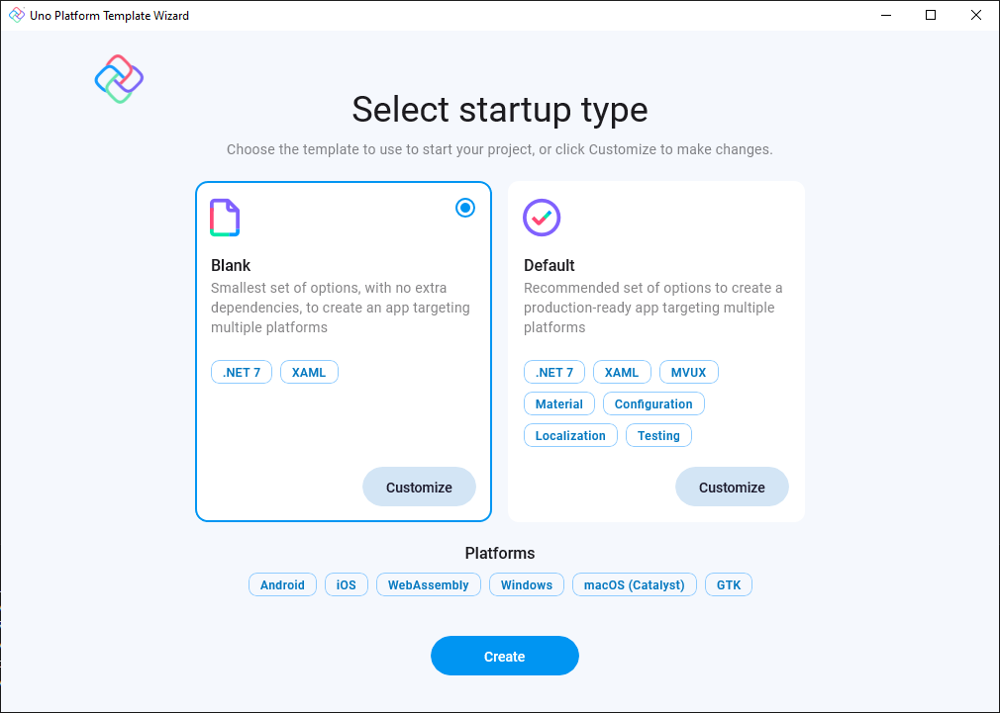
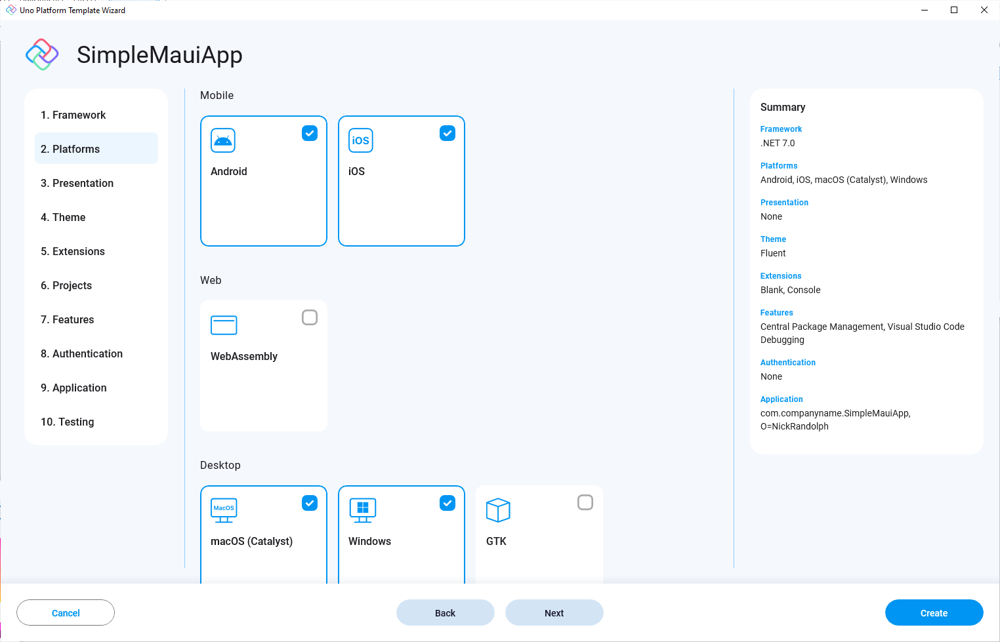
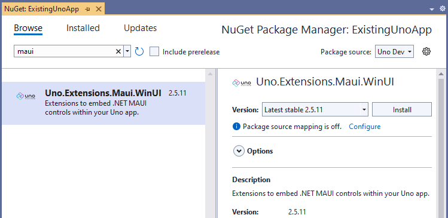
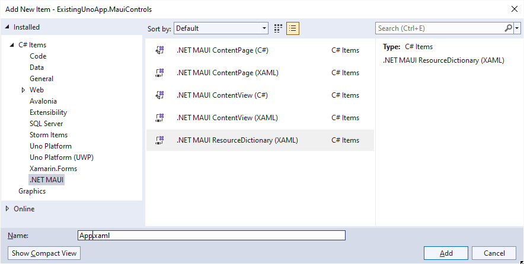

# .NET MAUI Embedding

With .NET MAUI Embedding 3rd party control libraries for .NET MAUI can bed used within an Uno Platform application.

## Overview

The integration of .NET MAUI controls into an Uno application consist of two parts, the .NET MAUI class library and the MauiHost control. 

The `MauiHost` control (that's part of the Uno.Extensions.Maui.WinUI package) is added to any Uno page or control to embed a .NET MAUI control. The `Source` property on the `MauiHost` is the type of .NET MAUI control that will be added as a child of the `MauiHost` control. As the .NET MAUI control will be added as a child, it will inherit the data context of the `MauiHost` control. The DataContext on the `MauiHost` is mapped to the `BindingContext` of the .NET MAUI control.

It's recommended that instead of hosting individual .NET MAUI controls in a `MauiHost` element, that a `ContentView` is created inside a .NET MAUI class library and set as the `Source` on a `MauiHost` element. This makes it easy to add multiple .NET MAUI controls, as well as setting properties, including data binding, in XAML.


## Get Started - New Uno Application

For new applications created using the Uno Platform Template Wizard for Visual Studio, .NET MAUI Embedding can be selected as a feature when creating the application.  

Start by selecting either the Blank or Default template, and clicking the Customize button (since neither of the predefined configurations include the .NET MAUI Embedding by default).  



.NET MAUI Embedding is only supported on iOS, Android, MacCatalyst and Windows. If you have any other platforms selected, the .NET MAUI Embedding feature will be disabled. Select the Platforms section and make sure only iOS, Android, MacCatalyst and Windows is selected.  



Select the Features section and include the MAUI Embedding feature, before clicking the Create button to complete the creation of the application.  


In addition to the typical Uno Platform application structure, there is a .NET MAUI class library (eg SimpleMauiApp.MauiControls). The MauiControls class library is where you add references to third party .NET MAUI control libraries, add any services or call registration/initialization methods on the third party libraries, and of course define the .NET MAUI controls that you want to display with the application. 


The application can be run by setting the desired platform project (Mobile or Windows) to be the startup project and then pressing F5 or clicking the Run button. The default layout shows a text, "Hello Uno Platform", which is an Uno TextBlock, followed by an Image, two TextBlock and a Button, which are all .NET MAUI controls.


These steps can also be achieved via the command lines by invoking the following commands 

```
dotnet new install uno.templates
dotnet new unoapp -preset blank -maui -o SimpleMauiApp
```

## Get Started - Existing Uno Application

.NET MAUI Embedding can be added to any existing Uno application via the following steps. The .NET MAUi Embedding feature is only supported in Uno applications that target iOS, Android, MacCatalyst and Windows, as shown in the Platforms folder in the following solution structure. These instructions are appropriate for an Uno application targeting .NET 7.


1.  **Uno.Extensions.Maui.WinUI**  
Add a reference in the existing class library to [Uno.Extensions.Maui.WinUI](https://www.nuget.org/packages/Uno.Extensions.Maui.WinUI). It's not necessary to add this package to other projects.  

  

1.  **Package References**

If the application is using Central Package Management, remove PackageVersion elements for the following packages

```xml
<Project ToolsVersion="15.0">
  <ItemGroup>
    ...
    <!--<PackageVersion Include="Microsoft.Windows.SDK.BuildTools" Version="10.0.22621.756" /> -->
    <!-- <PackageVersion Include="Microsoft.WindowsAppSDK" Version="1.3.230724000" />-->
    ...
    <!--<PackageVersion Include="Xamarin.Google.Android.Material" Version="1.9.0.2" />-->
    ...
  </ItemGroup>
</Project>
```

In the project file for the existing Class Library, add the following ItemGroup, and remove the specified PackageReferences

```xml
<Project Sdk="Microsoft.NET.Sdk">
  ...
  <!-- Add this ItemGroup to add reference to Android packages -->
	<ItemGroup Condition="$(IsAndroid)">
		<PackageReference Include="Xamarin.Google.Android.Material" VersionOverride="1.9.0.2" />
		<PackageReference Include="Xamarin.AndroidX.Navigation.UI" VersionOverride="2.6.0.1" />
		<PackageReference Include="Xamarin.AndroidX.Navigation.Fragment" VersionOverride="2.6.0.1" />
		<PackageReference Include="Xamarin.AndroidX.Navigation.Runtime" VersionOverride="2.6.0.1" />
		<PackageReference Include="Xamarin.AndroidX.Navigation.Common" VersionOverride="2.6.0.1" />
	</ItemGroup>
  ...
  <Choose>
		<When Condition="$(IsWinAppSdk)">
      ...
      <!-- Remove these package references and default to those specified by .NET Maui -->
			<!--<ItemGroup>
				<PackageReference Include="Microsoft.WindowsAppSDK" />
				<PackageReference Include="Microsoft.Windows.SDK.BuildTools" />
			</ItemGroup>-->
		</When>
</Project>
```

Update the project file (csproj) for the Mobile target with the following PackageReferences
```xml
<Project Sdk="Microsoft.NET.Sdk">
  ...
	<Choose>
		<When Condition="$(IsAndroid)">
			<ItemGroup>
        <!-- Add, or amend, the reference to Xamarin.Google.Android.Material with the VersionOverride -->
				<PackageReference Include="Xamarin.Google.Android.Material" VersionOverride="1.9.0.2" />

				<!-- Add reference to additional Android wrapper libraries -->
        <PackageReference Include="Xamarin.AndroidX.Navigation.UI" VersionOverride="2.6.0.1" />
				<PackageReference Include="Xamarin.AndroidX.Navigation.Fragment" VersionOverride="2.6.0.1" />
				<PackageReference Include="Xamarin.AndroidX.Navigation.Runtime" VersionOverride="2.6.0.1" />
				<PackageReference Include="Xamarin.AndroidX.Navigation.Common" VersionOverride="2.6.0.1" />
        ...
			</ItemGroup>
      ...
</Project>
```

Update the project file (csproj) for the Windows target to remove the following PackageReferences

```xml
<Project Sdk="Microsoft.NET.Sdk">
	...
  <ItemGroup>
		<PackageReference Include="Uno.WinUI" />

    <!-- Remove the following PackageReferences and use the packages included by .NET MAUI -->
		<!-- <PackageReference Include="Microsoft.WindowsAppSDK" /> -->
		<!-- <PackageReference Include="Microsoft.Windows.SDK.BuildTools" />-->
	</ItemGroup>
</Project>
```

1.  **Maui class library**  
Add a new .NET MAUI Class Library to the application, `ExistingUnoApp.MauiControls`.

  

1.  **MauiControls - EmbeddedControl**  

Remove the Class1.cs file that was created by the .NET MAUI Class Library template and add a .NET MAUI ContentView, `EmbeddedControl`  

  

1.  **MauiControls - App**  


Add a new .NET MAUI Resource Dictionary called App.

  

This will generate App.xaml and App.xaml.cs, which we'll update to inherit from the `Application` base class instead of being a ResourceDictionary

```xml
<?xml version = "1.0" encoding = "UTF-8" ?>
<Application xmlns="http://schemas.microsoft.com/dotnet/2021/maui"
			 xmlns:x="http://schemas.microsoft.com/winfx/2009/xaml"
			 x:Class="ExistingUnoApp.MauiControls.App">
	<Application.Resources>
		<ResourceDictionary>
			<ResourceDictionary.MergedDictionaries>
			</ResourceDictionary.MergedDictionaries>
		</ResourceDictionary>
	</Application.Resources>
</Application>
```

```csharp
public partial class App : Application
{
    public App()
    {
        InitializeComponent();
    }
}
```

1.  **ProjectReference - MauiControls**

In the project file (csproj) for the Uno class library, add a reference to the .NET MAUI class library

```xml
<Project Sdk="Microsoft.NET.Sdk">
  ...
	<ItemGroup>
    <!-- Add the reference to the .NET MAUI class library as a ProjectReference -->
		<ProjectReference Include="..\..\ExistingUnoApp.MauiControls\ExistingUnoApp.MauiControls.csproj" />
	</ItemGroup>
  ...
</Project>

```


1.  **EmbeddingApplication**  

Back in the Uno class library, change the base class in `App.cs` from `Application` to `EmbeddingApplication`   

```csharp
public class App : EmbeddingApplication
{
    protected Window? MainWindow { get; private set; }
    protected IHost? Host { get; private set; }
```


1.  **UseMauiEmbedding**  
If using Uno.Extensions, add UseMauiEmbedding to the IHost builder, before the Customize method. Alternatively, add a call to the UseMauiEmbedding extension method for the application instance.  

**With** Uno.Extensions

```csharp
public class App : EmbeddingApplication
{
    protected async override void OnLaunched(LaunchActivatedEventArgs args)
    {
        var builder = this.CreateBuilder(args)
            ...
            .UseMauiEmbedding<MauiControls.App>()
            ...
            .Configure(host => host
            ...
```

**Without** Uno.Extensions

```csharp
public class App : EmbeddingApplication
{
    protected async override void OnLaunched(LaunchActivatedEventArgs args)
    {
      ...
      this.UseMauiEmbedding<MauiControls.App>(MainWindow);
      ...
```

1.  **MauiHost**  

Add a MauiHost element to the MainPage and set the Source property to match the EmbeddedControl  

```xml
<Page x:Class="ExistingUnoApp.Presentation.MainPage"
  ... >

	<Grid>
    ...
    <embed:MauiHost x:Name="MauiHostElement"
            xmlns:embed="using:Uno.Extensions.Maui"
            xmlns:controls="using:ExistingUnoApp.MauiControls"
            Source="controls:EmbeddedControl" />
    ...
	</Grid>
</Page>
```

Build and run on each target platform to see the .NET MAUI control embedded within the Uno application
