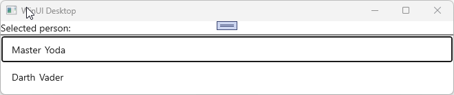
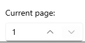
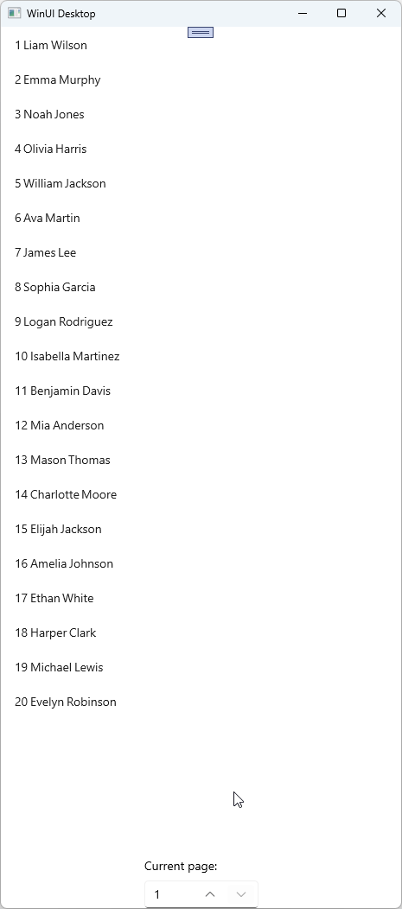
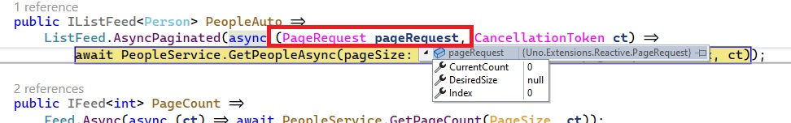
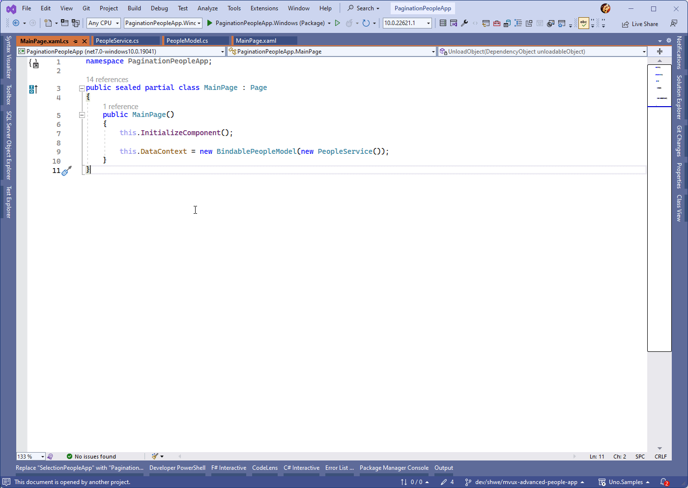

# Advanced MVUX topics

This page covers the following topics:

- [Selection](#selection)
  - [Single item selection](#single-item-selection)
  - [Multi-item selection](#multi-item-selection)
- [Pagination](#pagination)
  - [Incremental loading](#incremental-loading)
  - [Offset pagination](#offset-pagination)
  - [Keyset pagination with a cursor](#keyset-pagination-with-a-cursor)
- [Commands](#commands)
  - [Asynchronous commands](#asynchronous-commands)
  - [Creating commands](#creating-commands)
- [Inspecting MVUX generated code](#inspecting-the-generated-code)

## Selection

MVUX has embedded support of selection.  
Any control that inherits [`Selector`](https://learn.microsoft.com/windows/windows-app-sdk/api/winrt/microsoft.ui.xaml.controls.primitives.selector) (e.g. [`ListView`](https://learn.microsoft.com/windows/windows-app-sdk/api/winrt/microsoft.ui.xaml.controls.listview), [`GridView`](https://learn.microsoft.com/windows/windows-app-sdk/api/winrt/microsoft.ui.xaml.controls.gridview), [`ComboBox`](https://learn.microsoft.com/windows/windows-app-sdk/api/winrt/microsoft.ui.xaml.controls.combobox), [`FlipView`](https://learn.microsoft.com/windows/windows-app-sdk/api/winrt/microsoft.ui.xaml.controls.flipview)), has automatic support for updating a List-State with its current selection.  
Binding to the `SelectedItem` property is not even required, as this works automatically.  

To synchronize to the selected value in the `Model` side, use the `Selection` operator of the List-View.

## Recap of the *PeopleApp* example

We'll be using the *PeopleApp* example which we've built step-by-step in [this tutorial](xref:Overview.Mvux.HowToListFeed).  

The *PeopleApp* uses an `IListFeed<T>` where `T` is a `Person` [record](https://learn.microsoft.com/dotnet/csharp/language-reference/builtin-types/record) with the properties `FirstName` and `LastName`.
It has a service which has the following contract:

```c#
public interface IPeopleService
{
    ValueTask<IImmutableList<Person>> GetPeopleAsync(CancellationToken ct);
}
```

It is then used by the `PeopleModel` class which requests the service using a List-Feed.

```c#
public partial record PeopleModel(IPeopleService PeopleService)
{
    public IListFeed<Person> People => ListFeed.Async(PeopleService.GetPeopleAsync);
}
```

The data is then displayed on the View using a `ListView`:

```xaml
<Page ...>
    <ListView ItemsSource="{Binding People}">
        <ListView.ItemTemplate>
            <DataTemplate>
                <StackPanel Orientation="Horizontal" Spacing="5">
                    <TextBlock Text="{Binding FirstName}"/>
                    <TextBlock Text="{Binding LastName}"/>
                </StackPanel>
            </DataTemplate>
        </ListView.ItemTemplate>
    </ListView>
</Page>
```

> [!NOTE]  
> The use of the `FeedView` is not necessary in our example, hence the `ListView` has been extracted from it, and its `ItemsSource` property has been directly data-bound to the Feed.

## Implement selection in the *PeopleApp*

MVUX has two extension methods of `IListFeed<T>`, that enables single or multi selection.

> [!NOTE]  
> The source-code for the sample app demonstrated in this section can be found [here](https://github.com/unoplatform/Uno.Samples/tree/master/UI/MvuxHowTos/AdvancedPeopleApp).

### Single-item selection

A Feed doesn't store any state, so the `People` property won't be able to hold any information, nor the currently selected item.  
To enable storing the selected value in the model, we'll create an `IState<Person>` which will be updated by the `Selection` operator of the `IListFeed<T>` (it's an extension method).

Let's change the `PeopleModel` as follows:

```c#
public partial record PeopleModel(IPeopleService PeopleService)
{
    public IListFeed<Person> People =>
        ListFeed
        .Async(PeopleService.GetPeopleAsync)
        .Selection(SelectedPerson);

    public IState<Person> SelectedPerson => State<Person>.Empty(this);
}
```

The `SelectedPerson` State is initialized with an empty value using `State<Person>.Empty(this)` (we still need a reference to the current instance to enable caching).

> [!NOTE]  
> Read [this](xref:Overview.Mvux.States#other-ways-to-create-feeds) to learn more about States and the `Empty` factory method.

The `Selection` operator was added to the existing `ListFeed.Async(...)` line, it will listen to the `People` List-Feed, and will affect its selection changes onto the `SelectedPerson` State property.

In the View side, wrap the `ListView` element in a `StackPanel`, and insert additional elements to reflect the currently selected value via the `SelectedPerson` State.  
We'll also add a separator (using `Border`) to be able to distinguish them.

The View code shall look like the following:

```xaml
<Page ...>

    <StackPanel>
        <StackPanel DataContext="{Binding SelectedPerson}" Orientation="Horizontal" Spacing="5">
            <TextBlock Text="Selected person:" />
            <TextBlock Text="{Binding FirstName}"/>
            <TextBlock Text="{Binding LastName}"/>
        </StackPanel>

        <Border Height="2" Background="Gray" />

        <ListView ...>
    </StackPanel>
</Page>
```

When running the app, the top section will reflect the item the user selects in the `ListView`:



> [!NOTE]  
> The source-code for the sample app can be found [here](https://github.com/unoplatform/Uno.Samples/tree/master/UI/MvuxHowTos/AdvancedPeopleApp).

#### Using a property selector

Selection can also be propagated to a new feed using the `Select` operator.

### Multi-item selection

The `Selection` operator has another overload which enables selecting multiple items. An `IListState<Person>` is need for multi-selection instead of `IState<Person>` used above.

In the `PeopleModel`, we'll modify the `SelectedPerson` property to look like the following:

```c#
public IState<IImmutableList<Person>> SelectedPeople => State<IImmutableList<Person>>.Empty(this);
```

Then change `.Selection(SelectedPerson)` to `.Selection(SelectedPeople)`.

Head to the View and enable multi-selection in the `ListView` by changing its `SelectionMode` property to `Multiple`.

> [!NOTE]  
> The source-code for the sample app can be found [here](https://github.com/unoplatform/Uno.Samples/tree/master/UI/MvuxHowTos/SelectionPeopleApp).

## Pagination

There are several ways to paginate data.

> [!NOTE]  
> The source-code for the sample app demonstrated in this section can be found [here](https://github.com/unoplatform/Uno.Samples/tree/master/UI/MvuxHowTos/|PaginationPeopleApp).

### Incremental loading

The easiest and most straight-forward is use the built-in incremental loading functionality that some controls (e.g. `ListView`, `GridView`) offer via the [`ISupportIncrementalLoading`](https://learn.microsoft.com/en-us/uwp/api/windows.ui.xaml.data.isupportincrementalloading) interface the paginated Feed implements.

For the Pagination example we'll also use the *PeopleApp* example used above in [Selection](#selection), but you can find the full code [here](https://github.com/unoplatform/Uno.Samples/tree/master/UI/MvuxHowTos/PaginationPeopleApp).

#### Service

Let's change the `GetPeopleAsync` method in the *PeopleService.cs* file to support pagination:

```c#
namespace PaginationPeopleApp;

public partial record Person(string FirstName, string LastName);

public interface IPeopleService
{
    ValueTask<IImmutableList<Person>> GetPeopleAsync(uint pageSize, uint pageIndex, CancellationToken ct);

    ValueTask<uint> GetPageCount(uint pageSize, CancellationToken ct);
}

public class PeopleService : IPeopleService
{
    public async ValueTask<IImmutableList<Person>> GetPeopleAsync(uint pageSize, uint pageIndex, CancellationToken ct)
    {
        // convert to int for use with LINQ
        var (size, index) = ((int)pageSize, (int)pageIndex);

        // fake delay to simulate loading data
        await Task.Delay(TimeSpan.FromSeconds(1), ct);

        // this is where we would asynchronously load actual data from a remote data store
        var people = GetPeople();

        return people
            .Skip(size * index)
            .Take(size)
            .ToImmutableList();
    }

    // Determines how many pages we'll need to display all the data.
    public async ValueTask<uint> GetPageCount(uint pageSize, CancellationToken ct) =>
        (int)Math.Ceiling(GetPeople().Length / (double)pageSize);

    private Person[] GetPeople() =>
        new Person[]
        {
            new("Liam", "Wilson"),
            new("Emma", "Murphy"),
            new("Noah", "Jones"),
            new("Olivia", "Harris"),
            new("William", "Jackson"),
            /* ... another gazillion names ... */
        }
    }
}
```

#### Model

```c#
using Uno.Extensions.Reactive;

namespace PaginationPeopleApp;

public partial record PeopleModel(IPeopleService PeopleService)
{
    const uint PageSize = 20;

    public IListFeed<Person> PeopleAuto =>
        ListFeed.AsyncPaginated(async (PageRequest pageRequest, CancellationToken ct) =>
            await PeopleService.GetPeopleAsync(pageSize: PageSize, pageIndex: pageRequest.Index, ct));
}
```

The `AsyncPaginated` method generates a `ListFeed` that supports pagination.

Whenever the user scrolls down to see additional data and is hitting the end of the collection displayed in a `ListView`, the pagination List-Feed is automatically triggered with a page request.  
The parameter of `AsyncPaginated`, is a delegate taking in a [`PageRequest`](#the-pagerequest-type) value and a `CancellationToken` and returning an `IListFeed<T>` where `T` is `Person` in our case. This delegate is invoked when a page request comes in.

As you can see, we are sending the `Index` property of the incoming `pageRequest` argument to determine what page we're positioned.  
`PageSize` refers to a constant value of `20`, but the `PageRequest` also has a `DesiredSize` property which the `ListView` can set according to its capacity. So essentially you can substitute `pageSize: PageSize` with `pageSize: pageRequest.DesiredSize` which is a nullable `uint`, and is populated by the `ListView`. We used a constant `PageSize` for the sake of this demonstration.

#### View

```xaml
<Page 
    x:Class="PaginationPeopleApp.MainPage"
	xmlns="http://schemas.microsoft.com/winfx/2006/xaml/presentation"
	xmlns:x="http://schemas.microsoft.com/winfx/2006/xaml"
    xmlns:local="using:PaginationPeopleApp"
    xmlns:mvux="using:Uno.Extensions.Reactive.UI">

    <Page.Resources>
        <DataTemplate x:Key="PersonDataTemplate" x:DataType="local:Person">
            <StackPanel Orientation="Horizontal" Spacing="2">
                <TextBlock Text="{x:Bind FirstName}"/>
                <TextBlock Text="{x:Bind LastName}"/>
            </StackPanel>
        </DataTemplate>
    </Page.Resources>

    <ListView ItemsSource="{Binding PeopleAuto}" ItemTemplate="{StaticResource PersonDataTemplate}"
        DataFetchSize="20" Header="Next page auto-loading when on available capacity or scrolled"/>

</Page>
```

In addition, make sure the `DataContext` of the `Page` is set to the generated bindable model called `BindablePeopleModel` (*MainPage.xaml.cs*):

```c#
public MainPage()
{
    this.InitializeComponent();

    this.DataContext = new BindablePeopleModel(new PeopleService());
}
```

> [!TIP]  
> You can inspect the generated code by either placing the cursor on the word `BindablePeopleModel` and hitting <kbd>F12</kbd>, see other ways to inspect the generated code [here](#inspecting-the-generated-code).

As you can see, there's nothing special in the XAML code as MVUX is taking advantage of the tools already implemented with the `ListView`.

- When the page load, the first 20 items are loaded (after a delay of one second - as simulated in the service).
- If there's available space in the `ListView`, the next batch of 20 items will be requested from the Feed and loaded from the service thereafter.
- When the user scroll down and hits the bottom of the `ListView`, the next 20 items will be requested.
- This behavior will follow as the user scrolls down and chases the service for more data until all items have been loaded.

Here's what the app renders like:


> [!TIP]  
> You can use these members of the `ListView` to control data loading: [`DataFetchSize`](https://learn.microsoft.com/en-us/uwp/api/windows.ui.xaml.controls.listviewbase.datafetchsize), [`IncrementalLoadingThreshold`](https://learn.microsoft.com/en-us/uwp/api/windows.ui.xaml.controls.listviewbase.incrementalloadingthreshold), and [`IncrementalLoadingTrigger`](https://learn.microsoft.com/en-us/uwp/api/windows.ui.xaml.controls.listviewbase.incrementalloadingthreshold).

> [!NOTE]  
> The source-code for the sample app demonstrated in this section can be found [here](https://github.com/unoplatform/Uno.Samples/tree/master/UI/MvuxHowTos/PaginationPeopleApp).

### Offset pagination

Offset pagination is controlled via a State that stores the current page index in the Model, and the List-Feed depending on it, using [the `Select` operator](xref:Overview.Mvux.Feeds#select-or-selectasync).  
When the user requests a new page, the current page index state is updated, thereby updating the dependent collection List-Feed.

Using the example started in [incremental loading above](#incremental-loading), we'll add another method to the service, which will disclose to the View how many items are there in total. Getting a count of items is more efficient than enumerating all entries. This is necessary to identify the total number of pages we have.

#### Service

Here's the method added to the service (*PeopleService.cs*):

```c#
public async ValueTask<int> GetPageCount(uint pageSize, CancellationToken ct) =>
    (uint)Math.Ceiling(GetPeople().Length / (double)pageSize);
```

The signature of `GetPageCount` should also be added to the `IPeopleService` interface:

```c#
ValueTask<int> GetPageCount(uint pageSize, CancellationToken ct);
```

#### Model

Let's expand the Model with the following:

```c#
public partial record PeopleModel(IPeopleService PeopleService)
{
    public IListFeed<Person> PeopleAuto ...// will not be used in this example

    const uint PageSize = 20;
        
    public IFeed<int> PageCount =>
        Feed.Async(async (ct) => await PeopleService.GetPageCount(PageSize, ct));

    public IState<uint> CurrentPage => State.Value(this, () => 1u);

    public IListFeed<Person> PeopleManual =>
        CurrentPage.SelectAsync(async (currentPage, ct) =>
            // currentPage argument as index based
            await PeopleService.GetPeopleAsync(pageSize: PageSize, pageIndex: currentPage - 1, ct))
        .AsListFeed();

    public async ValueTask Move(uint currentPage, uint pageCount, int direction, CancellationToken ct)
    {
        var desiredPage = currentPage + direction;

        if (desiredPage <= 0 || desiredPage > pageCount)
            return;

        await CurrentPage.Set((uint)desiredPage, ct);
    }
}
```

In the code above, whenever `CurrentPage` changes, `PeopleManual` will update its data accordingly.  
MVUX's code generator generates an async command that is bound to from the View, when the user clicks the designated button to move to either previous or next page, the `Move` method will be invoked with the `direction` argument set to either 1 or -1 added to the current page index.

You may be wondering where the `currentPage` and `pageCount` arguments are populated from, this is another MVUX magic trick where when the parameters type and name matches a Feed or a State in the current Model, their latest value are provided as an argument to the executed Command.  
Read onward on [Creating commands](#creating-commands) to learn more.

#### View

Replace the `ListView` from the previous example with this one:

```xaml
<ListView Grid.Column="2" x:Name="manual" ItemsSource="{Binding PeopleManual}"
          ItemTemplate="{StaticResource PersonDataTemplate}" Header="Load single page on demand">
    
    <ListView.Footer>
        <StackPanel Orientation="Horizontal" Spacing="3">

            <Button Content="Previous" Command="{Binding Move}" VerticalAlignment="Center">
                <Button.CommandParameter>
                    <x:Int32>-1</x:Int32>
                </Button.CommandParameter>
            </Button>

            <TextBlock Text="{Binding CurrentPage}" VerticalAlignment="Center" />

            <Button Content="Next" Command="{Binding Move}" VerticalAlignment="Center">
                <Button.CommandParameter>
                    <x:Int32>1</x:Int32>
                </Button.CommandParameter>
            </Button>

        </StackPanel>
    </ListView.Footer>
</ListView>
```

Two buttons were added to the `ListView`'s footer which are bound to the `Move` command, and the `TextBlock` in-between them will display the current page via the `CurrentPage` State it's bound to.  
A `CommandParameter` of either *1* or *-1* has been set to Next and Previous buttons respectively.



> [!TIP]  
> The generated `Move` command can be seen in the generated `BindablePeopleModel` as well, follow the instructions [here](#inspecting-the-generated-code).

When running the app, the first page will be loaded and await the users input to navigate to other pages which will be loaded on-demand:



#### The `PageRequest` type

The `PageRequest` type contains the following properties and is used by a paginated Feed to pass information about the desired page the user wants to navigate to. It's the first parameter passed into the `PaginatedAsync` method when invoked:



Its properties are:

|Property|Description|
|---|---|
|Index|The index of the page to be loaded.|
|CurrentCount|This is the total number of items currently in the list.|
|DesiredSize|The desired number of items for the current page, if any.<br/><br/>This is the desired number of items that the view requested to load.<br/>It's expected to be null only for the first page.<br/>Be aware that this might change between pages (especially is user resize the window), DO NOT use in `source.Skip(page.Index * page.DesiredSize).Take(page.DesiredSize)`.<br/>Prefer to use the `CurrentCount` property, e.g. `source.Skip(page.CurrentCount).Take(page.DesiredSize)`.|

### Keyset pagination with a cursor

There are several caveats in using `Skip` and `Take` (Offset pagination) with an arbitrary page size multiplied by the page number.

- When we skip data records, the database might still have to process some the skipped records on its way to the desired ones.
- If any updates have been applied to the records preceding the currently displayed page, and then the user moves to the next or previous page, there might be inconsistencies in showing the subsequent data, some of the entries might be skipped or shown twice.

An alternative way to paginate data is by using a cursor that points to a specific record and take then number of desired records in a page onwards.  
This is referred to as 'keyset pagination' or 'seek-based pagination'.

To utilize this pagination style, MVUX provides another `ListFeed` factory overload, the `AsyncPaginatedByCursor`.

The signature of this method is:

```c#
public static IListFeed<T> AsyncPaginatedByCursor<TCursor>(TCursor firstPage, GetPage<TCursor, T> getPage)
```

where the `GetPage` type is a delegate with the following pattern:

```
public delegate ValueTask<PageResult<TCursor, TItem>> GetPage<TCursor, TItem>(TCursor cursor, uint? desiredPageSize, CancellationToken ct);
```

The callback delegate takes two parameters and returns two.

The two input parameters are:

- A cursor to the first page, in other words the item this page starts with. The service then starts by ordering the data and searching for the first item, then uses the second parameter:
- The desired page size, the number of entries following it, along with another entity that uses as the cursor of the next page, which is not displayed to the user.
- A `CancallationToken` which can be used to abort the operation.

The callback returns a `PageResult<TCursor, TItem>`, and it contains:

- An `ImmutableList<T>` containing the items to be displayed in the resulted page.
- A `TCursor` that can be of a different type that points to the beginning of the upcoming page.

To demonstrate this we'll stick to the *PaginatedPeopleApp* we've started before.

#### Service

To keep the service agnostic, we'll add the following method to the Service:

*IPeopleService*:

```c#
ValueTask<(IImmutableList<Person> CurrentPage, Person NextCursor)> GetPeopleAsync(Person? cursor, uint pageSize, CancellationToken ct);
```

This method has 3 parameters:

- The first is a `Person` which uses as a cursor to the first page, i.e. the first `Person` of the requested page.
- The second is a `uint` representing the number of entities to follow the first one. The reason of using a `uint` is that negative values are not expected here.
- The third one is a `CancellationToken` which can be used to signal the service to abort loading data.

The method returns a tuple with two components (same as `PageResult`, only keeping the service agnostic of MVUX):

- An `IImmutableList<Person>` which includes the entities of this page
- A `Person` which uses as a cursor as the beginning of the next page.

> [!TIP]  
> The cursor does not necessarily have to be a `Person` or the data type the collection contains, it can also be an ID or another key of an entity for the service to lookup and return it along with its upcoming entries.

In the example above we want to override the `ToString` method of `Person` so that we can later order the entities by their string representation:

```c#
public partial record Person(string FirstName, string LastName)
{
    public override string ToString() => $"{FirstName} {LastName}";
}
```

The fully implemented method in the service is as follows:

```c#
public async ValueTask<(IImmutableList<Person> CurrentPage, Person NextCursor)> GetPeopleAsync(Person? cursor, uint pageSize, CancellationToken ct)
{
    // fake delay to simulate loading data
    await Task.Delay(TimeSpan.FromSeconds(1), ct);

    var people = GetPeople();

    var collection = people
        // order by full name
        .OrderBy(person => person.ToString())
        // select only subsequent items
        .Where(person => StringComparer.CurrentCultureIgnoreCase.Compare(cursor?.ToString(), person.ToString()) <= 0)
        // take only n number of rows, plus the first entity of the next page
        .Take((int)pageSize + 1)        
        .ToArray();

    // this returns a tuple of two elements
    // first element is the current page's entities except the last
    // the second contains the last item in the collection, which is a cursor for next page
    return (CurrentPage: collection[..^1].ToImmutableList(), NextCursor: collection[^1]);
}
```

#### Model

```c#
public IListFeed<Person> PeopleCursor =>
    ListFeed<Person>.AsyncPaginatedByCursor(
            // starting off with a blank Person, since the person list is to be ordered by name, any valid name will follow.
            firstPage: new Person(string.Empty, string.Empty), 
            // this will be automatically invoked by the ISupportIncrementalLoading the ListView supports
            getPage: async (cursor, desiredPageSize, ct) =>
                {
                    // gets the tuple result from the service
                    var result = await PeopleService.GetPeopleAsync(cursor, PageSize, ct);
                    // converts tuple to PageResult
                    return new PageResult<Person, Person>(result.CurrentPage, result.NextCursor);
                });
```

#### View

There's not much needed in the View as this is magically working via the `ISupportIncrementalLoading` implemented with the `ListView`!

```xaml
<ListView ItemsSource="{Binding PeopleCursor}" ItemTemplate="{StaticResource PersonDataTemplate}" />
```

When the program runs, it works like it did in auto incremental loading, except the people list is sorted by full-name:


## Commands

### Commands recap

In the [overview](xref:Overview.Mvux.Overview) you've seen a brief introduction on how a method in the Model gets generated as a command in the Bindable Proxy Model.

### Asynchronous commands

The [`AsyncCommand`](https://github.com/unoplatform/uno.extensions/blob/main/src/Uno.Extensions.Reactive/Presentation/Commands/AsyncCommand.cs) class, is a Command that implements [`ICommand`](https://learn.microsoft.com/en-us/dotnet/api/system.windows.input.icommand) and adds support for asynchronous operations.  
As it implements `ICommand`, it can be bound from the View as a regular Command (e.g. in a `Button.Command` property). The advantage is that it can be invoked asynchronously.  
In addition it also implements [`INotifyPropertyChanged`](https://learn.microsoft.com/en-us/dotnet/api/system.componentmodel.inotifypropertychanged), to enable tracking if its properties have changed, and `ILoadable` - an Uno interface that provides information of an objects state whether it's currently in execution mode or not.


### Creating commands

There are several methods of how to create an MVUX command.

1. Using code generation

    As demonstrated in previous tutorials, when creating a method in the Model, it will be generated as an `AsyncCommand` in the Bindable Model.
    
    Command generation rules:
    
     - Any parameter that has a type and name matching a Feed or a State in this Model will be evaluated when the Command is invoked and its current latest value will be passed in as an argument.  
     You'll find this feature to be very powerful in invoking commands by combining data from various Feeds in addition to a command parameter received from the View.    
     - Can be either synchronous or asynchronous
     - Can have one `CancellationToken` as its last parameter, but it's not mandatory.

     > [!TIP]  
     > You can explicitly match a parameter with a Feed even the names don't match by decorating the parameter with the `FeedParameter` attribute:  
     >
     > ```c#
     > public IFeed<string> Message { get; }
     > 
     > public async ValueTask Share([FeedParameter(nameof(Message))] string msg)
     > {
     > }
     > ```

     > [!TIP]  
     > You can also opt in or out of implicit matching of Feeds and command parameters by the decorating the current assembly or class with the `ImplicitFeedCommandParameters` attribute:  
     >
     > ```c#
     > [assembly:ImplicitFeedCommandParameter(false)]
     >
     > [ImplicitFeedCommandParameter(true)]
     > public partial record MyModel
     > ```

1. Using factory methods

    Commands can also built manually using the static class [`Command`](https://github.com/unoplatform/uno.extensions/blob/main/src/Uno.Extensions.Reactive/Presentation/Commands/Command.cs).  
    This class provides factory methods for creating commands.

    - Async

    ```c#
    public ICommand MyCommand => Command.Async(async(ct) => await PingServer(ct));
    ```

    > [!Note]  
    > You need not worry about the `=>` operator and that the `Command.Async` will be called over and over, this value is cached and will only be called once.  
    The benefit of using `=>` in place of traditional `{ get; } = ...`, is that local methods are accessible (otherwise these would have been required to be intialized in the constructor).

    - `Create` & `Create<T>`;

    To create a command you can use the fluent API of `ICommandBuilder` provided in the `Command.Create` factory methods, which provides the following three methods:

    - Given - This method takes a Feed (or a State!) and configures a command which will be triggered whenever a new value is available to the Feed.

        ```c#
        public IFeed<int> PageCount => ...

        public IAsyncCommand MyCommand => Command.Create(builder => builder.Given(PageCount));
        ```

    - When - Limits the command execution to a set prerequisite - in other words sets the 'can execute' of the command.

        ```c#
        public IAsyncCommand MyCommand => Command.Create<int>(builder => builder.When(i => i > 10));
        ```

    - Then - Sets the actual asynchronous callback to be invoked when the Command is executed. This method will be genereric if there's a preceding parameter setting (via Given or When).

        ```c#
        public IAsyncCommand MyCommand => Command.Create(builder => builder.Then(async ct => await ExecuteMyCommand(ct)));
        ```

    Here's a complete example:

    ```c#
    public IAsyncCommand MyCommand => 
        Command.Create(builder => 
            builder
            .Given(CurrentPage)
            .When(currentPage => currentPage > 0)
            .Then(async (currentPage, ct) => await NavigateToPage(currentPage, ct)));
    ```

    Below is a diagram detailing the methods in the Command factory toolset.

    

## Inspecting the generated code

Viewing the generated code can be achieved in several ways:

1. Placing the cursor on the class name and hitting <kbd>F12</kbd>:

    

1. Hitting <kbd>Ctrl</kbd>+<kbd>T</kbd> and typing in the Bindable type name:

    

1. Another way which can also be used to inspect all code generated by MVUX and even other code generators, is by navigating to the project's analyzers.

    1. Expand the shared project's *Dependencies* object
    2. Expand the current target platform (e.g. *net7.0windows10.0...*)
    3. Expand the *Analyzers* sub menu and then *Uno.Extensions.Reactive.Generator*
    4. Under *Uno.Extensions.Reactive.Generator.FeedsGenerator* you'll find the code generated Bindable Models and proxy types.  
    
