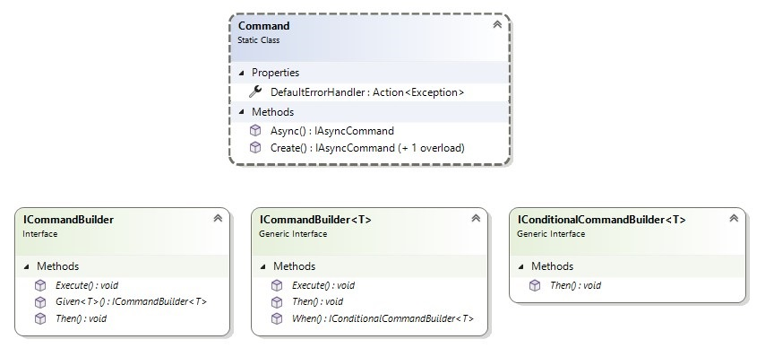

# Commands

This page covers the following topics:

- [**What are commands**](#what-are-commands)
- [**Asynchronous commands**](#asynchronous-commands)
- [**Implicit command generation**](#implicit-command-generation)
  - [**Basic Commands**](#basic-commands)
  - [**Using the CommandParameter**](#using-the-commandparameter)
  - [**Additional Feed parameters**](#additional-feed-parameters)
  - [**Command generation rules**](#command-generation-rules)
  - [**Configuring command generation using attributes**](#configuring-command-generation-using-attributes)
  - [**Using XAML behaviors to execute a command when an event is raised**](#using-xaml-behaviors-to-execute-a-command-when-an-event-is-raised)
- [**Manual command creation using factory methods**](#manual-command-creation-using-factory-methods)

## What are commands

Commands provide a way to expose code within an application (typically a method) that performs an action, so that it can be invoked from the View.  

For example the `MainModel` includes a `Save` method:

```csharp
public partial record MainModel()
{    
    public void Save() { ... }
}
```

The `Save` method will be exposed as a command on the generated bindable proxy, `BindableMainModel`:

```csharp
public partial class BindableMainModel
{
    public IAsyncCommand Save { get; }
}  
```

The `Command` property on a `Button` can be bound to the `Save` command on the `BindableMainModel`. When the `Button` is clicked, the `Save` command will be executed, which will invoke the `Save` method on `MainModel`.

```xml
<Button Command="{Binding Save}">Save</Button>
```

### IAsyncCommand

The MVUX commands implements the [`IAsyncCommand`](https://github.com/unoplatform/uno.extensions/blob/main/src/Uno.Extensions.Reactive/Presentation/Commands/IAsyncCommand.cs) interface, which extends the [`ICommand`](https://learn.microsoft.com/windows/windows-app-sdk/api/winrt/microsoft.ui.xaml.input.icommand) interface.  

The [`ICommand`](https://learn.microsoft.com/windows/windows-app-sdk/api/winrt/microsoft.ui.xaml.input.icommand) interface has two methods and one event:

- [`Execute`](https://learn.microsoft.com/windows/windows-app-sdk/api/winrt/microsoft.ui.xaml.input.icommand.execute): This method is called when the command is executed (i.e. the Save method on MainModel)
- [`CanExecute`](https://learn.microsoft.com/windows/windows-app-sdk/api/winrt/microsoft.ui.xaml.input.icommand.canexecute): This method is invoked when the UI needs to determine if the command can be executed. It returns a boolean value indicating if the command can be executed (i.e. false whilst the Save method is executing)
- [`CanExecuteChanged`](https://learn.microsoft.com/windows/windows-app-sdk/api/winrt/microsoft.ui.xaml.input.icommand.canexecutechanged): This event is raised when something that affects whether this command can execute happens, and the `CanExecute` result needs to be updated.

The `IAsyncCommand` interface also extends the [`ILoadable`](xref:Toolkit.Controls.LoadingView#iloadable) interface to report the current execution state via the `IsExecuting` property.  

Lastly, the `IAsyncCommand` also extends the  [`INotifyPropertyChanged`](https://learn.microsoft.com/dotnet/api/system.componentmodel.inotifypropertychanged) interface in order to raise the `PropertyChanged` event when any of its properties change. For example the UI could bind to the `IsExecuting` property to disable a control whilst `IsExecuting` is true. When `IsExecuting` changes to false, a `PropertyChanged` event is raised and the binding will be re-evaluated, enabling the control.

Command parameters can also be used. These will be explained [below](#using-the-commandparameter).

## Implicit command generation

When creating a method in the Model, a property of an `IAsyncCommand` wrapper will be implicitly generated in the Bindable Proxy . When that command is executed via a button-click etc., the method in the Model will be called.  
Explicit command generation is when the commands are created by hand using [factory methods](#explicit-command-creation-using-factory-methods).

### Basic commands

The `IAsyncCommand` property will be generated in the Bindable Proxy if the method signature returns no value, or is an asynchronous method (any awaitable method, e.g. `ValueTask`/`Task`).  
When the method is asynchronous, it may contain a single `CancellationToken` parameter. Although a `CancellationToken` parameter is not mandatory, it's a good practice to add one, as it enables the cancellation of the asynchronous operation. When the Model gets disposed, running commands' are requested to be cancelled.

For example, if the Model contains a method in any of the following signatures:

1. A method without a return value:
    ```csharp
    public void DoWork();
    ```
2. A method returning `ValueTask`, with `CancellationToken` parameter:
    ```csharp
    public ValueTask DoWork(CancellationToken ct);    
    ```
3. A method returning `ValueTask`, without a `CancellationToken` parameter:
    ```csharp
    public ValueTask DoWork();
    ```

a `DoWork` command will be generated in the Bindable Proxy :

```xml
<Button Command="{Binding DoWork}" />
```

In some scenarios, you may need to use the method only, without a command generated for it. You can use the [`ImplicitCommand` attribute](#implicit-commands-attribute) to switch off or back on command generation for certain methods, classes, or assemblies.  
When command generation is switch off, the methods under the scope which has been switched off will be generated in the Bindable Proxy as regular methods rather than as commands.

### Using the CommandParameter

An additional parameter can be added to the method, which is then assigned with the value of the `CommandParameter` received from the View. For instance, when using a Button and clicking it, the method will be called with the [`Button.CommandParameter`](https://learn.microsoft.com/windows/windows-app-sdk/api/winrt/microsoft.ui.xaml.controls.primitives.buttonbase.commandparameter) value, given that the type of the value matches the method parameter type. Otherwise the command's `CanExecute` will be false thereby disabling the button.

Model:
```csharp
public void DoWork(double param)
{
    ...
}
```
View:
```xml
<Slider x:Name="slider" Minimum="1" Maximum="100"/>
<Button Command="{Binding DoWork}" CommandParameter="{Binding Value, ElementName=slider}"/>
```

If the `CommandParameter` is null, or if its type doesn't match the parameter type of the method, the button will remain disabled.  
On the other hand, in case the `CommandParameter` is specified in the View but the method in the Model doesn't have a parameter, the View's `CommandParameter` value will just be disregarded.

In the following example, the Model method has a `double` parameter, whereas a `string` is provided by the View:

Model:
```csharp
public void DoWork(double param)
{
    ...
}
```
View:
```xml
<Button Command="{Binding DoWork}" CommandParameter="A string, not a double" />
```

This will result in the command's `CanExecute` to return `false`, and in turn, the button to appear as disabled:


A `CancellationToken` parameter can still be added. Although this parameter is recommended, it's not mandatory.
        
### Additional Feed parameters

The current value of any Feed can be materialized in an asynchronous method by awaiting the Feed:

```csharp
public IFeed<int> MyFeed = ...;

public async ValueTask DoWork()
{
    in myFeedValue = await MyFeed;
}
```

However, MVUX commands also enable consuming the current value of Feed properties in the Model, using parameter names in the Model method, with a name and type matching the Feed property.  
The name matching is NOT case-sensitive.

For example:

```csharp
public IFeed<int> CounterValue => ...

public void ResetCounter(int counterValue)
{
    ...
}
```

When the command is executed and the `ResetCounter` method is invoked, because the parameter `counterValue` matches a feed property in the Model by type and name, this parameter will be materialized with the actual most recent value from the Feed.

A `CancellationToken` parameter can still be added as the method's last parameter. Although this parameter is recommended, it's not mandatory.

This behavior can be configured using the [`FeedParameter`](#feedparameter-attribute) and [`ImplicitFeedCommandParameter`](#implicitfeedcommandparameter-attribute) attributes.

### Command generation rules

Here is a recap of the rules the Model method must comply with for an `IAsyncCommand` wrapper to be generated for it:

- The method may be synchronous (`void`) or asynchronous (`ValueTask`/`Task`)
- Any return values of the method (if any) will be discarded.
- The method may have one `CancellationToken` parameter or none.
- The method may have multiple parameters that can be resolved from feeds (see [Additional Feed parameters](#additional-feed-parameters) above).
- The method may have one parameter other than parameters resolved from Feeds (to be provided from the View's `CommandParameter` property), or none.

### Configuring command generation using attributes

#### ImplicitCommands attribute

By default, implicit command generation is enabled when the MVUX package is installed. That means that any method in the Model that matches the [command generation rules](#command-generation-rules) will have an accompanying command wrapper generated for it.  
However, you may choose to switch implicit command generation on or off for a specific class, or the entire assembly. Conversely, when it has been switched off for the assembly, it can be switched back on for a specific class.

Switching on or off commands can be achieved using the [`ImplicitCommands`](https://github.com/unoplatform/uno.extensions/blob/main/src/Uno.Extensions.Reactive/Config/ImplicitCommandsAttribute.cs) attribute. Here are some examples:

Switching off implicit command generation throughout the entire assembly:
```csharp
[assembly:ImplicitCommands(false)]
```

Switching on implicit command generation for a single class:
```csharp
[ImplicitCommands(true)]
public partial record MyModel(...)
```

You can combine these attributes on various classes or on the assembly to opt-in or opt-out of implicit command generation on certain scopes.

#### Command attribute

In addition to the [`ImplicitCommand`](https://github.com/unoplatform/uno.extensions/blob/main/src/Uno.Extensions.Reactive/Presentation/Commands/CommandAttribute.cs) attribute which controls implicit command generation of a class or assembly, you can explicitly switch on or off command generation for a specific method. When command generation is switched off for a specific  method, that method will be re-generated in the Proxy Model as it currently is (a method) rather than a command.

This can be achieved using the `ImplicitCommand` attribute.

To have a command generated for the method, decorate it with the `Command` attribute (with its default value `true`):

```csharp
[Command]
public async ValueTask DoWork()
{
}
```

Or on the contrary, if this method should remain without a command generated for it, specify `true` to its `isEnabled` parameter:

```csharp
[Command(false)]
public async ValueTask DoWork()
{
}
```

The `Command` attribute has precedence over the `ImplicitCommands` attribute, if a method is decorated with this attribute, whether it will be generated as a command or not will depend solely on this attribute value if set to true (default) or to false, as this has been explicitly configured, even an upper scope has command generation set differently.

One example of when you'd want to switch off command generation is if you are using [Event Binding](https://learn.microsoft.com/en-us/windows/uwp/xaml-platform/x-bind-markup-extension#event-binding), you might need to opt out from command generation for a the bound method so that you can bind to it from the View.

#### ImplicitFeedCommandParameter attribute

You can opt-in or opt-out implicit matching of Feeds and command parameters by decorating the current assembly or class with the [`ImplicitFeedCommandParameters`](https://github.com/unoplatform/uno.extensions/blob/main/src/Uno.Extensions.Reactive/Config/ImplicitFeedCommandParametersAttribute.cs) attribute:  
     
```csharp
[assembly:ImplicitFeedCommandParameter(false)]
     
[ImplicitFeedCommandParameter(true)]
public partial record MyModel
```

#### FeedParameter attribute

You can also explicitly match a parameter with a Feed even if the names don't match. Decorate the parameter with the [`FeedParameter`](https://github.com/unoplatform/uno.extensions/blob/main/src/Uno.Extensions.Reactive/Presentation/Commands/FeedParameterAttribute.cs) attribute to explicitly match a parameter with a Feed:
     
```csharp
public IFeed<string> Message { get; }
     
public async ValueTask Share([FeedParameter(nameof(Message))] string msg)
{
}
```

`ImplicitFeedCommandParameter` and `FeedParameter` attributes can also be nested to enable or disable specific scopes in the app. The `FeedParameter` setting has priority over `ImplicitFeedCommandParameter`, so parameters decorated with `FeedParameter` will explicitly indicate that the parameter is to be fulfilled by a Feed.

### Using XAML behaviors to execute a command when an event is raised

You can also utilize MVUX's generated command and invoke them when an event is raised.
This can be achieved with the [XamlBehaviors](https://github.com/unoplatform/Uno.XamlBehaviors) library.

For example, if you want to capture a `TextBlock` being double-tapped, you can add in the Model a method to be invoked on that event:

```csharp
public void TextBlockDoubleTapped(string text)
{
    // perform action
}
```

The `TextBlockDoubleTapped` method will be generated as a command, which you can then use XAML behaviors to invoke when the `TextBlock`'s `DoubleTapped` event occurs. You can also pass its command parameter to the method (although you can chose ot omit it):

```xml
<Page
    ...
    xmlns:interactivity="using:Microsoft.Xaml.Interactivity" 
    xmlns:interactions="using:Microsoft.Xaml.Interactions.Core">

    <TextBlock x:Name="textBlock" Text="Double tap me">
        <interactivity:Interaction.Behaviors>
            <interactions:EventTriggerBehavior EventName="DoubleTapped">
                <interactions:InvokeCommandAction
                    Command="{Binding TextBlockDoubleTapped}"
                    CommandParameter="{Binding Text, ElementName=textBlock}"/>
            </interactions:EventTriggerBehavior>
        </interactivity:Interaction.Behaviors>
    </TextBlock>
</Page>
```

When the `TextBlock` is double tapped (or double clicked), the `TextBlockDoubleTapped` command which is generated in the Proxy Model will be executed, and in turn the `TextBlockDoubleTapped` method in the Model will be invoked. The text 'Double tap me' will be passed in as the command parameter.

## Manual command creation using factory methods

Adding Commands via code generation is sufficient enough to probably cover all scenarios. However, sometimes you'd want to fine-grain your Commands and declare them in an explicit manner.  
Commands can be built manually using the static class [`Command`](https://github.com/unoplatform/uno.extensions/blob/main/src/Uno.Extensions.Reactive/Presentation/Commands/Command.cs).  
This class provides factory methods for creating commands.

### Async

The `Async` utility method takes an `AsyncAction` callback as its parameter. An `AsyncAction` refers to an asynchronous method that has a `CancellationToken` as its last parameter (preceed by any other parameters), and returns a `ValueTask`.

```csharp
public ICommand MyCommand => Command.Async(async(ct) => await PingServer(ct));
```

In the above example, `PingServer` is of the following signature:

```csharp
ValueTask PingServer(CancellationToken ct);
```

The `Command.Async` method will create a command that when executed will run the `PingServer` method asynchronously.

### Create & Create\<T>

To create a command you can use the API provided in the `Command.Create` factory methods. The `Command.Create` provides an `ICommandBuilder` parameter which you can use to configure the command in a fluent-API fashion.  
This API is intended for Uno Platform's internal use but can come in handy if you need to create custom commands.

`ICommandBuilder` provides the three methods below.

- #### Given

  This method initializes a command from a Feed (or a State). The command will be triggered whenever a new value is available to the Feed. It takes a single `IFeed<T>` parameter.
  
  ```csharp
  public IFeed<int> PageCount => ...
  
  public IAsyncCommand MyCommand => Command.Create(builder => builder.Given(PageCount));
  ```

- #### When

  Defines the 'can execute' of the command. It accepts a predicate of `T`, where `T` is the type the command has been created with. When this is configured, the command will be executed only if the condition is true.
  
  ```csharp
  public IAsyncCommand MyCommand => Command.Create<int>(builder => builder.When(i => i > 10));
  ```

  In the above example, the predicate passed into the `When` method will be executed when the UI wants to determine if the command can be executed, which will only be true if the command parameter will be greater than 10.

- #### Then

  Sets the asynchronous callback to be invoked when the Command is executed. This method will be generic if there's a preceding parameter setting (via `Given` or `When`).

  ```csharp
  public IAsyncCommand MyCommand => Command.Create(builder => builder.Then(async ct => await ExecuteMyCommand(ct)));

  public ValueTask ExecuteMyCommand(CancellationToken ct)
  {
      ...
  }
  ```

  You can use the `Execute` instead of `Then`. These are just aliases of each other.

### Example

Here's a complete example:

Model:
```csharp
public IAsyncCommand MyCommand => 
    Command.Create(builder => 
        builder
        .Given(CurrentPage)
        .When(currentPage => currentPage > 0)
        .Then(async (currentPage, ct) => await NavigateToPage(currentPage, ct)));

public IFeed<int> CurentPage => ...

public ValueTask NavigateToPage(int currentPage, CancellationToken ct)
{
    ...
}
```

View:
```xml
<Button Command="{Binding Model.MyCommand}" Content="Execute my command" />
```

In the above example (in the Model), when the button is clicked, the `Given` section will be materialized with the most recent value of the `CurrentPage` Feed, it will be then evaluated with the predicate provided in the `When` call, and if its value is greater than 0, it will be passed on to `Then`, and `NavigateToPage` will be called with the `CurrentPage` Feed value passed on.

> [!IMPORTANT]  
> Commands created using the fluent API will not be generated in the Bindable Proxy . In order to bind to `MyCommand`, use the Bindable Proxy 's `Model` property to access the original Model and then the command.
> For example:
>```xml
><Button Command="{Binding Model.MyCommand}" />
>```

Here is another example of using the fluent-API with a `CommandParameter` received from the View:

Model:
```csharp
public IAsyncCommand YourCommand => Command.Create<int>(builder => builder.When(i => i > 10).Then(YourMethod));

private async ValueTask YourMethod(int arg, CancellationToken ct)
{
    ...
}
```

View:
```xml
<Button Command="{Binding Model.YourCommand}" Content="My command">
    <Button.CommandParameter>
        <x:Int32>44</x:Int32>
    </Button.CommandParameter>
</Button>
```

In the last example, `YourCommand` gets invoked if the `CommandParameter` passes the condition passed in to `When`, and is then forwarded on to `Then` which takes an async action of `T`, and has the `YourMethod` passed in.

This is a diagram detailing the methods in the Command factory toolset:



Below is a list of all methods and their signatures:

Methods of Command class:

Method name    | Signature
---------------|-----------------------------------------------------------------------------------------------------------------
**Async**      | public static IAsyncCommand Async(AsyncAction execute, [CallerMemberName] string? name = null)
**Create**     | public static IAsyncCommand Create(Action<ICommandBuilder> build)
**Create\<T>** | public static IAsyncCommand Create<T>(Action<ICommandBuilder<T>> build, [CallerMemberName] string? name = null)

Methods of `ICommandBuilder`:

Method name    | Signature
---------------|-------------------------------------------------------
**Given**      | public ICommandBuilder<T> Given<T>(IFeed<T> parameter)
**Then**       | public void Then(AsyncAction execute)

Methods of `ICommandBuilder<T>`:

Method name    | Signature
---------------|--------------------------------------------------------------------
**When**       | public IConditionalCommandBuilder<T> When(Predicate<T> canExecute)
**Then**       | public void Then(AsyncAction<T> execute)

Methods of `IConditionalCommandBuilder<T>`:

Method name    | Signature
---------------|------------------------------------------
**Then**       | public void Then(AsyncAction<T> execute);

`AsyncAction` refers to an action with a variable number of parameters (up to 16), with its last parameter being a `CancellationToken`, and returns a `ValueTask`:
```chsarp
public delegate ValueTask AsyncAction<in T1, T2...>(T1 t1, T2 t2 ... , CancellationToken ct);
```
