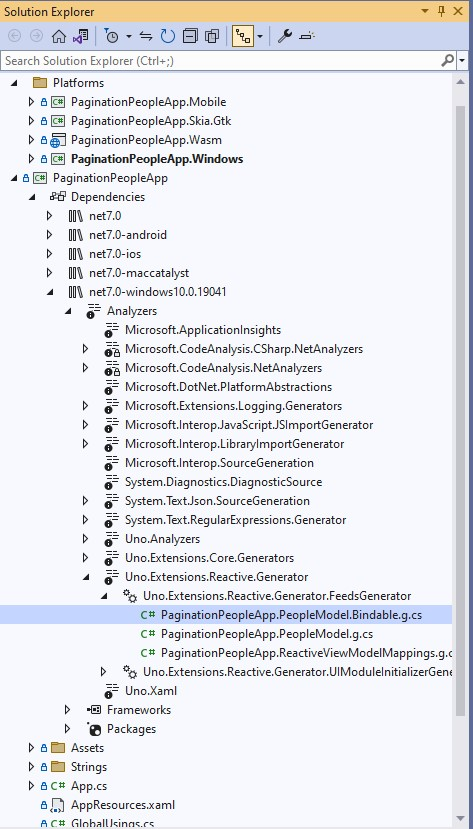

# Inspecting the generated code

Viewing the generated code can be achieved in several ways:

1. Placing the cursor on the class name and hitting <kbd>F12</kbd>:

    

1. Hitting <kbd>Ctrl</kbd>+<kbd>T</kbd> and typing in the Bindable type name:

    

1. Another way which can also be used to inspect all code generated by MVUX and even other code generators, is by navigating to the project's analyzers.

    1. Expand the shared project's *Dependencies* object
    2. Expand the current target platform (e.g. *net7.0windows10.0...*)
    3. Expand the *Analyzers* sub menu and then *Uno.Extensions.Reactive.Generator*
    4. Under *Uno.Extensions.Reactive.Generator.FeedsGenerator* you'll find the code generated Bindable Models and proxy types.  
    
