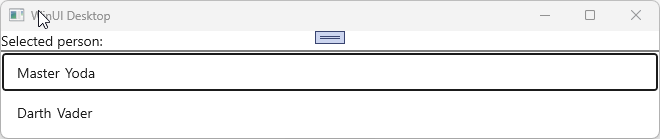

# Selection

MVUX has embedded support for both [single item](#single-item-selection) and [multi-item selection](#multi-item-selection).  
Any control that inherits [`Selector`](https://learn.microsoft.com/windows/windows-app-sdk/api/winrt/microsoft.ui.xaml.controls.primitives.selector) (e.g. [`ListView`](https://learn.microsoft.com/windows/windows-app-sdk/api/winrt/microsoft.ui.xaml.controls.listview), [`GridView`](https://learn.microsoft.com/windows/windows-app-sdk/api/winrt/microsoft.ui.xaml.controls.gridview), [`ComboBox`](https://learn.microsoft.com/windows/windows-app-sdk/api/winrt/microsoft.ui.xaml.controls.combobox), [`FlipView`](https://learn.microsoft.com/windows/windows-app-sdk/api/winrt/microsoft.ui.xaml.controls.flipview)), has automatic support for updating a List-State with its current selection.  
Binding to the `SelectedItem` property is not even required, as this works automatically.  

To synchronize to the selected value in the `Model` side, use the `Selection` operator of the List-View.

### Recap of the *PeopleApp* example

We'll be using the *PeopleApp* example which we've built step-by-step in [this tutorial](xref:Overview.Mvux.HowToListFeed).  

The *PeopleApp* uses an `IListFeed<T>` where `T` is a `Person` [record](https://learn.microsoft.com/dotnet/csharp/language-reference/builtin-types/record) with the properties `FirstName` and `LastName`.
It has a service which has the following contract:

```csharp
public interface IPeopleService
{
    ValueTask<IImmutableList<Person>> GetPeopleAsync(CancellationToken ct);
}
```

It is then used by the `PeopleModel` class which requests the service using a List-Feed.

```csharp
public partial record PeopleModel(IPeopleService PeopleService)
{
    public IListFeed<Person> People => ListFeed.Async(PeopleService.GetPeopleAsync);
}
```

The data is then displayed on the View using a `ListView`:

```xml
<Page ...>
    <ListView ItemsSource="{Binding People}">
        <ListView.ItemTemplate>
            <DataTemplate>
                <StackPanel Orientation="Horizontal" Spacing="5">
                    <TextBlock Text="{Binding FirstName}"/>
                    <TextBlock Text="{Binding LastName}"/>
                </StackPanel>
            </DataTemplate>
        </ListView.ItemTemplate>
    </ListView>
</Page>
```

> [!NOTE]  
> The use of the `FeedView` is not necessary in our example, hence the `ListView` has been extracted from it, and its `ItemsSource` property has been directly data-bound to the Feed.

### Implement selection in the *PeopleApp*

MVUX has two extension methods of `IListFeed<T>`, that enables single or multi selection.

> [!NOTE]  
> The source-code for the sample app demonstrated in this section can be found [here](https://github.com/unoplatform/Uno.Samples/tree/master/UI/MvuxHowTos/AdvancedPeopleApp).

## Single-item selection

A Feed doesn't store any state, so the `People` property won't be able to hold any information, nor the currently selected item.  
To enable storing the selected value in the model, we'll create an `IState<Person>` which will be updated by the `Selection` operator of the `IListFeed<T>` (it's an extension method).

Let's change the `PeopleModel` as follows:

```csharp
public partial record PeopleModel(IPeopleService PeopleService)
{
    public IListFeed<Person> People =>
        ListFeed
        .Async(PeopleService.GetPeopleAsync)
        .Selection(SelectedPerson);

    public IState<Person> SelectedPerson => State<Person>.Empty(this);
}
```

The `SelectedPerson` State is initialized with an empty value using `State<Person>.Empty(this)` (we still need a reference to the current instance to enable caching).

> [!NOTE]  
> Read [this](xref:Overview.Mvux.States#other-ways-to-create-feeds) to learn more about States and the `Empty` factory method.

The `Selection` operator was added to the existing `ListFeed.Async(...)` line, it will listen to the `People` List-Feed, and will affect its selection changes onto the `SelectedPerson` State property.

In the View side, wrap the `ListView` element in a `Grid`, and insert additional elements to reflect the currently selected value via the `SelectedPerson` State.  
We'll also add a separator (using `Border`) to be able to distinguish them.

The View code shall look like the following:

```xml
<Page ...>

    <Grid>
        <Grid.RowDefinitions>
            <RowDefinition Height="Auto"/>
            <RowDefinition Height="Auto"/>
            <RowDefinition Height="*"/>
        </Grid.RowDefinitions>

        <StackPanel DataContext="{Binding SelectedPerson}" Orientation="Horizontal" Spacing="5">
            <TextBlock Text="Selected person:" />
            <TextBlock Text="{Binding FirstName}"/>
            <TextBlock Text="{Binding LastName}"/>
        </StackPanel>

        <Border Height="2" Background="Gray" Grid.Row="1" />

        <ListView Grid.Row="2" ItemsSource="{Binding People}">
    </Grid>
</Page>
```

When running the app, the top section will reflect the item the user selects in the `ListView`:



> [!NOTE]  
> The source-code for the sample app can be found [here](https://github.com/unoplatform/Uno.Samples/tree/master/UI/MvuxHowTos/AdvancedPeopleApp).

#### Using a property selector

Selection can also be propagated to a new feed using the `Select` operator.

## Multi-item selection

The `Selection` operator has another overload which enables selecting multiple items. An `IListState<Person>` is need for multi-selection instead of `IState<Person>` used above.

In the `PeopleModel`, we'll modify the `SelectedPerson` property to look like the following:

```csharp
public IState<IImmutableList<Person>> SelectedPeople => State<IImmutableList<Person>>.Empty(this);
```

Then change `.Selection(SelectedPerson)` to `.Selection(SelectedPeople)`.

This is what's changed in the PeopleModel class:

```chsarp
public partial record PeopleModel(IPeopleService PeopleService)
{
    public IListFeed<Person> People =>
        ListFeed
        .Async(PeopleService.GetPeopleAsync)
        .Selection(SelectedPeople);

    public IState<IImmutableList<Person>> SelectedPeople => State<IImmutableList<Person>>.Empty(this);
}
```

Head to the View and enable multi-selection in the `ListView` by changing its `SelectionMode` property to `Multiple`.

> [!NOTE]  
> The source-code for the sample app can be found [here](https://github.com/unoplatform/Uno.Samples/tree/master/UI/MvuxHowTos/SelectionPeopleApp).
