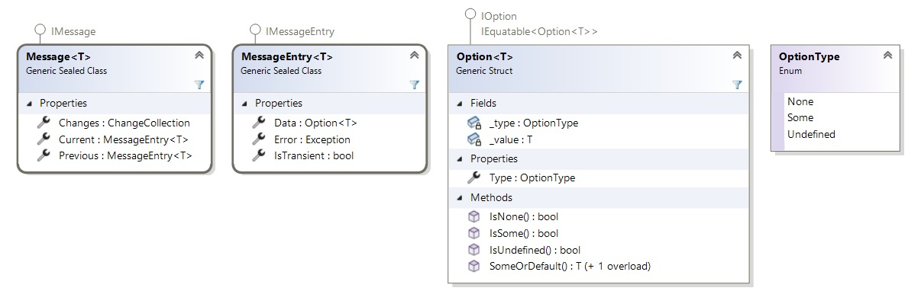

# What are Feeds?

Feeds are there to manage asynchronous data requests from a service and provide their result to the View in an efficient manner.

It provides out of the box support for data coming from task-based methods as well Async-Enumerables ones.  

They accompany the requests with additional metadata that indicates whether the request is still in progress, ended in an error, or if it was successful, whether the data that was returned contains any entries or was empty.

## Feeds are stateless

Feeds are used as a gateway to request data from services and expose it in a stateless manner so that it can be displayed by the View.  

Feeds are stateless and do not provide support for reacting upon changes the user makes to the data on the View, the data can only be reloaded and refreshed upon request which is when the underlying task or Async-Enumerable will be invoked and the data refreshed.
In other words, a Feed is a read-only representation of the data received from the server.

In contrast to Feeds, [States](xref:Overview.Mvux.States), as the name suggests, are stateful and keep track of the latest value, as updates are applied.

## How to use Feeds?

### Creation of Feeds

For the examples below, let's use a counter service that returns the current count number, starting from 1. It will be run 3 consecutive times delayed by a second each.
For the data type, we'll create a record type called `CounterValue`:

```csharp
public record CounterValue(int Value);
```

Feeds can be created directly from methods that return a `ValueTask` or `Task`, or from methods that return an `IAsyncEnumerable`. In both cases, the methods can optionally take a `CancellationToken` parameter.

#### Feed.Async factory

The `Feed.Async` factory method will create an IFeed by invoking a method that will return either a `ValueTask` or a `Task`. For example, the `CountOne` method will wait for a second (unless cancelled via the `CancellationToken`) before returning the next counter value.

```csharp
private int _currentCount = 0;

public async ValueTask<CounterValue> CountOne(CancellationToken ct)
{
    await Task.Delay(TimeSpan.FromSeconds(1), ct);

    // note that a service does not normally hold data
    // this example is for demonstration purposes
    return new CounterValue(++_currentCount);
}
```

The `Feed.Async` factory method can be used to create an `IFeed` by calling the `CountOne` method:

```csharp
public IFeed<CounterValue> Value => Feed.Async(_myService.CountOne);
```

This is known as a 'pull' method, as the `CountOne` method is awaited while retrieving the data. To get the next counter value, the IFeed needs to be signaled to call the `CountOne` method again.

For the most part `Task` and `ValueTask` are interchangeable. However, with MVUX if the method returns `Task<T>` the method needs to be awaited in the `Feed.Async` callback.

```csharp
// Service method
public async Task<CounterValue> CountOne() { ... }

// Feed creation - needs to await the CountOne call
public IFeed<CounterValue> CurrentCount => Feed.Async(async ct => await _myService.CountOne());
```

#### Feed.AsyncEnumerable factory

In contrast to Tasks which operate as 'pull' methods, the 'push' method is where we call a method and establish some sort of connection with it, while it sends new data as it becomes available:

```csharp
public async IAsyncEnumerable<CounterValue> StartCounting([EnumeratorCancellation] CancellationToken ct)
{
    while (!ct.IsCancellationRequested)
    {
        await Task.Delay(TimeSpan.FromSeconds(1), ct);
                
        if (ct.IsCancellationRequested)
        {
            yield break;
        }

        yield return new CounterValue(++_currentCount);
    }
}
```

Referring to the Async Enumerable from the example a Feed can be created in the following way:

```csharp
public async IAsyncEnumerable<CounterValue> StartCounting(CancellationToken ct) { ... }

public IFeed<CounterValue> CurrentCount => Feed.AsyncEnumerable(_myService.StartCounting);
```

`CancellationToken`s are essential to enable halting an ongoing async operation.  
However, if the API you're consuming does not have a `CancellationToken` parameter, you can disregard the incoming `CancellationToken` parameter as follows:

```csharp
public IFeed<CounterValue> CurrentCount => Feed.AsyncEnumerable(ct => StartCounting());
```

> [!NOTE]
> `Feed` is a static class that provides factory methods that create `IFeed<T>`s, as well as extension methods for `IFeed<T>`.

> [!NOTE]  
> There are additional ways to load data (e.g. Observables), but most of them are easily convertible to one of the above two.

> [!TIP]
> Feeds can also be constructed manually using the `Feed.Create` method.

### Consumption of Feeds

#### Directly await Feeds

Feeds are directly awaitable, so to get the data currently held in the feed, this is useful when you want to use the current value in a command, etc.  
You can await it in the following manner:

```csharp
public IFeed<CurrentCount> CurrentCount => ...

private async ValueTask SomeAsyncMethod()
{
    int currentCount = await CurrentCount;
}
```

> [!TIP]
> This is possible thanks to the `GetAwaiter` extension method of `IFeed<T>`. Read [this](https://devblogs.microsoft.com/pfxteam/await-anything) for more.

#### Use Feeds in an MVUX Model

The MVUX analyzers generate a proxy entity for each of the models in your app (those with `Model` suffix). For every Feed property (returning `IFeed<T>` or `IListFeed<T>`) found in the model, a corresponding Feed (or List-Feed) property is generated on the proxy entity.  
MVUX recommends using plain [POCO](https://en.wikipedia.org/wiki/Plain_old_CLR_object) (Plain Old CLR Object) `record` types for the models in your app as they're immutable, and will not require any property change notifications to be raised.  
The generated proxy and its properties ensure that data-binding will work, even though property change notifications aren't being raised by the models themselves.

> [!Note]  
> For the code generation to work, mark the Models and entities with the `partial` modifier, and have the Feed properties' access modifier as `public`.  
You can learn more about partial classes and methods in [this article](https://learn.microsoft.com/dotnet/csharp/programming-guide/classes-and-structs/partial-classes-and-methods).

#### With regular data-binding

Feeds can be consumed directly by data-binding to the Feed property declared on the Model.  
MVUX code-generation engine ensures the Feeds and all entities they expose are going to be seamlessly data-bound with the XAML data-binding engine.

The Feed can be consumed directly from the View, it's as simple as binding a regular value property exposed on the Model:

```xml
<Page ...>
    <TextBlock Text="{Binding CurrentCount.Value}" />
</Page>
```

> [!TIP]
> The data-binding engine will await the feed under the hood and will display the awaited data once available.

#### With the `FeedView` control

The `FeedView` control has been designed to work with Feeds and is tailored to the additional metadata mentioned [earlier](#what-are-feeds) that are disclosed by the Feed and respond to it automatically and efficiently.  
A `FeedView` has built-in templates that adapt the View according to the current state of the data, such as when the data request is still in progress, an error has occurred, or when the data contained no records.  
Built-in templates are included with the `FeedView` for these states, but they can all be customized.

Here's how to utilize the `FeedView` to display the same data as before:

```xml
<Page
    ...
	xmlns:mvux="using:Uno.Extensions.Reactive.UI">

	<mvux:FeedView Source="{Binding CurrentCount}">
		<DataTemplate>
			<TextBlock DataContext="{Binding Data}" Text="{Binding Value}" />
        </DataTemplate>
    </mvux:FeedView>
</Page>
```

> [!TIP]  
> The `FeedView` wraps the data coming from the Feed in a special `FeedViewState` class which includes the Feed metadata.  
One of its properties is `Data`, which provides access to the actual data of the Feed's current state, in our example the most recent integer value from the `CountOne` or `StartCounting` method [above](#consumption-of-feeds).

## Messages

Messages are one of the core components of MVUX. They refer to the metadata that wraps around the entities streaming along as discussed earlier.

The Feed encapsulates a stream of Messages for each packet of data received from the underlying request. For a Task, it would be each execution of the Task and obtaining the refreshed/up-to-date value, and similarly with Async-Enumerable, it would be each iteration and yielding of a refreshed value, until it's cancelled using the `CancellationToken`.

A Message provides several metadata types (called axis/axes).  
The most common three metadata types are:

- Data  
This discloses information about the data that was allegedly returned by the request.  
The data is encapsulated in an `Option<T>` (where `T` refers to the data entity type):
    - None - indicates absence of data, i.e. the data-request resulted in no records.
    - Some - indicates presence of a value / values.
    - Undefined - we can't currently determine if there's data, e.g. we're still awaiting it or if an error occurred.
- Progress  
The underlying task/request is in progress, if there's data, it's regarded as transient till the request completes and a new result is available.
- Error  
An error has occurred. The `Exception` is attached.

The following illustration show how the classes are built. Note that this diagram shows a stripped-down version of the actual types, for brevity:



> [!TIP]  
> MVUX provides you with peripheral tools that read the metadata Messages for you so that you don't normally even have to know about the Message structure!

## Feed Operators

The Feed supports some LINQ operators that enable readjusting it into a new one.

### Where

The `Where` extension method enables filtering a Feed. It returns a new Feed where the values of the parent one match the specified criteria.  
For example:

```csharp
public IFeed<CounterValue> OmitEarlyCounts => CurrentCount.Where(currentCount => currentCount.Value > 10);
```

> [!Note]  
> Be aware that unlike `IEnumerable<T>`, `IObservable<T>`, and `IAsyncEnumerable<T>`, if the predicate returns false, a result is still received but it contains a `Message<T>` with a data `Option<T>` of `None`.

### Select or SelectAsync

This one enables projecting one feed into another one by selecting one of its properties, or by passing it as a parameter to an external function.

```csharp
public IFeed<int> OmitEarlyCounts => CurrentCount.Select(currentCount => currentCount.Value);
```

The selection can also be asynchronous, and even use an external method:

```csharp
public IFeed<CountInfo> CountTrends => CurrentCount.SelectAsync(currentCount => myService.GetCountInfoAsync(currentCount));
```

> [!TIP]  
> You can use the LINQ syntax if you prefer, or combine the operators:

```csharp
public IFeed<int> OmitEearlyCounts =>
    from currentCount in CurrentCount
    where currentCount.Value > 10
    select currentCount.Value;
```
