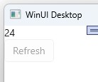

---
uid: Overview.Mvux.Overview
---

# MVUX Overview

**M**odel, **V**iew, **U**pdate, e**X**tended (**MVUX**) is an evolution of the MVU design pattern, that encourages unidirectional flow of immutable data. MVUX supports data binding, bringing together the best of the MVU and MVVM design patterns.

MVUX uses a source code generator to generate bindable proxies for each Model. Additional bindable proxies are generated for other entities where needed.

Bindable proxies are used as a bridge that enables immutable entities to work with the Uno Platform data-binding engine.  

Changes in the bindable proxies result in parts of the Model being recreated, rather than changing properties. This ensures the Model is immutable, and thus eliminates a large set of potential exceptions and issues related to mutable entities.

## Learning MVUX by samples

To better understand MVUX, let us consider a weather application that will display the current temperature, obtained from an external weather service. At face value, this seems simple enough: call service to retrieve latest temperature and display the returned value.  
  
Although this seems like an easy problem, as is often the case, there are more details to consider than may be immediately apparent:

- What if the external service isn't immediately available when starting the app?
- How does the app show that data is being loaded? Or being updated?
- What if no data is returned from the external service?
- What if an error occurs while obtaining or processing the data?
- How to keep the app responsive while loading or updating the UI?
- How do we refresh the current data?
- How do we avoid threading or concurrency issues when handling new data in the background?
- How do we make sure the code is testable?

Individually, these questions are simple enough to handle, but hopefully, they highlight that there is more to consider in even a very trivial application. Now imagine an application that has more complex data and user interface, the potential for complexity and the amount of required code can grow enormously.

MVUX is a response to such situations and makes it easier to handle the above scenarios.  

## WeatherApp Sample

You can find the code for our weather app here: https://github.com/unoplatform/Uno.Samples/tree/master/UI/MvuxHowTos/WeatherApp

## What is MVUX?

MVUX is an extension to the MVU design pattern, and leverages code generation in order to take advantage of the unique data-binding engine of WinUI and the Uno Platform.

### Model

The **Model** in MVUX is similar in many ways to the viewmodel in MVVM. The **Model** defines the properties that will be available for data binding and methods that include any business logic. In MVUX this is referred to as the **Model**, highlighting that it is immutable by design.

For our weather app, `WeatherModel` is the **Model**, and defines a property named `CurrentWeather`.

```csharp
public partial record WeatherModel(IWeatherService WeatherService)
{
    public IFeed<WeatherInfo> CurrentWeather => Feed.Async(this.WeatherService.GetCurrentWeather);
}
```

The `CurrentWeather` property returns a feed (`IFeed`) of `WeatherInfo` entities (for those familiar with [Reactive](https://reactivex.io/) this is similar in many ways to an `IObservable`). When the `CurrentWeather` property is accessed, an `IFeed` is created via the `Feed.Async` factory method, which will asynchronously call the `GetCurrentWeather` service.  

### View

The **View** is the UI, which can be written in XAML, C#, or a combination of the two, in the same way that you would if you were using another design pattern. For example, the following can be used to data bind the `Text` property of a `TextBlock` to the `CurrentWeather.Temperature` property.

```xml
<Page x:Class="WeatherApp.MainPage"
        xmlns="http://schemas.microsoft.com/winfx/2006/xaml/presentation"
        xmlns:x="http://schemas.microsoft.com/winfx/2006/xaml">
    <StackPanel>
        <TextBlock Text="{Binding CurrentWeather.Temperature}" />
    </StackPanel>
</Page>
```  

This XAML data binds the `Text` property on the `TextBlock` to the `CurrentWeather.Temperature` property on the `DataContext` of the page. In other words, the `CurrentWeather` property is retrieved from the `DataContext`. If the resulting object is not null, the `Temperature` property is retrieved and used to set the `Text` property on the `TextBlock`.

What's unique to MVUX is the additional information that `IFeed` exposes, such as when data is being loaded and whether there was an error loading the data. For this, we can leverage the MVUX `FeedView` control.

```xml
<Page x:Class="WeatherApp.MainPage"
    xmlns="http://schemas.microsoft.com/winfx/2006/xaml/presentation"
    xmlns:x="http://schemas.microsoft.com/winfx/2006/xaml"
    xmlns:mvux="using:Uno.Extensions.Reactive.UI">
    
    <mvux:FeedView Source="{Binding CurrentWeather}">
        <DataTemplate>
            <StackPanel>
                <TextBlock Text="{Binding Data.Temperature}" />
            </StackPanel>
        </DataTemplate>
    </mvux:FeedView>
    
</Page>
```

The `FeedView` control is designed to work with an `IFeed`, and has visual states that align with the states that an `IFeed` can be in (e.g. loading, refreshing, error, etc.). The above XAML defines the `ValueTemplate`, which is required in order to display the `Data` from the `IFeed`. Other templates include `ProgressTemplate`, `ErrorTemplate` and `NoneTemplate`, which can be defined in order to control what's displayed depending on the state of the `IFeed`.

### Update

An **Update** is any action that will result in a change to the **Model**. An **Update** is often triggered via an interaction by the user with the **View**, such as editing text or clicking a button. However, an **Update** can also be triggered from a background process (for example a data sync operation or perhaps a notification triggered by a hardware sensor, such as a GPS).

In the weather example, if we wanted to refresh the current weather data, a `Refresh` method can be added to the `WeatherModel`.

```csharp
public partial record WeatherModel(IWeatherService WeatherService)
{
    public IFeed<WeatherInfo> CurrentWeather => Feed.Async(this.WeatherService.GetCurrentWeather);
    public async ValueTask Refresh() { ... }
}
```  

In the `View` the `Refresh` method can be data bound to a `Command` property on a `Button`.  

```xml
<Page x:Class="WeatherApp.MainPage"
        xmlns="http://schemas.microsoft.com/winfx/2006/xaml/presentation"
        xmlns:x="http://schemas.microsoft.com/winfx/2006/xaml">
    <StackPanel>
        <TextBlock Text="{Binding CurrentWeather.Temperature}" />
        <Button Content="Refresh" Command="{Binding Refresh}" />
    </StackPanel>
</Page>
```  

As refreshing a feed is such a common scenario, the `FeedView` control exposes a `Refresh` command, that removes the requirement to have a `Refresh` method on the `WeatherModel` and can be data bound, again to the `Command` property, of a `Button`, as follows:  

```xml
<Page x:Class="WeatherApp.MainPage"
    xmlns="http://schemas.microsoft.com/winfx/2006/xaml/presentation"
    xmlns:x="http://schemas.microsoft.com/winfx/2006/xaml"
    xmlns:mvux="using:Uno.Extensions.Reactive.UI">
    
    <mvux:FeedView Source="{Binding CurrentWeather}">
        <DataTemplate>
            <StackPanel>
                <TextBlock Text="{Binding Data.Temperature}" />
                <Button Content="Refresh" Command="{Binding Refresh}" />
            </StackPanel>
        </DataTemplate>
    </mvux:FeedView>
    
</Page>
```

Clicking the button will execute the `Refresh` command on the `FeedView` which will signal the `IFeed` to reload. In the case of the weather app it would invoke the `GetCurrentWeather` method of the service again.

### eXtended

At this point you might be wondering how we're able to data bind to `CurrentWeather.Temperature`, as if it were a property that returns a single value, and then also bind the `CurrentWeather` property to the `Source` property of the `FeedView` to access a much richer set of information about the `IFeed`.  This is possible because of the bindable proxies that are being generated by the MVUX source code generators.

The **eXtended** part of MVUX includes the generation of these bindable proxies, that bridge the gap between the **Model** that exposes asynchronous feeds of immutable data and the synchronous data binding capability of WinUI and the Uno Platform.  

Instead of an instance of `WeatherModel`, the `DataContext` on the **View** is set to be an instance of the generated bindable proxy, `BindableWeatherModel`, which exposes a property, `CurrentWeather`, the same as the original `WeatherModel`. The `BindableWeatherModel` also exposes a property, `Refresh`, that returns a command that wraps a call to the `Refresh` method on the `WeatherModel`.  

For the purpose of this example, the `DataContext` property can be set in the page's code-behind file:

```csharp
public sealed partial class MainPage : Page
{
    public MainPage()
    {
        this.InitializeComponent();

        DataContext = new BindableWeatherModel(new WeatherService());
    }
}
```

### Result

When the app is launched, a waiting progress ring appears while the service loads the current temperature:


It is thereafter replaced with the temperature as soon as it's received from the service:


When the 'Refresh' button is pressed, the progress ring shows again for a short time, until the new temperature is received from the server. The Refresh button is automatically disabled while a refresh request is in progress:



For the full weather app tutorial see [How to create a feed](xref:Overview.Mvux.HowToSimpleFeed).

## Recap

In order to summarize what we've just seen, let's return to the list of challenges posed by our simple application.

- What if the external service isn't immediately available when starting the app?  
**The `FeedView` has an `ErrorTemplate` that can be used to control what's displayed when data can't be retrieved.**

- How does the app show that data is being loaded? Or being updated?  
**The `FeedView` has a `ProgressTemplate` that defaults to a `ProgressRing` but can be overwritten.**  

- What if no data is returned from the external service?  
**The `FeedView` has a `NoneTemplate` that can be defined.**  

- What if an error occurs while obtaining or processing the data?  
**The `FeedView` has both a `ErrorTemplate` can be used to control what's displayed when data can't be retrieved.**  

- How to keep the app responsive while loading or updating the UI?  
**MVUX is inherently asynchronous and all operations are dispatched to background threads to avoid congestion on the UI thread.**

- How do we refresh the current data?  
**Feeds support re-querying the source data and the `FeedView` exposes a `Refresh` property that can be bound to `Command` properties on UI elements such as `Button`.**

- How do we avoid threading or concurrency issues when handling new data in the background?  
**The `IFeed` handles dispatching actions to background threads and then marshalling responses back to the UI thread as required.**

- How do we make sure the code is testable?  
**The Model doesn't depend on any UI elements, so can be unit tested, along with the generated bindable proxies.**

## Key points

- Feeds are reactive in nature, similar in many ways to Observables.
- Models and associated entities are immutable.
- Operations are asynchronous by default.
- Feeds include various dimensions such as loading, if there's data or if an error occurred.
- Feeds borrow from Option concept in functional programming where no data is a valid state for the feed.
- MVUX combines the unidirectional flow of data, and immutability of MVU, with the data binding capabilities of MVVM.

## Learning MVUX by Creating your own

To create a new project using MVUX on Uno Platform, see [How to set up an MVUX project](xref:Overview.Mvux.HowToMvuxProject).

You can then use the example above as a reference to create your own solution.

### In the Model

- Define your own Models
- MVUX recommends using record types for the Models in your app as they're immutable
- The MVUX analyzers auto-generate a bindable proxy for each `partial` `class` or `record` named with a _Model_ suffix  
- For every public feed property (returning `IFeed<T>` or `IListFeed<T>`) found in the model, a corresponding property is generated on the bindable proxy.
- You can use [states](xref:Overview.Mvux.States) for accepting input from the user
- For example:

    ```csharp
    public partial record MainModel(IGreetingService GreetingService)
    {
        public IFeed<string> WelcomeMessage => Feed.Async(this.GreetingService.Welcome);
    ...
    ```

### In the View

- Create your views and add data binding to the XAML elements as required
- Create and customize your FeedView as you can see in [The FeedView control](xref:Overview.Mvux.FeedView).
- Use two-way binding to a state to allow input from the user

### Update

- Trigger feeds to be refreshed
- Update states in the Model, or two-way data bind to states in the XAML

### eXtended

- Bindable proxies have already been generated for you
- You just need to create an instance of the bindable proxy for your Model and assign it to the `DataContext` and it is done.  
