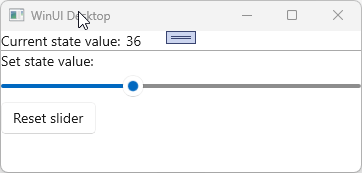

# What are states

## States are stateful feeds

Like [feeds](xref:Overview.Mvux.Feeds), states are used to manage asynchronous operations and wrap them in metadata that provides information about the current state of the operation, such as whether the operation is still in progress, when an error occurs, or if the result has no data.

Contrary to Feeds, states are stateful (as the name suggests) in that they keep a record of the current data value. States also allow the current value to be modified, which is useful for two-way binding scenarios.

MVUX utilizes its powerful code-generation engine to generate a bindable proxy for each Model, which holds the state information of the data, as well as a bindable proxy for entities where needed, for instance, if the entities are immutable (e.g. records - the recommended type).  
The bindable proxies use as a bridge that enables immutable entities to work with the WinUI data-binding engine. The states in the Model are monitored for data-binding changes, and in response to any change, the objects are recreated fresh, instead of their properties being changed.

States keep the current value of the data, so every new subscription to them, (such as awaiting them or binding them to an additional control, etc.), will use the data currently loaded in the state (if any).  

Like a feed, states can be reloaded, which will invoke the asynchronous operation that is used to create the state.

States and Feeds are different in the following:

1. When subscribing to a state, the currently loaded value is going to be replayed.
2. A state provides the `Update` method that allows changing its current value.
3. States are attached to an owner and share the same lifetime as that owner.
4. The main usage of a state is for two-way bindings.

## States are attached to their owner

Besides holding the state information, a reference to the Model is shared with the states so that when the View is closed and disposed of, it tunnels down to the states and the Models and makes them available for garbage collection. States share the same lifetime as their owner.

## How to use states

### Creation of states

#### From Tasks

States are created slightly differently, they require a reference to the Model for caching and GC as mentioned above:

```csharp
public record MainModel {
    public IState<Person> MainContact => State.Async(this, ContactsService.GetMainContact);
}
```

Where `GetMainContact` is a `ValueTask<Person>`, and takes a parameter of `CancellationToken`. The `this` parameter is the owner of the state, which is the Model in this case.

#### From Async-Enumerables

A State can also be created from an Async Enumerable as follows:

```csharp
public IState<StockValue> MyStockCurrentValue => State.AsyncEnumerable(this, ContactsService.GetMyStockCurrentValue);
```

Make sure the Async Enumerable methods have a `CancellationToken` parameter and are decorated with the `EnumerationCancellation` attribute.  
You can learn more about Async Enumerables in [this article](https://learn.microsoft.com/archive/msdn-magazine/2019/november/csharp-iterating-with-async-enumerables-in-csharp-8#a-tour-through-async-enumerables).

#### Start with an empty state

You can setup a state without any values, values can always be set using the [`Set`](#set) or the [`Update`](#update) methods.

    ```csharp
    public IState<City> CurrentCity => State<City>.Empty(this);
    ```

#### Create a state with an initial value

You can setup a state with a synchronous initial value. The state can be set later on using the [`Update`](#update) or the [`Set`](#set) methods.

    ```csharp
    public IState<City> CurrentCity => State.Value(this, () => new City("Montreal"));
    ```

#### From a feed

A state can easily be converted from a feed as follows:

```csharp
public IFeed<int> MyFeed => ...
public IState<int> MyState => State.FromFeed(this, MyFeed);
```

#### Other ways to create states

> [!TIP]
A state can also be constructed manually by building its underlying Messages or Options.  
This is intended for advanced users and is explained [here](xref:Overview.Reactive.State#create).

### Usage of States

States are advanced Feeds. As such, they can also be awaited directly:

```csharp
City currentCity = await this.CurrentCity;
```

#### How to bind the View to a State

States are built to be cooperating with the data-binding engine. A State will automatically update its value when the user changes data in the View bound to this State.

1. In an MVUX app (read [How to set up an MVUX project](xref:Overview.Mvux.HowToMvuxProject)), add a Model class with a State as follows:

    ```csharp
    public partial record SliderModel
    {
        // create a state with an initial random double value between 0 and 1, multiplied by 100.
        public IState<double> SliderValue => State.Value(this, () => Random.Shared.NextDouble() * 100);
    }
    ```

1. Replace all child elements in the _MainPage.xaml_ with the following:

    ```xml
    <Page 
        x:Class="SliderApp.MainPage"
        xmlns="http://schemas.microsoft.com/winfx/2006/xaml/presentation"
        xmlns:x="http://schemas.microsoft.com/winfx/2006/xaml"
        xmlns:local="using:SliderApp">
        <Page.DataContext>
            <local:BindableSliderModel />
        </Page.DataContext>
    
        <StackPanel>
            <StackPanel Orientation="Horizontal" Spacing="5">
                <TextBlock Text="Current state value:" />
                <TextBlock Text="{Binding SliderValue}" />
            </StackPanel>
    
            <Border Height="1" Background="DarkGray" />
    
            <TextBlock Text="Set state value:"/>
            <Slider Value="{Binding SliderValue, Mode=TwoWay}" />
        </StackPanel>
    </Page>
    ```

In this scenario, the `DataContext` is set to an instance of the `BindableSliderModel` class, which is the generated bindable proxy for the `SliderModel` record.

1. When you run the app, moving the `Slider` instantly affects the upper `TextBox`; the `Silder.Value` property has a two-way binding with the `SliderValue` State, so any change to the Slider immediately updates the State value, which in turn affects the data-bound `TextBlock` on top:

    

### Change data of a state

#### Update

To manually update the current value of a state, use its `Update` method.  

In this example we'll add the method `IncrementSlider` that gets the current value and increases it by one (if it doesn't exceed 100):

```csharp
public async ValueTask IncrementSlider(CancellationToken ct = default)
{
    static double incrementValue(double currentValue) =>
        currentValue <= 99
        ? currentValue + 1
        : 1;

    await SliderValue.Update(updater: incrementValue, ct);
}
```

The `updater` parameter of the `Update` method accepts a `Func<T, T>`. The input parameter provides the current value of the State when called. The return value is the new value that will be applied as the new value of the State, in our case we use the `incrementValue` [local function](https://learn.microsoft.com/dotnet/csharp/programming-guide/classes-and-structs/local-functions) to increment `currentValue` by one (or return `1` if the value exceeds `100`).

#### Set

There are additional methods that update the data of a State such as `Set` and `UpdateMessage`, explained [here](xref:Overview.Reactive.State#update-how-to-update-a-state). The `Set` method is the same as the `Update`, except that in `Set` there is no callback that provides the current value, instead a new value is provided directly and the old value is discarded:

```csharp
public async ValueTask SetSliderMiddle(CancellationToken ct = default)
{    
    await SliderValue.Set(50, ct);
}
```

### Subscribing to changes

The `ForEachAsync` enables executing a callback each time the value of the `IState<T>` is updated.

This extension-method takes a single parameter which is a async callback that takes two parameters. The first parameter is of type `T?`, where `T` is type of the `IState`, and represents the new value of the state. The second parameter is a `CancellationToken` which can be used to cancel a long running action.

For example:

```csharp
public partial record Model
{
    public IState<string> MyState => ...

    public async ValueTask EnableChangeTracking()
    {
        MyState.ForEachAsync(PerformAction);
    }

    public async ValueTask PerformAction(string item, CancellationToken ct)
    {
        ...
    }
}
```

### Commands

Part of the MVUX toolbox is the automatic generation of Commands.
In the `IncrementSlider` example [we've just used](#change-data-of-a-state), a special asynchronous Command will be generated that can be used in the View by a `Button` or other controls:

Let's modify the XAML [above](#how-to-bind-the-view-to-a-state) with the following:

```xml
        ...
        <TextBlock Text="Set state value:"/>
        <Slider Value="{Binding SliderValue, Mode=TwoWay}" />

        <Button Content="Increment slider" Command="{Binding IncrementSlider}" />

    </StackPanel>
</Page>
```

When pressing the _Increment slider_ button, the generated `IncrementSlider` command will be executed invoking the `IncrementSilder` method on the Model resulting on an incrementation of the value.

This is what the result will look like:



The source code for the sample app can be found [here](https://github.com/unoplatform/Uno.Samples/tree/master/UI/MvuxHowTos/SliderApp).


To learn more about Commands read the Commands section in [this article](xref:Overview.Reactive.InApps#commands).
