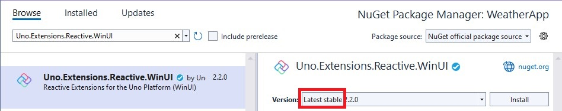

# How to set up an MVUX project

In this tutorial you'll learn how to set up an Uno Platform project ready to use with the MVUX architecture and its tools.

1. Make sure your environment is set up properly by using [uno check](external/uno.check/doc/using-uno-check.md).
1. You can create a Uno App by either using the Uno Platform Visual Studio extension or via the command line interface.

    # [**Visual Studio**](#tab/vs)
    
    #### Using Visual Studio 2022 Uno Platform Extension

    1. Make sure you have the latest version of Uno Extension (v4.8) installed.

        

    1. Press <kbd>Ctrl</kbd>+<kbd>Shift</kbd>+<kbd>N</kbd> to create a new project and select "Uno Platform App".

    1. Give your project an appropriate name.

    1. When prompted Select *Blank* and click *Customize*

        

    1. In the *Presentation* tab (3rd one), select MVUX.

        

    1. Click *Create* on the bottom right corner.    
    
    # [**CLI**](#tab/cli)
    
    #### Using the command line interface
    
    1. Run the following command, using an appropriate name (`MyAppName` in this page).
    
        ```cmd
        dotnet new unoapp -preset blank
        ```
      
        Refer to [this](https://platform.uno/docs/articles/get-started-dotnet-new.html) article for more details
        on using the CLI interface of creating projects.
      
        > [!NOTE] 
        > Make sure .NET 7 or above is selected, as we'll be using some of the recent C# features in these tutorials,
        such as [records](https://learn.microsoft.com/en-us/dotnet/csharp/language-reference/builtin-types/record).         

    1. Open the project and right-click on `MyAppName` solution (or the name you gave it) and select `Manage NuGet Packages for Solution` from the context menu.
        - Make sure to select **nuget.org** or **NuGet official package source** as the package source
        - Click on the Updates tab. Update the following packages to the latest stable version,
        if they're not up to date: `Uno.WinUI`, `Uno.UI.WebAssembly` `Uno.Wasm.Bootstrap`, and `Uno.Wasm.Bootstrap.DevServer`.
    
    1. Click back on the **Browse** tab and install the following NuGet Packages to the `MyAppName` project: `Uno.Extensions.Reactive.WinUI`.

    
