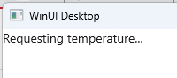
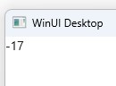

# How to create a simple feed

1. Create an MVUX project by following the steps in [this](xref:Overview.Reactive.HowTos.CreateMvuxProject) tutorial, and name your project `WeatherApp`.
1. Add a class named *DataStore.cs*, and replace its content with the following:

    ```c#
    namespace WeatherApp;

    public partial record WeatherInfo(int Temperature);

    public class WeatherService
    {       
        public async ValueTask<WeatherInfo> GetCurrentWeatherAsync(CancellationToken ct)
        {
            // Fake delay to immitate requesting from a remote server
            await Task.Delay(TimeSpan.FromSeconds(2), ct);

            // assign a random number ranged -40-40.
            var temperature = new Random().Next(-40, 40);

            return new WeatherInfo(temperature);
        }
    }
    ```

We're using [records](https://learn.microsoft.com/en-us/dotnet/csharp/language-reference/builtin-types/record) in purpose,
as records are immutable and ensure purity of objects. Records also implements easy equality comparison and hashing.

1. Create a file named *WeatherModel.cs* replacing its content with the following:

    ```c#
    public partial record WeatherModel
    {
        private readonly WeatherService _weatherService = new();
    
        public IFeed<WeatherInfo> CurrentWeather => Feed.Async(_weatherService.GetCurrentWeatherAsync);
    }
    ```

MVUX's analyzers will read the `WeatherModel` and will generate a special mirrored `BindableWeatherModel`,
which provides binding capabilities for the View, so that we can stick to sending update message in an MVU fashion.

The `CurrentWeather` property value also gets cached, so no need to worry about its being created upon each `get`.

<!-- TODO the generated code can be inspected via project->analyzers etc. -->


1. Open the file `MainView.xaml` and add the following namespace to the XAML:

    `xmlns:mvux="using:Uno.Extensions.Reactive.UI"`

1. Replace anything inside the `Page` element with the following code:

    ```xaml
    <mvux:FeedView Source="{Binding CurrentWeather}">
        <DataTemplate>
            <StackPanel>
                <TextBlock DataContext="{Binding Data}" Text="{Binding Temperature}"/>
                <Button Content="Refresh" Command="{Binding Refresh}" />
            </StackPanel>
        </DataTemplate>

        <!-- Optional: this will show up when loading, or when we click refresh and data is still loading -->    
        <mvux:FeedView.ProgressTemplate>
            <DataTemplate>            
                <TextBlock Text="Requesting temperature..."/>
            </DataTemplate>
        </mvux:FeedView.ProgressTemplate>
    </mvux:FeedView>
    ```

The `FeedView` wraps its source (in this case our `CurrentWeather` feed) in a `FeedViewState` object
that provides the `Data` property to access the data currently available in the `CurrentWeather` feed,
the `Refresh` command that explicitly triggers reloading the trip.

1. Press <kbd>F7</kbd> to navigate to open code-view, and in the constructor, after the line that calls `InitializeComponent()`, add the following line:

    ```c#
    this.DataContext = new BindableWeatherModel();
    ```

The `BindableWeatherModel` is a special MVUX-generated mirror class that represents a mirror of the `WeatherModel` adding binding capabilities,
for MVUX to be able to recreate and renew the model when an update message is sent by the view.  

1. Click F5 to run the project

1. When the app loads you'll notice how the `ProgressTemplate` shows (if you've included one), till the data is received from the service (2 seconds).

    

1. The data is the available and the `FeedView` switches to its `ValueTemplate` (the first default `DataTemplate` in our example).

    

*13* is the temperature that was obtained from the `WeatherInfo` service.
