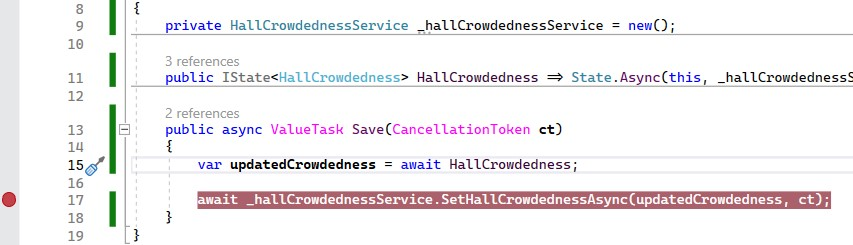
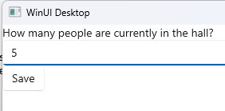
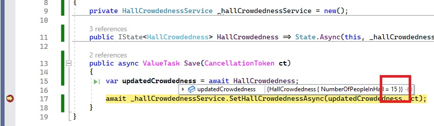

# How to create a state with a single value

In this tutorial you will learn how to create an MVUX project that asynchronously requests and displays a value from the service
and enables storing the current state and saving the updated value to the service.

1. Create an MVUX project by following the steps in [this](xref:Overview.Reactive.HowTos.CreateMvuxProject) tutorial, and name your project `TheFancyWeddingHall`.
1. Add a class named *DataStore.cs*, and replace its content with the following:

    ```c#
    using System.Threading;
    using System.Threading.Tasks;

    namespace TheFancyWeddingHall;

    public partial record HallCrowdedness(int NumberOfPeopleInHall);

    public class HallCrowdednessService
    {
        private int _numberOfPeopleInHall = 5; /* initial value is 5 */

        public ValueTask<HallCrowdedness> GetHallCrowdednessAsync(CancellationToken ct)
        {
            var result = new HallCrowdedness(_numberOfPeopleInHall);

            return ValueTask.FromResult(result);
        }

        public ValueTask SetHallCrowdednessAsync(HallCrowdedness crowdedness, CancellationToken ct)
        {
             _numberOfPeopleInHall = crowdedness.NumberOfPeopleInHall;

            return ValueTask.CompletedTask;
        }
    }
    ```

We're using [records](https://learn.microsoft.com/en-us/dotnet/csharp/language-reference/builtin-types/record) in purpose,
as records are immutable and ensure purity of objects. Records also implements easy equality comparison and hashing.

1. Create a file named *HallCrowdedness.cs* replacing its content with the following:

    ```c#
    public partial record HallCrowdednessModel
    {
        private HallCrowdednessService _hallCrowdednessService = new();

        public IState<HallCrowdedness> HallCrowdedness => State.Async(this, _hallCrowdednessService.GetHallCrowdednessAsync);

        public async ValueTask Save(CancellationToken ct)
        {
            var updatedCrowdedness = await HallCrowdedness;

            await _hallCrowdednessService.SetHallCrowdednessAsync(updatedCrowdedness, ct);
        }
    }
    ```

1. In the `Save` method above, place a breakpoint on the line `await _hallCrow...SetHallCrowd...`, for later use.



MVUX's analyzers will read the `HallCrowdednessModel` and will generate a special mirrored `BindableHallCrowdednessModel`,
which provides binding capabilities for the View, so that we can stick to sending update message in an MVU fashion.

The `HallCrowdedness` property value also gets cached, so no need to worry about its being created upon each `get`.

In addition, MVUX reads the `Save` method, and generates in the bindable Model a command named `Save` that can be used from the View, which is invoked asynchronously.
                                                                                                                                                                             
<!-- TODO the generated code can be inspected via project->analyzers etc. -->

1. Open the file `MainView.xaml` and add the following namespace to the XAML:

    `xmlns:mvux="using:Uno.Extensions.Reactive.UI"`

1. Replace anything inside the `Page` element with the following code:

    ```xaml
    <StackPanel>
        <TextBlock Text="How many people are currently in the hall?" />
        <TextBox 
            DataContext="{Binding HallCrowdedness}"
            Text="{Binding NumberOfPeopleInHall, Mode=TwoWay, UpdateSourceTrigger=PropertyChanged}" />

        <Button Content="Save" Command="{Binding Save}" />
    </StackPanel>
    ```

As you can see, we're now assigning the generated `Save` command to the button's command.

1. Press <kbd>F7</kbd> to navigate to open code-view, and in the constructor, after the line that calls `InitializeComponent()`, add the following line:

    ```c#
    this.DataContext = new BindableHallCrowdednessModel();
    ```

The `BindableHallCrowdednessModel` is a special MVUX-generated mirror class that represents a mirror of the `HallCrowdednessModel` adding binding capabilities,
for MVUX to be able to recreate and renew the model when an update message is sent by the view.  

1. Click F5 to run the project

1. The app will load with its default value '5' as the number of people.



1. Change the number to 15 and click 'Save'.

The debugger will stop at the breakpoint you placed earlier. <!--(See step No. x)-->



As you can see, the current value of the state has gotten the updated number '15'.
This is now being saved to the service.
