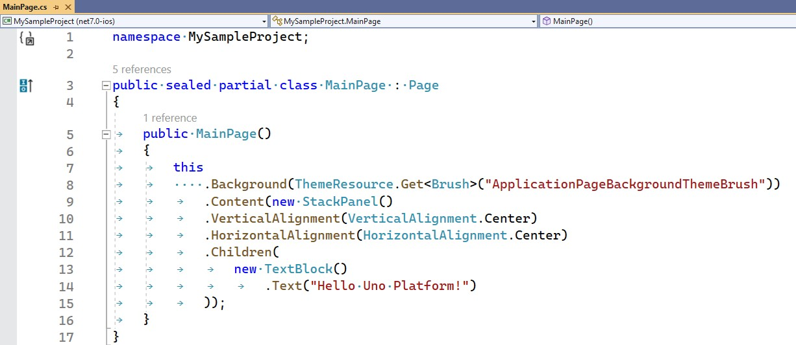
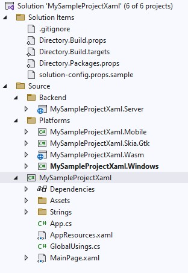
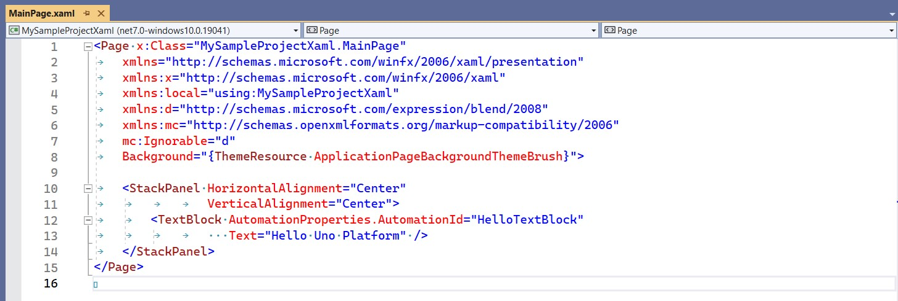

# How to set up your onw C# Markup project

In this tutorial you'll learn how to set up an new *basic project* using Uno Platform and C# Markup. 

## Set up an Markup project

You can use this tutorial to learn how to set up an Uno Platform project to use Uno.Extensions.Markup.

> For this sample project we will set the name of the project as MySampleProject.

- [Setting up the environment and creating a Creating the Markup project](xref:Reference.Markup.HowToMarkupProject)

## Start creating some basic Layout

The purpose of this tutorial is to show you how to create a basic project from scratch and make a comparison between C# Markup and XAML.

Open the created project
Take a look at the created structure.

## Comparing the C# Markup with the XAML project

    # [**C# Markup**](#tab/cs)

    #### C# Markup project structure

	- The project is separated into Solution Items, where general settings and properties files are located, and Source, which contains information about the Backend, Platforms and Shared Project.

    - Check out how your first Start Up Markup project will look like.

        

    - Set as Startup Project the some Platform and Run the Project.

    - In the Shared Project open the file *MainPage.cs* and analyze the code that will look like this.

            
    
    # [**XAML**](#tab/cli)
    
    #### XAML project structure
    
	- The project is separated into Solution Items, where general settings and properties files are located, and Source, which contains information about the Backend, Platforms and Shared Project.

    - Check out how your first Start Up XAML project will look like.

        

    - Set as Startup Project the some Platform and Run the Project.

    - In the Shared Project open the file *MainPage.xaml* and analyze the code that will look like this.

            

## Build a UI with C# Markup

Chage the *MainPage.cs* to have a different content as the sample bellow.


```csharp

using Microsoft.UI;
using Microsoft.UI.Xaml.Controls;
using Microsoft.UI.Xaml.Media.Imaging;

namespace MySampleProject;

public sealed partial class MainPage : Page
{
	public MainPage()
	{
		this
			//Set Background from Theme
			.Background(ThemeResource.Get<Brush>("ApplicationPageBackgroundThemeBrush"))
			.Content(
					new Grid()
						//Custom the Row and Column Definitions
						.RowDefinitions<Grid>("Auto, *")
						.ColumnDefinitions<Grid>("2*, Auto, 2*")

						//Set Background from Colors
						.Background(new SolidColorBrush(Colors.Silver))

						//Set attributes
						.Padding(50)


						.Children(

							//Add Some TextBlock
							new TextBlock()
								.Text("Welcome!!")
								.Padding(50)

								//Set and Attached Properties
								.Grid(row: 0, column: 0),

							//Add a imagem from a external URL
							new Image()
								.Source(new BitmapImage(new Uri("https://picsum.photos/366/366")))
								.Stretch(Stretch.UniformToFill)
								.Width(70)
								.Height(70)
								.Grid(row: 0, column: 2)

								//Custom the Alignment
								.HorizontalAlignment(HorizontalAlignment.Right),

							new Grid()
								.ColumnDefinitions<Grid>("*, *, *")
								.CornerRadius(50)

								//Set Background from custom Brush
								.Background(new SolidColorBrush(Color.FromArgb(255, 233, 233, 233)))

								//Attached Properties using builder pattern
								.Grid(grid => grid.Row(1).ColumnSpan(3))
								.Children(
									new TextBlock()
										.Text("Content!!")
										.HorizontalAlignment(HorizontalAlignment.Center)
										.VerticalAlignment(VerticalAlignment.Center)
								)
						)

			);
	}
}


```

> This code creates a simple user interface, but it allows us to cover several concepts.

## Important points.


### Add elements on the UI, using C# Markup and set attributes.

- The code below shows how to create simple elements like TextBlock in the UI.
Working as simple as that `new TextBlock()`.

```csharp
//Add Some TextBlock
new TextBlock()
	.Text("Welcome!!")
	.Padding(50)					
						
```

- And set attributes directly on the elements.

```csharp
//Set attributes
.Padding(50)

//Custom the Alignment
.HorizontalAlignment(HorizontalAlignment.Right),						
						
```

### Set the backgroun in different ways, as display in the lines below.

- From the Page using access to the Application Theme

```csharp
//Set Background from Theme
.Background(ThemeResource.Get<Brush>("ApplicationPageBackgroundThemeBrush"))
```

- From the Grid using access to the Colors Helper

```csharp
//Set Background from Colors
.Background(new SolidColorBrush(Colors.Silver))
```

- From the second Grid using the creation of a Brush through a manual ARGB color.

```csharp
//Set Background from custom Brush
.Background(new SolidColorBrush(Color.FromArgb(255, 233, 233, 233)))
```

### Work with the Grid in order to customize the columns and their children.

- We can see a simple and straightforward approach on how to configure the columns and rows using C# Markup.

```csharp
//Custom the Row and Column Definitions
.RowDefinitions<Grid>("Auto, *")
.ColumnDefinitions<Grid>("2*, Auto, 2*")
```

Using Attached Properties 

```csharp
//Set and Attached Properties
.Grid(row: 0, column: 0),
```

Or using Attached Properties and builder pattern

```csharp
//Attached Properties using builder pattern
.Grid(grid => grid.Row(1).ColumnSpan(3))

```

## Try it yourself

Now try to change your MainPage to have different layout and test other attributes and elements..

We continue in the next section to learn how to configure styles, work with Bindings, Templates and Template Selectors.

## Next Steps

Learn more about:

- [Learn how to change Style, Bindings, Templates and Template Selectors using C# Markup](xref:Reference.Markup.HowToCustomMarkupProject)
