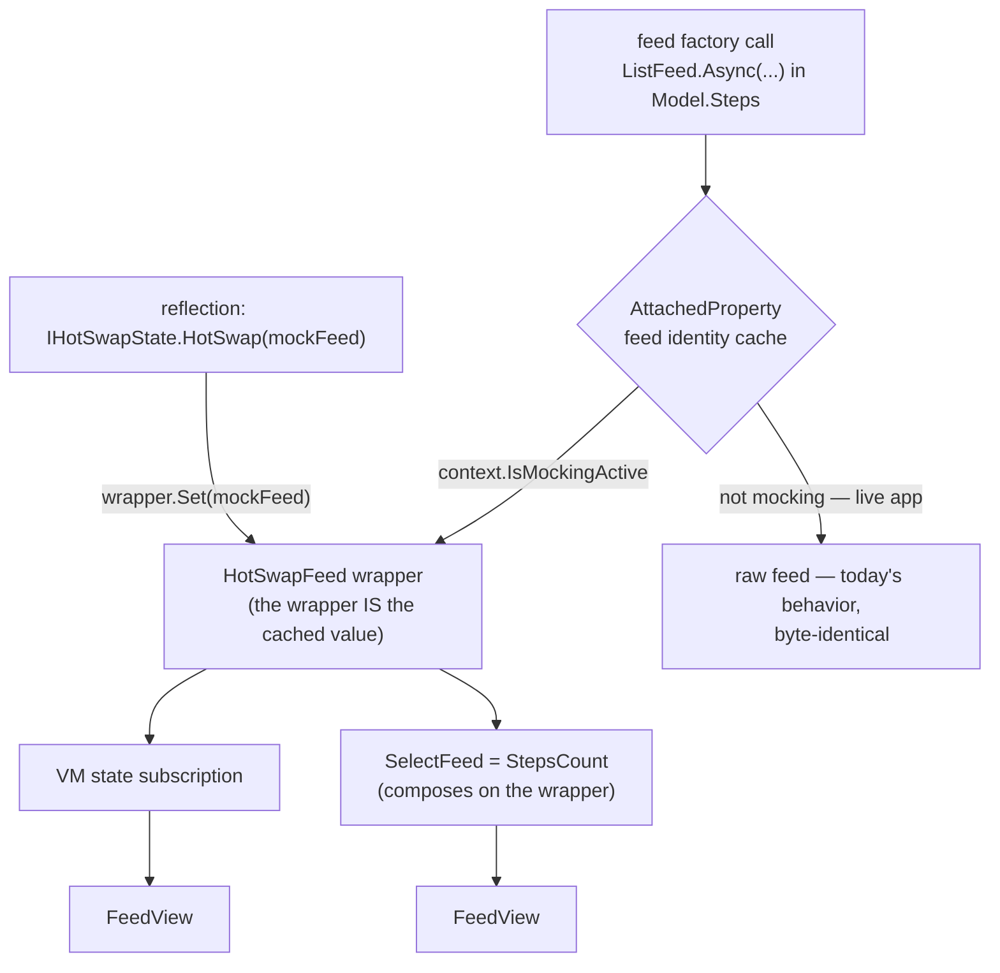
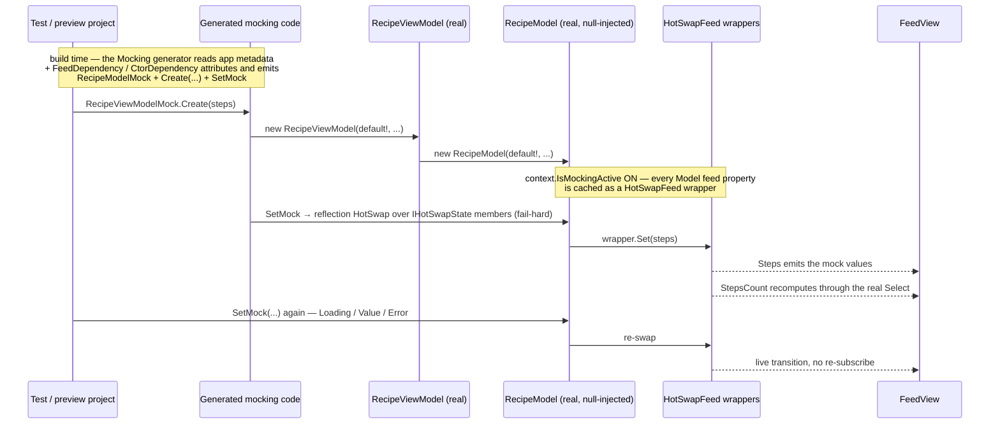

# 013 — Architecture

Grounded in the current tree. File refs relative to repo root. (Restored after workspace loss — line references to be re-verified against a fresh clone.)

## 0. Existing seams reused

| Concern | Existing type / seam | Location |
| --- | --- | --- |
| State carrier bound by templates | `MessageEntry<T>` (public), `IMessageEntry` | `Core/MessageEntry.cs`, `Core/IMessageEntry.cs` |
| One-message-then-complete feed | `ValueFeed<T>` (internal) | `Sources/ValueFeed.cs` |
| Runtime feed substitution | `HotSwapFeed<T>.Set(feed)` (internal) | `Operators/HotSwapFeed.cs` |
| **Feed identity cache (per property)** | `AttachedProperty.GetOrCreate(owner/delegate, factory)` | `Core/Feed.cs` (all factories), `Core/Internal/AttachedProperty*` |
| Per-state swap seam | `IHotSwapState<T>.HotSwap` → `_hotSwap.Set` | `Core/Internal/StateImpl.cs:95` |
| Swap gate (**new, per-context**) | `SourceContext.IsMockingActive` read in `StateImpl` ctor **instead of** `EffectiveHotReload.HasFlag(State)` | `StateImpl.cs:74`, `Core/Internal/SourceContext.cs` |
| Reflection swap driver (reused) | iterate `IHotSwapState<T>` members → `HotSwap` (mocking = **fail-hard**, no silent skip) | `BindableViewModelBase.HotReload.cs:457` |
| HR model replacement (inspiration) | `HotPatch` → `__Reactive_CreateModelInstance` → `__Reactive_UpdateModel` → `__Reactive_BindableInitializeForUpdatedModel` | `Presentation/Bindings/BindableViewModelBase.HotReload.cs`, `ViewModelGenTool_3.cs:202` |
| VM ctor wraps real Model | `{Vm}(params) : this(new Model(params))` | `ViewModelGenTool_3.cs:128` |
| Visual state from axes | `FeedViewVisualStateSelector.GetVisualState` | `UI/View/FeedViewVisualStateSelector.cs:31` |

## 1. The swap anchor — why derived feeds survive (D6)

Every feed factory caches its instance via `AttachedProperty.GetOrCreate` keyed on the provider delegate (stable when lambdas capture only `this` — the MVUX norm). A derived feed `StepsCount => Steps.Select(...)` is itself a cached `SelectFeed(sourceFeed, selector)` **composed on the instance returned by `Steps`**.

**Anchor:** when the owning `SourceContext.IsMockingActive` is set (§6 — the per-context bit the scope drives), the feed returned for a Model feed-property is wrapped in a `HotSwapFeed<T>` **at this cache level** (stable identity preserved — the wrapper is what gets cached). Consequences:

- `Model.Steps` returns the wrapper → the VM state subscribes to it → **swap propagates to the VM member**;
- `StepsCount`'s `SelectFeed` composes on the same wrapper → **swap propagates through business logic** (live: a re-swap re-emits through `Select`);
- no `dynamic`, no duck-typed re-init needed for feeds: **`SetMock` = reflection over the context's `IHotSwapState<T>` members**, calling `HotSwap` per mocked feed (D11), reusing the hot-reload driver but **fail-hard** — a member that cannot be swapped throws. No per-member generated handle. (The HR `dynamic` path stays untouched, HR-only.)



Identity risk (R6): lambdas capturing locals/params produce fresh delegate targets → unstable cache key. This pre-exists mocking (same constraint for state persistence); P0 canary + doc.

## 2. Split of responsibilities

### 2.1 MVUX generator (Model's assembly — analysis + attributes + hidden hooks)

**a) Dependency analysis** (Roslyn, source available):

- per feed/command member: walk initializer/getter body; **lambda/anonymous/local-function bodies = deferred boundary**; eager remainder binding to a ctor param (or param-assigned field) → `ServiceDependent(param)`; reference to another feed member → `DerivedFrom(member)`; else `Independent`.
- **ctor instrumentation**: walk ctor bodies (incl. field/property initializers, primary-ctor captures used eagerly); any eager service dereference → the ctor is **unsafe under null-inject for that parameter**.

**b) Emitted metadata attributes** (defined in core so they survive as metadata; also **hand-declarable** on the Model — explicit declarations override/merge with analysis):

```csharp
[FeedDependency(nameof(RecipeModel.Steps), OnParameter = "svc")]          // service-dependent input
[FeedDependency(nameof(RecipeModel.StepsCount), OnFeed = nameof(Steps))] // derived — never required in mocks
[CtorDependency("svc", Eager = true, Members = new[] { "..." })]          // ctor NREs if svc is null
```

(Names to bikeshed; semantics fixed: *input vs derived vs independent*, plus *ctor-eager* flags.)

**c) Hidden hooks** (`EditorBrowsable(Never)`, emitted by default — opt-out via `EnableFeedMocking(IsEnabled = false)`):

- on the **Model partial**: **nothing per-feed** — the swap is reflection over `IHotSwapState<T>` members at runtime (D11), reusing the hot-reload driver, fail-hard. The generator emits no `__Mock_Swap_{Member}`;
- on the **VM partial**: **no construction seam** — null-inject uses the existing public ctors (`new {Vm}(default!, …)`) under an ambient `MockingService.Enable()` scope (D12: the `SourceContext` built at construction is mockable, captured on the instance). The only emitted seam is `__Mock_SetCommand(string name, IAsyncCommand)` (public, `EditorBrowsable(Never)`, fail-hard) which reassigns a command property post-construction — commands have no `IHotSwapState<T>` and are unreachable by the reflection swap (R2).

### 2.2 Mocking generator (ships in `Uno.HotTesting.Reactive`, runs in the test/preview project)

Reads the app assembly **metadata** (generated VM/Model types + the attributes above). No syntax trees needed → cross-assembly by construction. Emits **external, generic and strongly typed types/extensions** (partial injection impossible and not needed):

```csharp
public record RecipeModelMock
{
    public static RecipeModelMock Empty { get; } = new() { Steps = ListFeedMock.Empty<Step>() };
    public required IListFeed<Step> Steps { get; init; }     // ServiceDependent input → required
    public IFeed<int>? StepsCount { get; init; }              // Derived → optional override; null = real business logic
    // Command mocking is deferred to vNext — the record carries no command member for now.
}
public static partial class RecipeViewModelMock
{
    public static RecipeViewModel Create();                                  // = Create(RecipeModelMock.Empty)
    public static RecipeViewModel Create(RecipeModelMock mock);              // opens MockingService.Enable() internally
    public static void SetMock(this RecipeViewModel vm, RecipeModelMock mock); // typed swaps
}
```

- `Create()` constructs the **real VM** via `new {Vm}(default!, …)`; **compile-time guard**: if `[CtorDependency(Eager=true)]` names parameter `p`, `Create` **requires** a real/fake `p` argument (or the generator emits an error diagnostic if no safe overload is possible).
- `SetMock` may be called repeatedly (live transitions, G6); `with`-expressions on the record make variants cheap (`Empty with { Steps = … }`).
- `required init` on service-dependent inputs = compile-time completeness. **Derived members are optional overrides**: `null` (default) → the real derivation recomputes over the swapped inputs; non-null → that member's own wrapper is swapped too (the cache-level anchor wraps *every* feed property when the context is mockable, derived included) — lets a test pin a derived value without caring about its inputs.
- **Tier 2 and tier 3 never accept `MessageEntry`, an untyped feed envelope, or any other tier-1 authoring abstraction. Their contracts remain `IFeed<T>`, `IListFeed<T>`, typed states and typed commands end to end.**

## 3. Tier 1 — declared `MessageEntry` as `FeedView.Source`

`FeedView.Source` accepts an **`IMessageEntry`** directly (core contract, unchanged). The authoring surface is a new **non-generic, authorable `MessageEntry` in Core**. It is a plain CLR object that XAML can instantiate, implementing `IMessageEntry`; it is **deliberately not a `DependencyObject`** and adds no UI property-system complexity to the message model:

```csharp
// Uno.Extensions.Reactive — authorable entry (XAML-friendly, plain CLR)
public sealed class MessageEntry : IMessageEntry
{
    public object? Data { get; set; }       // set → Some; explicitly null → None
    public bool IsUndefined { get; set; }   // true → Data axis Undefined (pre-first-emission)
    public object? Error { get; set; }      // Exception, or any value wrapped as exception (strings)
    public bool IsProgress { get; set; }    // true → transient message → Indeterminate

    // Extensibility — MVUX's strength is its open axis model; anything beyond
    // the core axes goes through the axis collection:
    public AxisValueCollection Axes { get; }            // XAML content collection
    public void Set(MessageAxis axis, object? value);   // code path (typed axis instance)
}

public sealed class AxisValue
{
    public string Axis { get; set; }    // axis identifier for XAML,
                                        // resolved against core + registered app axes
    public object? Value { get; set; }
}
```

**Custom axes are first-class.** The core axes (`Data`/`Error`/`Progress`) are just convenience properties; any other axis — built-in non-core (selection, pagination) or app-defined `MessageAxis<T>` — is expressible through `Axes`/`Set`, participates in the wrapper's **axis diff** like any core axis, and flows to `FeedViewState`/bindings exactly as it would from a real feed. Axis resolution from XAML uses the axis **identifier** (`MessageAxis.Identifier`); an unknown identifier is a diagnostic, not a silent drop.

`Data` may be a POCO or another value authored by the application. This convenience object is confined to tier 1; it is not a mocking vocabulary and does not participate in generated Model mocks.

### Coercion & evolution semantics

`FeedView.OnSourceChanged`:

1. `ISignal<IMessage>` (any feed/state) → passthrough, unchanged.
2. `IMessageEntry` → the view lazily creates **one entry-driven wrapper feed** (`MessageEntryFeed`, internal) and keeps it for the lifetime of the subscription.
3. anything else → today's behavior (ignored). No heuristic.

**Requirement — natural feed evolution.** When the `FeedView.Source` **instance changes** to another `IMessageEntry` (for example, a preview state picker updates its bound source), the new entry is **pushed into the existing wrapper**: the subscription is preserved and the message stream evolves entry-by-entry, each message's changes being the **axis diff against the previous entry**. The view must **not** transit through a spurious initial/loading state between two entries — the stream must look like the natural evolution of a real feed (`Loading → Some → Error → …`). Re-creating the wrapper is acceptable as an implementation detail **only if** no visible state reset occurs; the observable contract is the natural evolution.

**`MessageEntry` itself is not observable.** Mutating `Data`, `Error`, `IsProgress` or `Axes` after the entry has been assigned does not push a message; assign a new entry to `FeedView.Source` to represent the next state.

### XAML examples

```xml
xmlns:mvux="using:Uno.Extensions.Reactive.UI"
xmlns:reactive="using:Uno.Extensions.Reactive"

<!-- Pinned loading — no view model -->
<mvux:FeedView ProgressTemplate="{StaticResource Spinner}">
    <mvux:FeedView.Source>
        <reactive:MessageEntry IsProgress="True" />
    </mvux:FeedView.Source>
</mvux:FeedView>

<!-- Value state, inline POCO payload -->
<mvux:FeedView>
    <mvux:FeedView.Source>
        <reactive:MessageEntry>
            <reactive:MessageEntry.Data>
                <models:Recipe Title="Avocado toast" StepsCount="3" />
            </reactive:MessageEntry.Data>
        </reactive:MessageEntry>
    </mvux:FeedView.Source>
    <DataTemplate>
        <TextBlock Text="{Binding Data.Title}" />
    </DataTemplate>
</mvux:FeedView>

<!-- Error / empty / undefined, as resources -->
<Page.Resources>
    <reactive:MessageEntry x:Key="Failed"    Error="Timeout while loading the recipe" />
    <reactive:MessageEntry x:Key="NoResult"  Data="{x:Null}" />
    <reactive:MessageEntry x:Key="Undefined" IsUndefined="True" />
</Page.Resources>
<mvux:FeedView Source="{StaticResource Failed}" />

<!-- State picker driving natural evolution (preview head) -->
<mvux:FeedView Source="{Binding CurrentEntry}" />
<!-- CurrentEntry is an IMessageEntry property raising INPC: each assignment pushes
     the next entry through the SAME wrapper — Loading → Value with no re-subscribe,
     no loading flash between entries. -->

<!-- Custom axes: core axes are direct properties, anything else via Axes -->
<mvux:FeedView>
    <mvux:FeedView.Source>
        <reactive:MessageEntry>
            <reactive:MessageEntry.Data>
                <models:Recipe Title="Avocado toast" />
            </reactive:MessageEntry.Data>
            <reactive:MessageEntry.Axes>
                <reactive:AxisValue Axis="MyApp.Confidence" Value="0.87" />
            </reactive:MessageEntry.Axes>
        </reactive:MessageEntry>
    </mvux:FeedView.Source>
</mvux:FeedView>

<!-- Illustrative only: an app may attach its own converter at FeedView.Source.
     The converter must return MessageEntry; this spec does not define or implement it. -->
<mvux:FeedView Source="{Binding RecipeJson,
                                Converter={StaticResource AppJsonToMessageEntry}}" />
```

The `FeedView.Source` converter above is only an illustration of normal XAML composition. It is application-owned and is not an implementation deliverable of this proposal.

## 4. Tier 3 — complete-model helpers

Pure consumers of §2.2: named catalogs (`static RecipeViewModel BasicRecipe => Create(ListFeed.Value(...))`), selection posed via states (`vm.Selected.Set(1)`), gallery pickers over `FeedMockState`. Hand-written in the test/preview project, optionally scaffolded.

## 5. End-to-end flow



## 6. Scoped activation — decided shape AND mechanism (source-verified)

The activation API is **decided** (D10): mocking exists only inside an explicit scope.

```csharp
// Create opens the MockingService.Enable() scope internally, around construction:
var vm = RecipeViewModelMock.Create(new RecipeModelMock { Steps = ListFeedMock.Value(steps) });
```

Rationale — **the wrap is not free**. §1 wraps each Model feed in a `HotSwapFeed`; that is one indirection per feed on every subscription path. Acceptable in a test/preview run, not in a live app. So the wrap must be **opt-in per scope**, never a framework-wide default: outside a scope, `AttachedProperty.GetOrCreate` caches the raw feed exactly as today.

Granularity is the caller's: a test assembly wanting mocking for its whole run opens the scope in **assembly init** and disposes it at cleanup; a single test wraps one `Create`. Same API.

The scope — not the ViewModel — is the boundary: the context owning States/subscriptions is **`SourceContext`** (`Core/Internal/SourceContext.cs`, source-verified), the natural carrier. `Enable()` establishes an ambient capture scope (over the existing `AsyncLocal<SourceContext> Current`), any feed context created inside it is tagged `IsMockingActive`, and disposal stops tagging *future* contexts while already-created ones stay mockable for their own lifetime.

Resolved against the source:

- **Carrier:** `SourceContext` gains `bool IsMockingActive`. It already exposes `AsyncLocal<SourceContext> Current`, per-owner contexts (`GetOrCreate(owner)`), and an eager pre-seed seam (`PreConfigure(type, ctx)` / `Set(owner, ctx)`).
- **Eager vs lazy:** `Create(...)` pre-seeds a mockable context on the VM/Model owner (via the `PreConfigure`/`Set` seam) so a lazy first subscription **after** the `using` block still wraps — the bit lives on the context instance, not only on the ambient `AsyncLocal`.
- **Wrap gate:** `StateImpl` ctor reads `context.IsMockingActive` instead of `FeedConfiguration.EffectiveHotReload` (D12).
- **Nested / concurrent / lifetime:** the bit is per-context-instance → concurrent tests don't leak; contexts created inside a scope stay mockable for their own lifetime after `Dispose`.
- **No mock registry on the context needed:** swap is reflection over the context's `IHotSwapState<T>` members (D11); overrides are applied by `SetMock` at swap time.

## 7. Constraints

- **Non-AOT/trim-safe by design** (D7): dev/test-time only; document that the Mocking package must never be referenced by a published app head.
- Tier 2/3 APIs remain generic and strongly typed; they do not depend on the non-generic tier-1 `MessageEntry`, source conversion, or an untyped feed abstraction.
- Tier 1 stays an isolated UI convenience.
- **No wrap unless `SourceContext.IsMockingActive`** (§6, D10/D12): the per-feed `HotSwapFeed` indirection must never exist in a live app; a live-app context never has the bit set.
- **Swap is reflection over `IHotSwapState<T>`, fail-hard** (D11): no per-member generated hook; an un-swappable mocked member throws.
- Frozen names (Hot Design + tests): `{Model}Mock`, `Empty`, `Create`, `SetMock`, `MockingService.Enable`, `SourceContext.IsMockingActive`, attribute names, the `__Mock_SetCommand` command seam.
- MVUX output byte-identical only when explicitly opted out (`EnableFeedMocking(IsEnabled = false)`); instrumentation is emitted by default.
