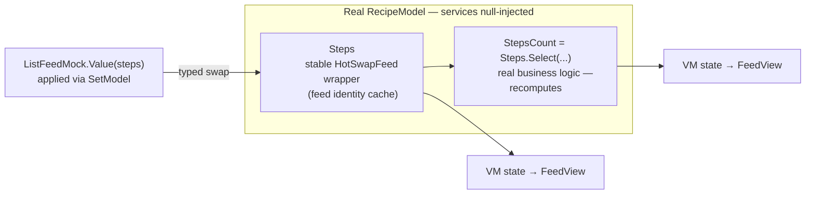
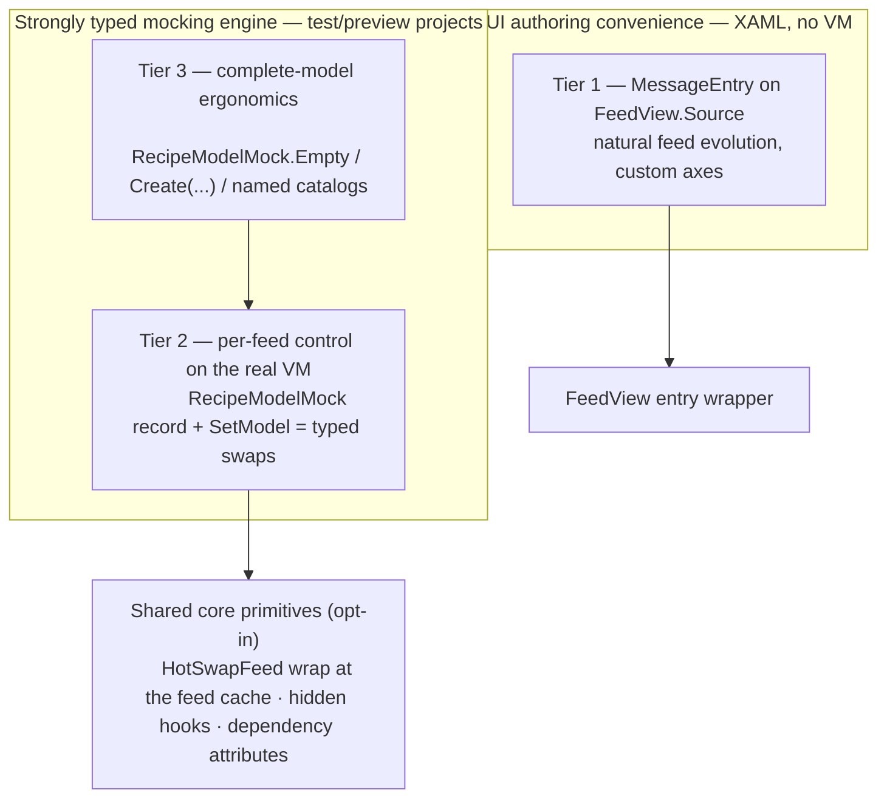
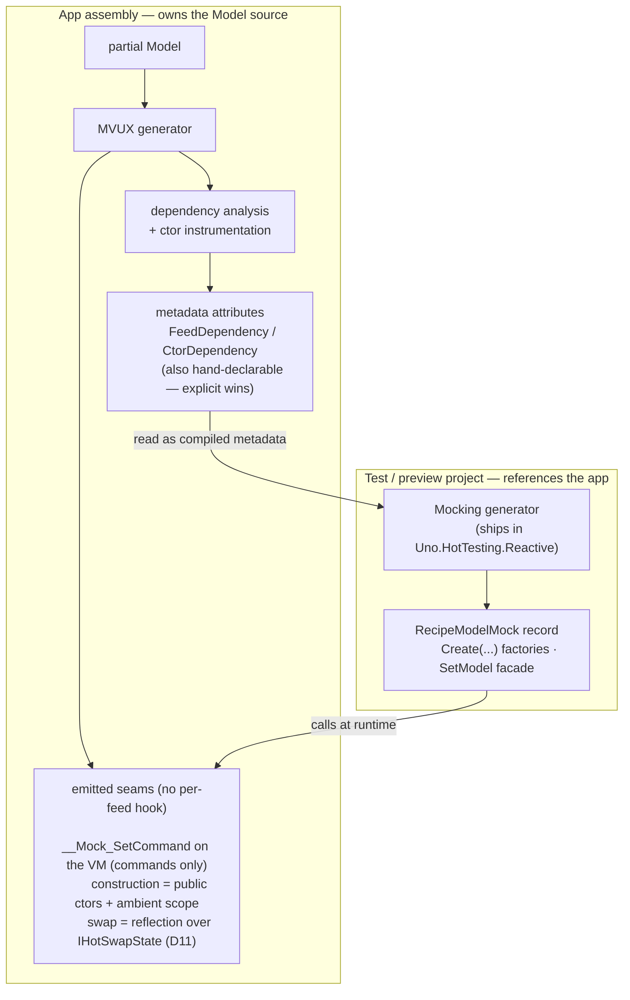
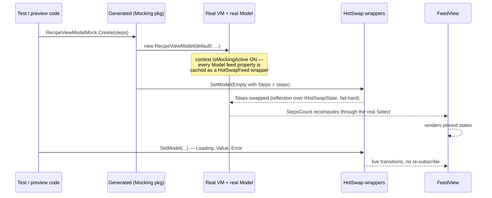
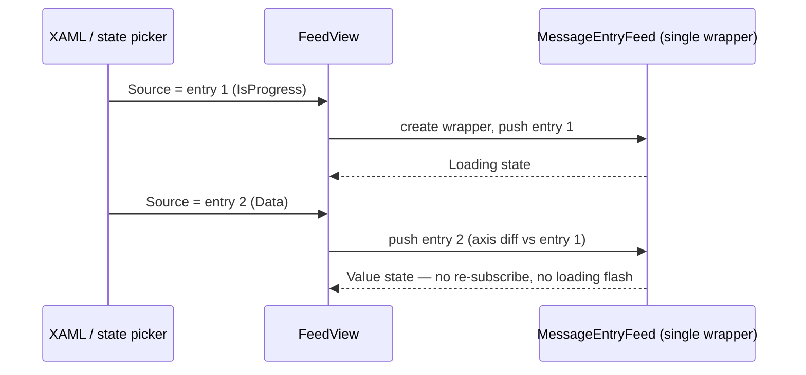

# 013 — MVUX Mocking & Previews

**Status:** Draft — under review
**Area:** `Uno.Extensions.Reactive` (attributes + hooks), `Uno.Extensions.Reactive.UI` (tier-1 bridge), **new package `Uno.HotTesting.Reactive`** (typed vocabulary + facade + its own generator)
**Prior art (POCs):** #3148 / spec 009, #3147 / spec 012
**Primary consumers:** app **test projects** (referencing the app), and Uno **Hot Design** *MVUX State Previews*
**Decision history:** [history.md](history.md)

---

## 1. Problem

Driving a page or a `FeedView` into a **non-happy feed state** (*Loading forever*, *Error*, *Empty/None*, *Refreshing*, *Undefined*) requires faking the service the Model consumes. Expensive — and several states are simply **unreachable** via service fakes:

| Feed state | Reachable with a fake service? |
| --- | --- |
| Value / Error / Empty | Yes |
| **Loading, indefinitely** | Only with a never-completing task — leaks, hangs test runs |
| **Refreshing** (stale value + progress) | No |
| **Undefined** (pre-first-emission) | No |
| **Transient error over stale data** | No |
| **Per-feed, independently, on one VM** | No — a fake is per-service, not per-feed |

**Crucially: mocking must be consumable from the OUTSIDE** — a test project that references the app — not injected into the app's own source.

## 2. Core principle — real VM, real Model, business logic survives

We always instantiate the **real ViewModel wrapping the real Model** (null-injected services). Mocking replaces **inputs** (service-dependent feeds), never **logic**:

```csharp
public IFeed<int> StepsCount => Steps.Select(steps => steps.Count);   // business logic
```

`StepsCount` **MUST keep computing over the mocked `Steps`** — that is the whole point of building a real VM+Model. Achieved by anchoring the swap at the **Model-feed level** (the feed-identity cache), so every composition (`Select`, `Where`, …) observes the swapped source. Live re-swap drives state transitions.



## 3. The three tiers (layers of one system)



1. **Tier 1 — Static/XAML, no VM:** `FeedView.Source` accepts a declared **`MessageEntry`** — a new authorable non-generic entry in **Core**, a **plain CLR object (deliberately NOT a `DependencyObject`)**, XAML element syntax; core axes as direct convenience properties and **custom axes first-class** via an axis collection (MVUX's open axis model). **Replacing** the `Source` entry instance pushes the new entry through the existing wrapper feed: the stream evolves like a real feed (no re-subscribe, no loading flash). The entry itself is **not observable** — a new instance is the unit of change. No heuristic envelope, no parallel DTO, no converter deliverable (an application-owned converter at `FeedView.Source` is illustration only). Tier 1 is an **isolated UI convenience** and never leaks into tiers 2/3.
2. **Tier 2 — Externally-generated mocks over the real VM:** referencing `Uno.HotTesting.Reactive` in a **test/preview project** generates, per reachable Model: `record {Model}Mock` (required-init, compile-time completeness), `{Vm}Mock.Create(...)` factories (null-inject + apply mock), and `SetModel(vm, mock)` which **swaps** each mocked feed at the Model-feed anchor. Commands via a `??` seam. Contracts remain `IFeed<T>` / `IListFeed<T>`, typed states and typed commands **end to end** — tier 2 never accepts `MessageEntry` or any untyped envelope.
3. **Tier 3 — Complete-model ergonomics:** `{Model}Mock.Empty`, `Create()` overloads whose **required parameters are exactly the service-dependent feeds**; **derived members are optional overrides** (unset → the real business logic runs over the mocked inputs; set → replaced — useful for tests); hand-extensible named catalogs (`BasicRecipe`, `RecipeWithSelection`…) for one-line preview binding. Strongly typed, no tier-1 abstractions.

## 4. Split of responsibilities



- **MVUX generator (runs in the Model's assembly, on the partial Model):**
  a. **Dependency analysis** of each feed/command member + **ctor instrumentation** (detect eager service access that would NRE under null-inject);
  b. emits results as **metadata attributes** (also hand-declarable by the author — explicit declarations win/merge);
  c. emits **only** the seams the reflection swap cannot synthesize (`EditorBrowsable(Never)`, on by default — opt-out): the VM `__Mock_SetCommand` seam for commands (R2 — commands have no `IHotSwapState<T>`). Construction needs no seam (public ctors + ambient scope, D12). **No per-feed `__Mock_Swap_{Member}` handles** — the swap itself is reflection over the Model's `IHotSwapState<T>` members at runtime (D11), reusing the hot-reload driver. It must **not** reuse `__Reactive_UpdateModel` (which reassigns `__reactiveModel`/INPC and is unsafe here).
- **Mocking generator (ships in `Uno.HotTesting.Reactive`, runs in the consuming test/preview project):** reads the app assembly **metadata** (types + attributes — no syntax trees needed), generates `{Model}Mock` records, `Create` factories and the `SetModel` facade as **new external, generic and strongly typed types/extensions** (no cross-assembly partial).

## 5. End-to-end — a test drives a page through its states



## 6. Tier 1 at a glance

```xml
<mvux:FeedView ProgressTemplate="{StaticResource Spinner}">
    <mvux:FeedView.Source>
        <reactive:MessageEntry IsProgress="True" />   <!-- pinned loading, no VM -->
    </mvux:FeedView.Source>
</mvux:FeedView>
```



Full authoring surface (custom axes, XAML examples, evolution contract): [architecture.md §3](architecture.md).

## 7. Tier 2 at a glance

The exhaustive route: build the **whole feed set** of the mock record, apply it with `SetModel`.

```csharp
// Test / preview project — no DI graph, no fake service
var vm = RecipeViewModelMock.Create();          // real VM + real Model, services null-injected

vm.SetModel(new RecipeModelMock             // required init → the compiler lists every input to fill
{
    Steps = ListFeedMock.Loading<Step>(),   // pinned Loading, forever
    Tags  = ListFeedMock.Empty<Tag>(),
});

vm.SetModel(RecipeModelMock.Empty with { Steps = ListFeedMock.Error<Step>(timeout) });   // live re-swap
```

- Required members = exactly the **service-dependent** feeds (compile-time completeness, G4).
- Derived members (`StepsCount`) and commands (`Save`) are **optional**: left unset, the real logic runs over the mocked inputs; set, they are replaced.
- `IListFeed<Step>` / `IFeed<int>` / `IAsyncCommand` throughout — never a `MessageEntry`.

Generated surface, `Create` overload rules and diagnostics: [architecture.md §2.2](architecture.md), [implementation.md §4](implementation.md).

## 8. Tier 3 at a glance

The same engine, one call: `Create` takes **only the required feeds** — nothing else to fill in.

```csharp
var vm      = RecipeViewModelMock.Create(ListFeedMock.Value(steps));    // one required input → one argument
var loading = RecipeViewModelMock.Create(ListFeedMock.Loading<Step>());
var empty   = RecipeViewModelMock.Create();                             // = every input Empty

// Named catalogs, hand-written in the test/preview project
public static RecipeViewModel BasicRecipe => RecipeViewModelMock.Create(ListFeedMock.Value(AvocadoToast));
```

```xml
<!-- One-line preview binding — real page, real VM, pinned state -->
<Page DataContext="{x:Bind catalog:RecipeCatalog.BasicRecipe}" />
```

No new mechanism: each overload is `Create()` + a `SetModel` of §7, so a preview head can keep re-issuing `SetModel` to walk states live (G6). Catalogs and pickers: [architecture.md §4](architecture.md).

## 9. Goals / Non-goals

**Goals**
- G1. Pin any service-dependent feed / list-feed / state / command of a real generated VM.
- G2. **Derived feeds recompute over mocked inputs** (business logic survives); derived members remain individually overridable for tests.
- G3. Mock generation happens **in the consumer project** (test/preview), against app metadata.
- G4. Compile-time completeness (`required init`) and compile-time surfacing of eager-ctor constraints.
- G5. Instrumentation emitted **by default** (opt-out via `[assembly: EnableFeedMocking(IsEnabled = false)]`, restoring byte-identical MVUX output). Additive only; the runtime (`MockingService.Enable()`) decides activation.
- G6. Live re-swap to drive transitions.
- G7. Tier-1 XAML state declaration with no VM, including custom axes.
- G8. Tiers 2/3 **strongly typed end to end**.
- G9. **Zero cost on a live app**: the `HotSwapFeed` wrap is created only for feeds built inside an explicit activation scope (§13). No wrapper is ever injected into the feeds of a running application.

**Non-goals**
- NG1. Behavioral/integration testing of services (this targets presentation state).
- NG2. **AOT/trim compliance of the mocking path.** Mocking is dynamic injection, dev/test-time only (JIT). Accepted and documented; never ships in a published app.
- NG3. Making arbitrary JSON graphs bindable on every platform (WinAppSDK dynamic-binding caveat).
- NG4. Command invocation recording/assertions (deferred).
- NG5. Making the tier-1 `MessageEntry` bindable or observable.
- NG6. Defining or implementing a JSON (or any) converter — converters are application-owned illustrations only.
- NG7. Reusing tier-1 untyped authoring objects or conversion helpers in tiers 2/3.

## 10. Frozen contracts (Hot Design + test code discover by name)

`{Model}Mock` record shape (required-init members, `Empty`, `with`-friendly), `{Vm}Mock.Create(...)`, `SetModel`, `MockingService.Enable()`, `SourceContext.IsMockingActive`, the dependency attributes, the VM `__Mock_SetCommand` command seam, and the `Uno.HotTesting.Reactive` namespace. Renames = breaking; additive evolution fine.

## 11. Risks

| # | Risk | Mitigation |
| --- | --- | --- |
| R1 | **Eager ctor service access** → NRE at construction, before any swap | ctor instrumentation (§4a) → attribute → `Create(...)` **requires** those services as parameters; diagnostic if unconstructible |
| R2 | Commands are not swap-backed states | `??` seam in `CommandFromMethod` emission |
| R3 | Undefined change-detection canary (spec 012 §10.2) | tier-1 `MessageEntry` route avoids it; tier-2 vocab proven by test (P0) |
| R4 | Refresh axis is internal → `Refreshing` visually faithful, not axis-faithful | documented |
| R5 | Scalar `IFeed<T>` → plain generated property, invisible to `FeedView` | documented |
| R6 | Swap-anchor identity: exotic lambda captures → unstable cache key | P0 canary matrix + diagnostic |
| R7 | The wrap has a **runtime cost** (an indirection per feed) → unacceptable if activation were global/always-on | activation is **scoped** (§13, D10): no scope, no wrap; the Mocking package is never referenced by a published head (D7) |

## 12. Resolved decisions (log)

| # | Decision |
| --- | --- |
| D1 | Tier-1 authoring = authorable non-generic `MessageEntry` **in Core**; **plain CLR, not a `DependencyObject`**; **not observable** (instance replacement is the unit of change); core axes as convenience properties, **custom axes** via `Axes` / `Set(MessageAxis, value)`; replacement pushes through the existing wrapper (natural feed evolution, no loading flash) |
| D2 | Commands = `??` seam (no swap analog) |
| D3 | **Facade** (`SetModel` / generated setters) in front of hidden hooks; `HotSwapFeed`/handles stay non-public |
| D4 | ~~Dedicated `FeedConfiguration` mockable flag~~ **superseded (2026-08-24)**: the gate lives on **`SourceContext.IsMockingActive`** (per-context, set by `MockingService.Enable()` on the ambient context). No separate static, no bespoke `AsyncLocal`. See D11–D12 |
| D5 | Mock codegen is **external** (consumer project); MVUX gen only analyzes + emits attributes & hidden hooks |
| D6 | Swap anchored at **Model-feed cache level** so derivations survive (non-negotiable) |
| D7 | AOT non-compliance of the mocking path accepted (dev/test only) |
| D8 | Converters (JSON or other) are **application-owned illustrations** attached at `FeedView.Source`, returning `IMessageEntry`; this feature defines and implements none |
| D9 | Tiers 2/3 are **strongly typed end to end**; the tier-1 authoring object is confined to tier 1 |
| D10 | Activation is an **explicit scope** — `using (MockingService.Enable())` — never an ambient app-wide switch. A test assembly may open it once at assembly init to cover its whole run. **Rationale: the wrap costs at runtime; it must exist only on demand, never in the feeds of a live app** (G9, R7). The scope's internal mechanism is now **resolved** — it rides `SourceContext` (§13) |
| D11 | **Swap is reflection-driven over the members, fail-hard** — reuse the existing hot-reload reflection path (`BindableViewModelBase.HotReload`, iterating `IHotSwapState<T>`); the MVUX generator emits **no per-member `__Mock_Swap_{Member}` hooks**, only metadata attributes + the VM `__Mock_SetCommand` command seam (construction uses public ctors + ambient scope). **Delta vs hot reload: a member that cannot be swapped throws — no silent skip** (hot reload is best-effort; mocking is strict) |
| D12 | **The mockable gate is a per-context bit on `SourceContext.IsMockingActive`**, read at wrap time in `StateImpl` ctor **instead of** the global `EffectiveHotReload` static — so only contexts created under an open scope wrap, every other context pays zero (G9/R7 by construction). **Reflection-core accepted over AOT-strict**: a 2-assembly split needs reflection anyway (generating the mock beside the Model would make the mocking assembly hollow); the mocking path stays dev/test-only, non-AOT (NG2/D7) |

## 13. Scoped activation — `MockingService.Enable()` (DECIDED shape AND mechanism)

**Decided.** Mocking is turned on by an **explicit scope**, and only inside it:

```csharp
using (MockingService.Enable())
{
    var vm = RecipeViewModelMock.Create(ListFeedMock.Value(steps));
}
```

- **On demand only.** Wrapping every Model feed in a `HotSwapFeed` costs at runtime (one indirection per feed, per subscription path). That cost is acceptable in a test/preview run and **not** in a live app: outside an activation scope nothing is wrapped, and no published app head ever references the Mocking package (G9, R7, D7).
- **Whole-run activation is the caller's choice, not the default.** A test assembly that wants mocking at large opens the scope once in its **assembly init** (and disposes it at assembly cleanup); a single test opens it around one `Create`. Same API either way — never a global flag flipped inside the framework.
- The scope, not the ViewModel, is the boundary. The real boundary is the feed subscription/state **context** that owns states and subscriptions — **confirmed in source: `SourceContext`** (`Core/Internal/SourceContext.cs`), which already holds an `AsyncLocal<SourceContext> Current` and per-owner contexts. `Enable()` tags the ambient/created contexts `IsMockingActive`; `StateImpl` reads that bit at wrap time.
- `SourceContext.IsMockingActive` (D12) is the low-level per-context gate the scope drives — it is not a knob for app authors, and there is no global static equivalent.

**Resolved mechanism** (source-verified, see [implementation.md §6](implementation.md)):

- **Context type & carrier:** `SourceContext` (`Core/Internal/SourceContext.cs`) — already the owner of `States`/subscriptions, already ambient via `AsyncLocal<SourceContext> Current`, already created per-owner (`GetOrCreate(owner)`) with an eager pre-seed seam (`PreConfigure(type, ctx)` / `Set(owner, ctx)`). It carries a new `bool IsMockingActive`.
- **Activation:** `MockingService.Enable()` opens a scope that marks the relevant `SourceContext`(s) `IsMockingActive` (ambient for async construction; eager pre-seed for the VM/Model context built by `Create(...)` so a lazy first subscription after the `using` block still wraps).
- **Wrap gate:** `StateImpl` ctor reads `context.IsMockingActive` **instead of** `FeedConfiguration.EffectiveHotReload` — no scope ⇒ no wrap (G9/R7 hold by construction, per-context not per-process).
- **Nested scopes / concurrency / lifetime:** inherited from `SourceContext` semantics — the bit lives on the context instance, so concurrent tests do not leak, and contexts created inside a scope stay mockable for their own lifetime after `Dispose`.
- **Swap:** reflection over the context's `IHotSwapState<T>` members (D11), fail-hard.
