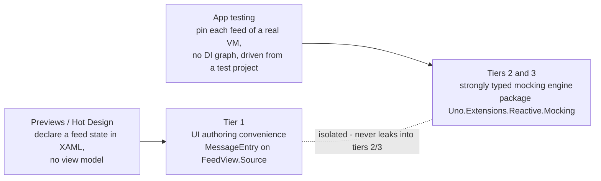
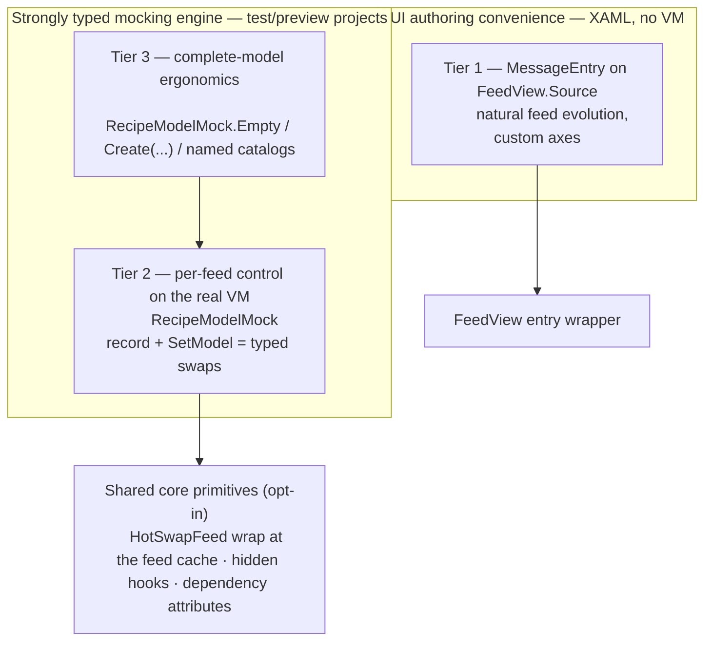
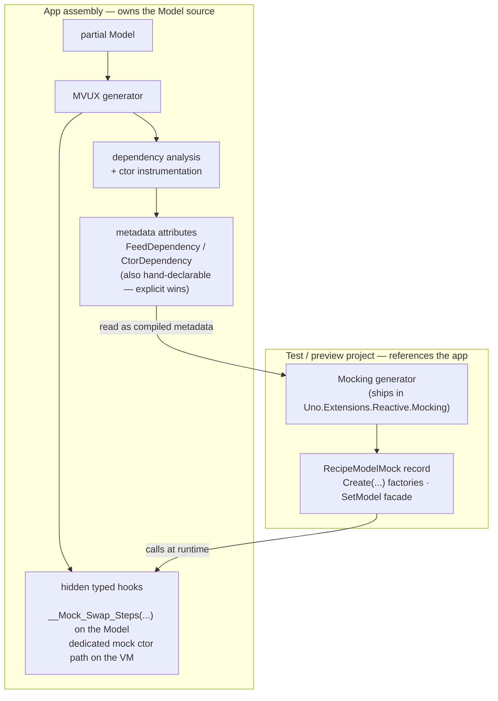
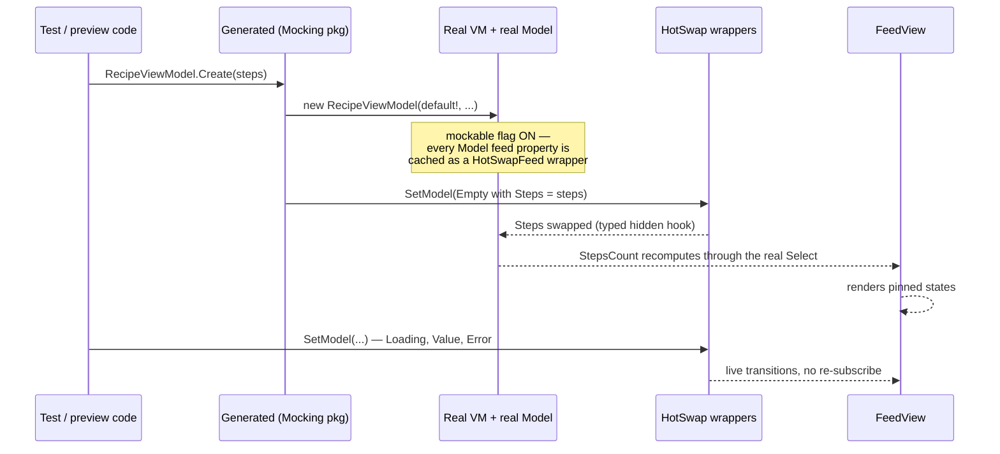
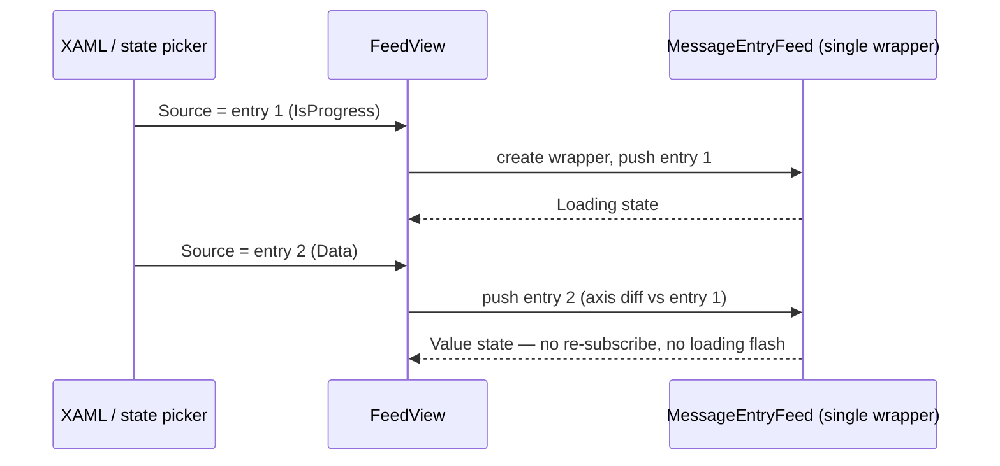

# 013 — MVUX Mocking & Previews

**Status:** Draft — under review
**Area:** `Uno.Extensions.Reactive` (attributes + hooks), `Uno.Extensions.Reactive.UI` (tier-1 bridge), **new package `Uno.Extensions.Reactive.Mocking`** (typed vocabulary + facade + its own generator)
**Prior art (POCs):** #3148 / spec 009, #3147 / spec 012
**Primary consumers:** app **test projects** (referencing the app), and Uno **Hot Design** *MVUX State Previews*
**Decision history:** [history.md](history.md)

---

## 1. Problem

Driving a page or a `FeedView` into a **non-happy feed state** (*Loading forever*, *Error*, *Empty/None*, *Refreshing*, *Undefined*) requires faking the service the Model consumes. Expensive — and several states are simply **unreachable** via service fakes:

| Feed state | Reachable with a fake service? |
| --- | --- |
| Value / Error / Empty | Yes |
| **Loading, indefinitely** | Only with a never-completing task — leaks, hangs test runs |
| **Refreshing** (stale value + progress) | No |
| **Undefined** (pre-first-emission) | No |
| **Transient error over stale data** | No |
| **Per-feed, independently, on one VM** | No — a fake is per-service, not per-feed |

Two audiences, and **two distinct needs that must stay separate**:



**Crucially: mocking must be consumable from the OUTSIDE** — a test project that references the app — not injected into the app's own source.

## 2. Core principle — real VM, real Model, business logic survives

We always instantiate the **real ViewModel wrapping the real Model** (null-injected services). Mocking replaces **inputs** (service-dependent feeds), never **logic**:

```csharp
public IFeed<int> StepsCount => Steps.Select(steps => steps.Count);   // business logic
```

`StepsCount` **MUST keep computing over the mocked `Steps`** — that is the whole point of building a real VM+Model. Achieved by anchoring the swap at the **Model-feed level** (the feed-identity cache), so every composition (`Select`, `Where`, …) observes the swapped source. Live re-swap drives state transitions.


## 3. The three tiers (layers of one system)



1. **Tier 1 — Static/XAML, no VM:** `FeedView.Source` accepts a declared **`MessageEntry`** — a new authorable non-generic entry in **Core**, a **plain CLR object (deliberately NOT a `DependencyObject`)**, XAML element syntax; core axes as direct convenience properties and **custom axes first-class** via an axis collection (MVUX's open axis model). **Replacing** the `Source` entry instance pushes the new entry through the existing wrapper feed: the stream evolves like a real feed (no re-subscribe, no loading flash). The entry itself is **not observable** — a new instance is the unit of change. No heuristic envelope, no parallel DTO, no converter deliverable (an application-owned converter at `FeedView.Source` is illustration only). Tier 1 is an **isolated UI convenience** and never leaks into tiers 2/3.
2. **Tier 2 — Externally-generated mocks over the real VM:** referencing `Uno.Extensions.Reactive.Mocking` in a **test/preview project** generates, per reachable Model: `record {Model}Mock` (required-init, compile-time completeness), `{Vm}.Create(...)` factories (null-inject + apply mock), and `SetModel(vm, mock)` which **swaps** each mocked feed at the Model-feed anchor. Commands via a `??` seam. Contracts remain `IFeed<T>` / `IListFeed<T>`, typed states and typed commands **end to end** — tier 2 never accepts `MessageEntry` or any untyped envelope.
3. **Tier 3 — Complete-model ergonomics:** `{Model}Mock.Empty`, `Create()` overloads whose **required parameters are exactly the service-dependent feeds**; **derived members are optional overrides** (unset → the real business logic runs over the mocked inputs; set → replaced — useful for tests); hand-extensible named catalogs (`BasicRecipe`, `RecipeWithSelection`…) for one-line preview binding. Strongly typed, no tier-1 abstractions.

## 4. Split of responsibilities



- **MVUX generator (runs in the Model's assembly, on the partial Model):**
  a. **Dependency analysis** of each feed/command member + **ctor instrumentation** (detect eager service access that would NRE under null-inject);
  b. emits results as **metadata attributes** (also hand-declarable by the author — explicit declarations win/merge);
  c. emits **hidden hooks** (HR-style, `EditorBrowsable(Never)`): per-feed typed swap handles on the Model partial + a dedicated mock-apply path on the VM (NOT `__Reactive_UpdateModel`, which reassigns `__reactiveModel`/INPC and is unsafe for this use).
- **Mocking generator (ships in `Uno.Extensions.Reactive.Mocking`, runs in the consuming test/preview project):** reads the app assembly **metadata** (types + attributes — no syntax trees needed), generates `{Model}Mock` records, `Create` factories and the `SetModel` facade as **new external, generic and strongly typed types/extensions** (no cross-assembly partial).

## 5. End-to-end — a test drives a page through its states



## 6. Tier 1 at a glance

```xml
<mvux:FeedView ProgressTemplate="{StaticResource Spinner}">
    <mvux:FeedView.Source>
        <reactive:MessageEntry IsProgress="True" />   <!-- pinned loading, no VM -->
    </mvux:FeedView.Source>
</mvux:FeedView>
```



Full authoring surface (custom axes, XAML examples, evolution contract): [architecture.md §3](architecture.md).

## 7. Goals / Non-goals

**Goals**
- G1. Pin any service-dependent feed / list-feed / state / command of a real generated VM.
- G2. **Derived feeds recompute over mocked inputs** (business logic survives); derived members remain individually overridable for tests.
- G3. Mock generation happens **in the consumer project** (test/preview), against app metadata.
- G4. Compile-time completeness (`required init`) and compile-time surfacing of eager-ctor constraints.
- G5. Opt-in; byte-identical MVUX output when disabled. Additive only.
- G6. Live re-swap to drive transitions.
- G7. Tier-1 XAML state declaration with no VM, including custom axes.
- G8. Tiers 2/3 **strongly typed end to end**.

**Non-goals**
- NG1. Behavioral/integration testing of services (this targets presentation state).
- NG2. **AOT/trim compliance of the mocking path.** Mocking is dynamic injection, dev/test-time only (JIT). Accepted and documented; never ships in a published app.
- NG3. Making arbitrary JSON graphs bindable on every platform (WinAppSDK dynamic-binding caveat).
- NG4. Command invocation recording/assertions (deferred).
- NG5. Making the tier-1 `MessageEntry` bindable or observable.
- NG6. Defining or implementing a JSON (or any) converter — converters are application-owned illustrations only.
- NG7. Reusing tier-1 untyped authoring objects or conversion helpers in tiers 2/3.

## 8. Frozen contracts (Hot Design + test code discover by name)

`{Model}Mock` record shape (required-init members, `Empty`, `with`-friendly), `{Vm}.Create(...)`, `SetModel`, the dependency attributes, hidden hook naming, and the `Uno.Extensions.Reactive.Mocking` namespace. Renames = breaking; additive evolution fine.

## 9. Risks

| # | Risk | Mitigation |
| --- | --- | --- |
| R1 | **Eager ctor service access** → NRE at construction, before any swap | ctor instrumentation (§4a) → attribute → `Create(...)` **requires** those services as parameters; diagnostic if unconstructible |
| R2 | Commands are not swap-backed states | `??` seam in `CommandFromMethod` emission |
| R3 | Undefined change-detection canary (spec 012 §10.2) | tier-1 `MessageEntry` route avoids it; tier-2 vocab proven by test (P0) |
| R4 | Refresh axis is internal → `Refreshing` visually faithful, not axis-faithful | documented |
| R5 | Scalar `IFeed<T>` → plain generated property, invisible to `FeedView` | documented |
| R6 | Swap-anchor identity: exotic lambda captures → unstable cache key | P0 canary matrix + diagnostic |

## 10. Resolved decisions (log)

| # | Decision |
| --- | --- |
| D1 | Tier-1 authoring = authorable non-generic `MessageEntry` **in Core**; **plain CLR, not a `DependencyObject`**; **not observable** (instance replacement is the unit of change); core axes as convenience properties, **custom axes** via `Axes` / `Set(MessageAxis, value)`; replacement pushes through the existing wrapper (natural feed evolution, no loading flash) |
| D2 | Commands = `??` seam (no swap analog) |
| D3 | **Facade** (`SetModel` / generated setters) in front of hidden hooks; `HotSwapFeed`/handles stay non-public |
| D4 | Dedicated **`FeedConfiguration` mockable flag** (decoupled from hot reload) |
| D5 | Mock codegen is **external** (consumer project); MVUX gen only analyzes + emits attributes & hidden hooks |
| D6 | Swap anchored at **Model-feed cache level** so derivations survive (non-negotiable) |
| D7 | AOT non-compliance of the mocking path accepted (dev/test only) |
| D8 | Converters (JSON or other) are **application-owned illustrations** attached at `FeedView.Source`, returning `IMessageEntry`; this feature defines and implements none |
| D9 | Tiers 2/3 are **strongly typed end to end**; the tier-1 authoring object is confined to tier 1 |

## 11. Open question — context scope & ambient activation (UNRESOLVED)

Tier 2 may not fundamentally be VM-scoped: the actual boundary may be the feed subscription/state **context** (believed to be `SourceContext`; must be verified in source). Desired call-site shape:

```csharp
using (MockingService.Enable())
{
    var model = new MyModel(...);
}
```

Semantics to decide by spike (P0-e, see [implementation.md §6](implementation.md)): ambient (`AsyncLocal`) vs process-global; nested scopes; concurrency; eager vs lazy context creation; subscriptions outliving `Dispose`; interaction with the mockable flag (D4). **Nothing here is accepted until verified against source and reviewed.**
